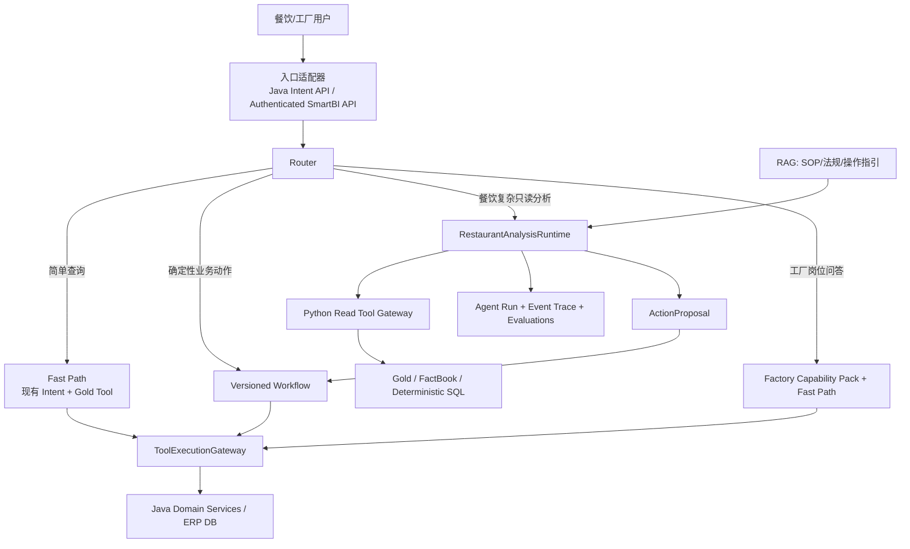

# Cretas Agent Architecture V2 — 餐饮重分析、工厂轻 Agent

**状态**：Accepted / D9、D10 底座已落地并完成生产验证；D11 架构收口进行中

**日期**：2026-07-18

**仓库审计真值**：`origin/main` @ `8d5af3daa8f7bcfa1b96c19bd1a736fc7bb4481f`（2026-07-20）

**独立审查基线**：Fable 5 handoff @ `18854c456`。此后的架构裁决和实现均以仓库真值、专项测试、真实 PostgreSQL 门禁与独立终审为准。

**当前产品范围**：餐饮端的数据分析与 AI Chat 是重点；工厂端暂时只做岗位型小 Agent，不建设通用数据分析 Agent Runtime。

### 0.1 2026-07-20 实施状态

本文后续章节保留 2026-07-18 形成裁决时的代码诊断和 ADR 推导；本节是当前实施真值，出现冲突时以本节和 `origin/main` 为准。

- **Gateway**：Phase 0A 安全止血、descriptor/policy、原子 confirmation、幂等账本和统一 Gateway 底座均已落地；D10A 又将 `product_create`、`bom_adjust` 两个固定写入口迁入 Gateway。D11A 已删除客户端 boolean confirmation authority、修复 descriptor 门禁并移除无消费者的旧 Manager。当前 descriptor 真值为 588 个 Tool（580 legacy、8 explicit），只有 7 个 runtime-approved policy；Gateway 外仍有 10 个文件/11 个调用表达式，不能把 Gateway 宣称为唯一入口。
- **餐饮 Runtime**：已有 10 个只读 Evidence Tool、有界 `Plan → Act → Observe → Replan`、持久化 Run/Event、最多两轮 evidence gap/replan/clarification、跨进程显式取消、checkpoint/resume/replay、32 KiB Evidence drill-down 和只读 `ActionProposal`。`V20261028_03/05/06` 已在生产执行，Java gate 已切为 `ACTIVE`，真实只读 run、owner/cross-user replay、cancel 和 ERP 零写入均通过；当前只支持 `GROSS_MARGIN_DECLINE_ATTRIBUTION` 一条固定路线。
- **AgentOps**：不可变 Eval Set、离线 Experiment、comparison、分页 detail、管理员 Run Trace、实现制品 SHA 和 response-loss-safe 幂等已由 PR #1495 合并；`V20261028_04` 已在生产执行，后续 exact-main Web 发布已包含 AgentOps 页面。当前 experiment 仍由客户端提交 actual snapshots，尚未形成自动 shadow/eval 流水线。
- **工厂端**：operator、warehouse、quality、manager 四个 config-only Capability Pack 已由 PR #1490 合并并进入后续 Java 生产制品，只暴露 `READ + LOW + REVIEW_REQUIRED` 元数据，不接 Tool 执行、动态规划或通用 Runtime；主 Router/Fast Path 尚未消费这些 Pack。
- **身份收口**：D9 Python session identity 代码已由 PR #1473 合并，`V20261028_02` 已在生产执行。
- **发布边界**：D9/D10 的 Python migration、Java、Python 与 Web 已有归档生产证据；未找到 RN/OTA 发布记录，因此餐饮 Runtime 卡片不能视为已进入所有用户客户端。后续任何构建、DDL、服务切换、Web/RN 发布仍必须以发布前现场真值、兼容窗口、回滚点和用户确认作为独立 high-stakes 门禁。

---

## 1. 最终结论

Cretas 现有架构不是“完全做错了”，但 **Tool + Skill 被迫承担了 Agent、Workflow、权限策略、执行引擎和配置包等过多职责**。实际系统更接近：

> 多层意图识别 + 588 个当前 descriptor Tool + 若干一次性 Tool/Skill 执行路径 + 既有餐饮分析管线 + 一条有界餐饮 Agent Runtime 路线。

在本裁决形成时，它还不是一个具备 `Plan → Act → Observe → Replan`、持久化 Run/Event、逐步预算和可评测工具轨迹的 Agent Runtime。此后餐饮只读 Runtime 和 AgentOps 已按上述边界落地并完成生产验证；剩余重点是让主 Chat 真正路由到 Runtime、继续缩小 Gateway 旁路、完成 ActionProposal→Workflow 与 Skill 三拆，并用自动回归评测证明线上收益。

V2 不引入 Coze Studio、AgentScope、ADK、Qwen-Agent 或 Arkitect 作为运行依赖，也不推倒现有数百个 Tool。采用以下边界：

1. **Tool**：有类型、有治理元数据的原子业务能力。
2. **ToolExecutionGateway**：唯一 Tool 执行入口，统一身份、租户、业态、权限、风险、确认、幂等、审计和 Trace。
3. **Workflow**：确定性、版本化的写操作和受监管业务流程。
4. **RestaurantAnalysisRuntime**：仅用于餐饮复杂只读分析的有界证据循环。
5. **Capability Pack**：Prompt、Tool 白名单、领域规则、示例和评测集；它不是执行引擎。
6. **Router**：简单问题继续走 Fast Path，只有需要跨证据推理的问题进入 Agent Runtime。
7. **AgentOps**：Run/Event Trace、评测集、实验和成本指标先于低代码画布。

第一步不是“让 Agent 更聪明”，而是关闭公开写入口并让 preview fail-closed；这部分安全代码已由 PR #1432 合并。Gateway 底座、餐饮 Runtime、AgentOps 和工厂 Capability Pack 随后按独立切片落地，当前不应再把“代码尚未实现”与“尚未生产发布”混为一谈。

---

## 2. 代码核验结论

### 2.1 已确认事实

| # | 结论 | 当前证据 | 裁决 |
|---|---|---|---|
| 1 | 没有通用 Observe/Replan 循环 | `ToolRouterService.java:203-220` 的 Auto-Planner 默认恒 false/null，且无实现覆写；`ToolRouterServiceImpl.java:226-253` 只按既定串并行链执行 | 确认 |
| 2 | MCP 仍是直接执行路径，但匿名与调用方身份注入已在 Phase 0A 封住 | `MCPServerAdapter.java:42` 仅在显式启用时注册；`:69-76` 要求 API key、服务端 Principal 与 allowlist；`:216-228` 校验 allowlist/工厂启用状态；`:261-266` 只构造服务端 context 后直调 `executor.execute` | 安全风险已显著缓解；仍待 Gateway 收口 |
| 3 | Tool 治理与 Principal 派生被复制，调用方 context 可覆盖可信字段 | `ToolDispatchService.java:218-219,697-698` 将 `request.context` 合入 params；`DynamicToolSelectionService.java:119-120,150-151` 用 `putAll` 覆盖 plan/execution context | 高优先级；Gateway 前先止血 |
| 4 | `ToolExecutor.execute/preview` 直调存在精确旁路基线 | 2026-07-20 exact-main 审计初始为 11 个生产文件/12 个表达式；D11A 删除无消费者的 `ToolExecutionManager` 后为 10 个文件/11 个表达式，其中 10 个 execute、1 个 preview | 确认；每批迁移必须真实缩小同一基线 |
| 5 | 原子确认已落地，旧 boolean authority 已删除 | token 绑定 factory/user/tool/version/params hash、TTL 并原子 claim/consume；D11A 在 execute/multi/stream/preview/params-confirm 边界剥离 `confirmed/forceExecute` 及变体，只接受进程内 server proof，并在 ToolCall 序列化前移除内部 marker | 已完成；crafted JSON、合法 token、参数确认和真实 dispatch 测试覆盖 |
| 6 | descriptor inventory 的分母必须按治理清单统计 | 2026-07-20 YAML 真值为 588 个 Tool：580 legacy、8 explicit；只有 7 个 runtime-approved，其余为 `REVIEW_REQUIRED` 或 `REVIEW_REQUIRED_P0` | 以 588 作为当前 descriptor 基线，不能直接全量切入 fail-closed Gateway |
| 7 | 测试与文档规模曾发生漂移 | 审计时 inventory/source 测试使用 588，但 `ToolDescriptorCatalogTest` 仍断言 589/581，本文也保留 601 的实施前口径；D11A 已将 8 个断言与本文统一到 588/580 及当前统计 | 已修复；后续由 inventory drift gate 阻止再次漂移 |
| 8 | Skill 语义和执行职责过载 | `SkillExecutorImpl.java:55-58` 自述 Site D 绕过 Site B；`:760-839` 再次复制执行守卫；timeout 主要记录而非强制中断 | 确认 |
| 9 | 旧 Python 分析资产不是 Agent Runtime；新的餐饮 Runtime 已落地 | `smartbi/agent/orchestrator.py` 与 `synthesis_engine.py` 仍是旧固定分析路径；新的 Restaurant Runtime 已提供 10 个 Read Tool、Run/Event、两轮上限、checkpoint/replay/cancel，但只有一条毛利归因路线 | 旧路径与新试点并存，主 Chat 尚未统一路由 |
| 10 | Python 与 Cretas 写库边界当前较干净 | SmartBI 写自己的数据层；已发现的 Python→Java 业务调用是 `value_notifier_client.py:28-72` 的站内通知 | 高信心；实施前仍需用出站调用清单做自动化守门 |
| 11 | 冗余缓存可能跨 Principal/租户复用 | `ToolDispatchService.java:343-346,418` 在 session 缺失时使用固定 `default`，缓存键依赖 tool + params；可信 factory/user/role 未稳定进入 params hash 时，相同参数可能跨租户命中 | Gateway 前先把 trusted principal 纳入隔离键并移除共享 default session |
| 12 | 入站 `confirmed/forceExecute` 伪造路径已关闭 | `forceExecute` 既是 Jackson `READ_ONLY`，又在 HTTP 边界显式复位；confirmation-like context key 会被规范化剥离，`WriteGuardService` 只认对象身份 marker | 已完成；确认只能由服务端 token/内部状态派生 |
| 13 | outbound MCP 具备条件启用后的高风险默认值 | `MCPClientAdapter.java:31,139` 可按 `cretas.mcp.external-servers` 注册外部 Tool；`MCPToolProxy.java:97` 外发完整 context，且未覆盖 metadata 时继承 `ToolExecutor` 的 `READ/LOW/无显式权限` 默认值 | 当前生产启动日志、unit 与 args 未发现启用配置；保持关闭并纳入 Gateway/出站最小化治理 |

### 2.2 对 Fable 报告的三项修正

1. **Python 不是“什么 Runtime 都没有”**：`AgentOrchestrator` 已提供预算、缓存、脱敏、多 Provider 路由、真正的 LLM streaming 和语料捕获，但它是固定 Gold 拉取后的一次叙述流程，没有可枚举 Tool、观察和重规划。`synthesis/comprehensive-stream` 仍是先完成计算再切片，而 `executive/insights/custom/stream` 已是真流式；两者不能混为一谈。
2. **统一入口不应直接等于扩大 `ToolDispatchService`**：该类绑定 `IntentExecuteRequest/Response`、参数抽取、纠错和回答格式。应在其下方抽出通用 Gateway，`ToolDispatchService` 保留为 Intent 适配器。
3. **Phase 0 不应把 DB 表作为唯一治理真值**：`ToolExecutor` 已有 action/risk/version/domain 元数据接口。先建立版本化治理清单和 CI 门禁；数据库可做禁用、灰度和只收紧覆盖，不能成为可静默放宽权限的安全后门。

### 2.3 已纠正的旧审计判断

旧 QA 文档曾把 `DictionaryTestController` 评为“公开但安全”，理由之一是 CORS 白名单。这不成立：CORS 不是服务端访问控制，非浏览器客户端不受它约束。对应 [QA 矩阵](../qa-audits/2026-05-12-r6-wider-controller-rbac-sweep.md) 已增加 2026-07-18 更正并标记该控制器已移除。

历史风险事实与当前仓库状态：

- 被删除的 `DictionaryTestController` 位于 `/api/public/dictionary-test`，曾接受外部 `factoryId` 并直接执行 `dictionary_add`；
- PR #1432 已从生产源码删除该控制器，并加入 `DictionaryTestControllerAbsenceTest` 防回归；
- 2026-07-18 生产发布后，网关本机通过 `--resolve` 验证 `/api/public/dictionary-test/**` 返回 404；2026-03-16 至 2026-07-18 的生产访问日志中该路径命中为 0。

因此旧结论应为“P0 公共写入口，现已在仓库代码中移除”，而不是“因 CORS 限制而安全”。

---

## 3. 目标架构



### 3.1 Tool

Tool 只完成一个可验证的业务能力。必须具有：

- stable `toolName` 和版本；
- schema 化输入输出；
- `READ / CREATE / UPDATE / DELETE / NOTIFY / ANALYZE` action；
- risk 和 permission；
- tenant/business-type 约束；
- 是否允许 system principal；
- 是否支持真正的只读 preview；
- 幂等语义和审计策略。

禁止继续依赖类名或 toolName 后缀作为最终安全事实。名称推断只能用于迁移期发现未知 Tool。

### 3.2 ToolExecutionGateway

新增通用 Gateway，而不是让所有调用方伪造 Intent DTO。建议核心契约：

```text
ToolExecutionCommand
  toolName, arguments, mode(PREVIEW|EXECUTE), idempotencyKey,
  confirmationToken, correlationId

ExecutionPrincipal
  kind(USER|SERVICE|SYSTEM), tenantId, actorId, roles/scopes,
  businessType, source

ToolExecutionResult
  status, output, auditId, traceId, policyDecisions, error
```

身份必须由服务端认证层构造，Tool 参数和外部 context 不能覆盖 `tenantId/userId/role`。执行顺序固定为：

1. 解析 Tool 与版本；
2. 校验租户、业态和启用状态；
3. 读取治理描述；
4. RBAC/风险策略；
5. preview 或单次确认 token；
6. 幂等与重放检查；
7. 执行；
8. 结果校验；
9. 统一审计、成本和 Trace。

迁移完成后，除 Gateway 内部外，生产代码不得直接调用 `ToolExecutor.execute/preview`。用 ArchUnit 或等价静态测试阻止新旁路。

### 3.3 Workflow

Workflow 负责确定性写操作、审批和可恢复业务流程。它不是 LLM 自由循环。

- 输入 schema 和版本固定；
- 每一步具有明确责任人、权限、幂等键和审计；
- 支持 preview → approval → execute；
- Agent 只能提出 `ActionProposal`，不能直接获得 Cretas 写权限；
- 初期复用现有 Java 业务服务，不急于引入通用图框架。

### 3.4 Capability Pack（Skill 的未来含义）

Capability Pack 是配置，不负责执行：

- role/system instructions；
- Tool/Workflow allowlist；
- 输出 schema；
- 领域规则和禁区；
- few-shot examples；
- evaluation cases；
- 版本、草稿、发布状态。

现有 Skill 渐进三拆：

| 当前 Skill 内容 | 迁移目标 |
|---|---|
| 固定 DAG、顺序、条件和写步骤 | Workflow |
| Prompt、Tool 白名单、规则、示例 | Capability Pack |
| 同领域 Tool 聚合 | 直接 Router/Pack，必要时合并 Tool |
| LLM 一次性生成执行计划 | 餐饮 Analysis Runtime 的 typed plan |
| 输出格式化 | Presenter / response contract |

不做 Big Bang；第一步只是让 `SkillExecutorImpl` 通过 Gateway 执行。

---

## 4. 餐饮端：重数据分析与 AI Chat

### 4.1 Router：快慢路径分离

餐饮问题分三类：

| 类型 | 示例 | 路径 |
|---|---|---|
| 简单确定性查询 | “昨天营业额多少”“毛利最高的菜” | 现有 T1/T2/T3 + Gold Tool，保持低延迟 |
| 复杂经营分析 | “为什么本月毛利下降，主要是哪家店和哪些菜造成的” | RestaurantAnalysisRuntime |
| 业务动作 | “给低毛利菜生成调价建议并发起审批” | Runtime 产出 ActionProposal，Java Workflow 执行 |

不能把全部餐饮查询都送入 Agent。Fast Path 是成本和稳定性资产，应继续保留。

### 4.2 RestaurantAnalysisRuntime v1

它不是开放式 ReAct，而是 **有界证据获取循环**：

```text
Classify → Create Run → Plan Evidence → Execute Read Tools
         → Reconcile Facts → Detect Evidence Gap
         → Replan / Clarify / Synthesize → Cite Evidence → Finish
```

硬上限：

- `replan <= 2`；
- `tool calls <= 12`；
- `wall clock <= 60s`；
- 每一步执行前检查剩余 token/时间/工具预算；
- v1 只允许读取 Python SmartBI/Gold；
- 任一数字必须来自 `EvidenceEnvelope`；
- 旧 synthesis 路径长期作为可切换降级通道。

第一条试点问题固定为“毛利下滑归因”，因为它同时需要时间窗口、门店贡献、菜品贡献、销量结构和成本证据，能证明 Replan 是否真的有价值。

### 4.3 Read Tool 与 Evidence 契约

不要把现有 Python 函数直接全部暴露给 LLM。先建立 6–10 个只读、稳定的分析工具，例如：

- revenue trend；
- store contribution/attribution；
- dish margin and mix；
- cost movement；
- waste anomaly；
- inventory/stockout signal；
- review/sentiment evidence（有数据时）；
- period comparison。

每个结果返回：

```text
EvidenceEnvelope
  evidenceId, toolName, querySpec, tenantId, timeWindow,
  dimensions, facts[], provenance, freshness, warnings
```

LLM 最终答案引用 `evidenceId`，FactReconciler 同时核验“数字是否存在”和“数字是否绑定正确证据”。RAG 只能提供 SOP、法规和运营方法，不能提供当前营业额、毛利或库存真值。

### 4.4 Run/Event 最小持久化

Fable 提出的五张表对 v1 偏重。先建两张：

- `smart_bi_agent_run`：tenant、session、question、route、status、budgets、started/finished、final source/error；
- `smart_bi_agent_event`：append-only sequence、event type、tool/evidence reference、safe payload、latency、token usage。

`PLAN_CREATED / TOOL_STARTED / TOOL_FINISHED / EVIDENCE_GAP / REPLAN / CLARIFICATION / ANSWER_CHUNK / COMPLETED / FAILED` 都是事件类型。Step 不需要单独建表；Evidence 初期放结构化事件或已有 FactBook 索引。只有查询量证明必要后再拆 evidence 表。

v1 的目标是可观察和可评测，不做崩溃后 checkpoint/resume。分析请求可安全重跑，恢复语义优先留给写 Workflow。

### 4.5 AI Chat 产品变化

餐饮 Chat 将从“等待一个答案”升级为：

- 显示正在检查哪些证据，而不是伪造思维链；
- 缺数据时提出一次有业务意义的澄清；
- 最终答案展示时间窗口、数据来源和可点击证据；
- 给出 `建议动作`，但用户确认前不写 ERP；
- 支持取消、失败重试和 run trace；
- 同一 session 保留最近业务上下文，但历史对话中的旧数字不能当当前真值。

主 Chat 入口继续通过 Java Intent API；现有 SmartBI 页面可以保留经 JWT/tenant guard 直达 Python 的适配器。两类入口必须进入同一个 Python Runtime 契约，而不是复制两套 Agent。

---

## 5. 工厂端：岗位 Capability Pack，不建通用 Agent Runtime

当前工厂端没有重数据分析需求，因此不共享餐饮的自由分析循环。先做四个岗位 Pack：

| Pack | 能力边界 | 执行方式 |
|---|---|---|
| 操作员 | 报工解释、批次/任务查询、异常上报引导 | Fast Path Tool；写操作走确定性表单/Workflow |
| 仓管 | 入出库、盘点、批次、库存异常解释 | Fast Path + 扫码/业务 Workflow |
| 质检 | 待检任务、标准/SOP、缺陷处置建议 | Gold/API + SOP RAG；处置必须审批 |
| 管理者 | 生产/库存/质量摘要和导航 | 预定义组合查询，不开放 Replan |

工厂 Pack 复用 Gateway、权限、Trace 和评测，但不承担 Agent 循环成本。只有出现稳定的跨域分析需求、现有 Fast Path 无法覆盖且有真实付费场景时，才重新评估工厂 Runtime。

---

## 6. 15 项 ADR 终审

下表是架构裁决，不代表所有 ADR 已落地；仅 ADR 2 的 Phase 0A 代码和 ADR 3 的 preview fail-closed 部分已由 PR #1432 合并。

| ADR | Fable 建议 | 最终裁决 |
|---|---|---|
| 1 | 升级 ToolDispatchService 为唯一 Gateway | **Modified Adopt**：新增通用 `ToolExecutionGateway`；ToolDispatchService 作为 Intent adapter |
| 2 | MCP prod 禁用/强制鉴权 | **Adopt / Phase 0A production verified**：默认不注册；启用需强制密钥/服务身份、服务端 tenant、Tool allowlist，禁止外部 context 注入身份。生产已部署，历史访问日志中 `/api/mcp` 命中为 0，网关探测返回 404 |
| 3 | 复活 PreviewToken | **Modified Adopt / partial**：PR #1432 已让不支持安全 preview 的写 Tool 拒绝执行；exact-base 审计确认现有 token 无生产 create 调用、confirm 非原子且未绑定 factory/tool/version/params。需重做为参数哈希绑定、TTL、单次原子消费，并删除入站 `confirmed=true` |
| 4 | DB `tool_governance` 为治理真值 | **Modified Adopt**：先用版本化 Tool descriptor/治理清单 + CI；DB 只允许禁用或收紧。新 Tool 缺 descriptor 直接构建失败，旧 Tool 分批清账 |
| 5 | Python 自建有界 Agent 循环 | **Adopt**：只做餐饮复杂只读证据循环，不做通用自主 Agent |
| 6 | run/step/event/evidence/metric 五表 | **Modified Adopt**：v1 只建 run + append-only event；复用现有 FactBook/指标资产，避免新 metric registry 重复建设 |
| 7 | Java 是唯一前门 | **Modified Adopt**：Java 是主 Chat/业务动作入口；受 JWT 和 tenant guard 保护的 SmartBI Python 入口可以保留，但必须共享同一 Runtime |
| 8 | Python 零 Cretas 写权限；ActionProposal→Workflow | **Adopt** |
| 9 | 工厂不建 Runtime，四岗位 Pack | **Adopt**，符合当前产品范围 |
| 10 | Skill 渐进三拆 | **Adopt**；先改执行入口，不重写全部 Skill |
| 11 | 意图+轨迹+数字真值评测 | **Adopt / Phase 1 前置** |
| 12 | Validate spring-ai-alibaba graph-core | **Downgrade to isolated Spike/Postpone**：官方 1.1.2.2 基线是 Boot 3.5.8 + Spring AI 1.1.2，不能直接进入 Boot 3.2.12 主服务 |
| 13 | Validate Coze Loop | **Modified Validate**：先采用 OTel/自有 eval schema；只验证 OTLP 摄入和实验模型，不部署其整套依赖作为前置 |
| 14 | Validate WeKnora docreader | **Postpone**：出现真实 PDF/OCR 需求时做隔离 gRPC sidecar PoC |
| 15 | Reject 整体引入平台/框架；Postpone sandbox | **Adopt** |

---

## 7. 外部项目最终借鉴矩阵

| 项目 | 借什么 | 不借什么 | Cretas 动作 |
|---|---|---|---|
| Coze Studio | Agent/Workflow/Plugin/Knowledge/Memory/Permission 的产品边界；DAG 状态语义 | 整个平台、画布优先、9 类基础设施 | Borrow-only |
| Coze Loop | eval set / evaluator / experiment；Trace→评测闭环 | ClickHouse/RocketMQ/MinIO/FaaS 全栈前置 | 小型隔离 PoC，非主线依赖 |
| JDGenie | 长任务进度、Artifact 与过程/结果分栏 | 停更框架和通用研究 Agent | 借餐饮分析进度 UI |
| WeKnora | 租户知识库和检索策略；docreader sidecar 形态 | 整体知识平台 | OCR 需求触发后验证 |
| AgentScope | PlanNotebook、Replan 和 Studio trace 交互 | Python 框架依赖、另起 Runtime | Borrow-only |
| Google ADK | Session/Event/State、callbacks、tool trajectory eval | 把现有 SmartBI 改造成 ADK 应用 | Borrow-only |
| Qwen-Agent | function calling 包装和 Browser/Code/RAG 示例 | v0.x Runtime 依赖 | Borrow-only |
| agentUniverse | Plan/Execute/Express/Review 拓扑 | 专家 Agent 框架 | 借 Review 闸设计 |
| Spring AI Alibaba | checkpoint/HITL/graph 设计 | 当前直接引入主服务 | 兼容性 Spike 后再议 |
| Arkitect | Context/流式组件示例 | 方舟 endpoint/API key/FaaS 耦合 | Reject as dependency |
| OpenSandbox | 未来代码解释器的隔离执行边界 | 当前引入沙箱平台 | Postpone |

官方核验要点：

- [Spring AI Alibaba 1.1.2.2 POM](https://github.com/alibaba/spring-ai-alibaba/blob/v1.1.2.2/pom.xml) 使用 Spring AI 1.1.2 与 Spring Boot 3.5.8；graph-core 本身依赖多个 Spring AI 模块。
- [Google ADK Session](https://adk.dev/sessions/session/)、[Callbacks](https://adk.dev/callbacks/)、[Evaluate](https://adk.dev/evaluate/) 适合借 schema 与工具轨迹评测，不构成引入框架的理由。
- [Coze Loop OTel issue](https://github.com/coze-dev/coze-loop/issues/76) 已关闭，roadmap 声明 OTel trace reporting；但其 [docker-compose](https://github.com/coze-dev/coze-loop/blob/main/release/deployment/docker-compose/docker-compose.yml) 仍包含较重的可选基础设施。
- [Coze Studio compose](https://github.com/coze-dev/coze-studio/blob/main/docker/docker-compose.yml) 包含 Milvus、etcd、MinIO 和 NSQ 等，不适合作为 Cretas 当前运行底座。
- [WeKnora docreader](https://github.com/Tencent/WeKnora/blob/main/docker-compose.yml) 是独立 gRPC 服务且默认无 auth/TLS，只适合内网隔离 sidecar。
- [Arkitect](https://github.com/volcengine/ai-app-lab/tree/main/arkitect) 的官方示例直接要求方舟 Endpoint 和 `ARK_API_KEY`。

---

## 8. 分阶段实施顺序

### Phase 0A — 安全止血（PR #1432 已合并）

目标：不改变 Agent 产品能力，先消除最紧急的公开入口与 preview 误执行风险。

1. **已合并**：MCP server 默认不注册；启用时强制认证、server-derived principal、精确 Tool allowlist，并仅允许 `READ/ANALYZE`。
2. **已合并**：删除 `DictionaryTestController` 生产源码，不再保留 `/api/public/**` 的该写入口。
3. **已合并**：修复 `previewOnly=true` + `supportsPreview=false` 的执行穿透；默认 preview fail-closed，并移除四个餐饮写 Tool 的虚假 preview 声明。

PR #1432 完成上述安全代码切片后，已于 2026-07-18 完成生产 Java 部署和独立只读运维核验：

- release commit：`b65337f0c4e8273a1bac68bb5aec1780ab13a040`；backend tree：`c583c277`；
- 生产 JAR 指纹：SHA-256 前缀 `3d4a3813…`，MD5 前缀 `aac0d575…`；
- 蓝绿切换：green `10020` → blue `10010`，切后健康检查 `5/5` 通过；
- 网关本机使用 `--resolve` 验证：`/api/mcp` = 404、`/api/public/dictionary-test/**` = 404、health = 200；
- 生产访问日志覆盖 2026-03-16 至 2026-07-18，`/api/mcp` 与 `/api/public/dictionary-test` 命中均为 0；
- 生产 Java 发布已完成；test `10011` 仍处于原异常状态，本次未触碰，也不纳入生产成功结论。

原计划中的“完整直调清单 + 静态旁路门禁”升级为 Phase 0B 的前置工作，因为它必须与 `ToolExecutionGateway` 的唯一合法调用边界一起定义，而不是只做一份不会阻止回归的清单。

仓库代码验收：

- 未启用 MCP 时 Adapter 不注册；启用配置缺失会启动失败，错误密钥被拒绝；
- `DictionaryTestController` 类不在生产源码，且有 absence regression test；
- 不支持 preview 的工具被 fail-closed，分发层返回 `PREVIEW_UNSUPPORTED`；
- 旧公共端点 QA 结论不再把 CORS 当鉴权。

### Phase 0B — ToolExecutionGateway

**当前状态**：Gateway 契约、principal、policy/descriptor、原子 confirmation、幂等账本和旁路门禁已经落地；`product_create`、`bom_adjust` 已迁入。D11A 已删除旧 boolean confirmation authority和无消费者的旧 Manager；剩余工作是按兼容批次把 10 文件/11 表达式的旁路降为零。

1. **Principal/cache 与 forceExecute 止血**：禁止 `request.context` 覆盖服务端 factory/user/role；冗余缓存键绑定 trusted principal 并移除共享 `default` session；调用方不得传入可组合绕过审批的 `forceExecute + confirmed`。outbound MCP 继续保持未配置，启用前必须完成 metadata 与 context 最小化。
2. **Gateway contracts / 门禁**：已定义 `ToolExecutionCommand`、`ExecutionPrincipal`、`ToolExecutionResult` 与版本化治理描述；当前以 10 文件/11 表达式为旁路基线，用静态测试阻止新增绕过。
3. **Confirmation 原子闭环**：token 绑定与原子消费已完成；D11A 已删除入站 `confirmed=true` authority，并确保内部 marker 不进入 ToolCall JSON/hash/cache。
4. **分批迁移**：不能把全部 ToolDispatch 直接切入只有 7 个 approved policy 的 fail-closed Gateway。先增加仅接受冻结 legacy inventory、可信 principal 且策略不弱于现状的 migration lane，再迁 ToolDispatch；随后按批次迁 DynamicSelection、Skill、MCP、scheduler/trigger/SOP/ToolRouter/LLM fallback，每批缩小 baseline。
5. 当前 588 个 descriptor 已有治理报告；新 Tool 从第一天 fail-closed。580 个 legacy Tool 必须通过冻结 inventory 与影子统计逐步收紧，不能用数据库覆盖静默放宽。

### Phase 1 — 评测与餐饮只读 Runtime

1. **已完成**：Read Tool registry、EvidenceEnvelope、run/event、RLS/tenant isolation 与“毛利下滑归因”有界 evidence loop。
2. **已完成**：生产 migration、Java `ACTIVE` gate、真实 run/replay/cancel 与 ERP 零写入验证。
3. **部分完成**：route、tool trajectory、numeric truth evaluator 已有，但尚未自动接入 51 条意图集、`smart_bi_distillation_samples` 和 Runtime shadow execution。
4. **待完成**：扩展第二条复杂餐饮路线前，先用既有毛利路线完成主 Chat 路由与自动评测闭环。

### Phase 2 — Chat UX 与 AgentOps

1. **已完成底座**：真实 run events、取消、证据引用、澄清、ActionProposal 卡片、Run Trace、Eval Set 与 Experiment 页面。
2. **未完成产品统一**：RN 卡片是独立固定入口，不由自然语言问题触发，也未嵌入主消息流；没有 RN/OTA 发布证据。
3. **未完成 AgentOps 闭环**：experiment 仍依赖客户端提交 actual snapshots，缺少自动语料导入、Runtime shadow execution 与合并回归门禁。
4. 继续复用 PostgreSQL；无数据证明前不引 ClickHouse、RocketMQ 或 Coze Loop 全栈。

### Phase 3 — 写 Workflow 与 Skill 拆分

1. ActionProposal 白名单映射到 Java Workflow。
2. 单次确认 token + 审批/幂等/审计闭环。
3. 按使用量迁移 Skill，不做全量重写。
4. Spring graph 框架仅在独立兼容性 Spike 通过且确有 checkpoint/HITL 需求时再评估。

当前 Phase 3 尚未完成：Proposal 仍是 `READ_ONLY_PROPOSAL`，没有 `workflowKey`/结构化执行参数及 Java 白名单 mapper；`SkillExecutorImpl` 仍直接调用 ToolExecutor，现有 Skill 也尚未拆为 Workflow、Capability Pack 与 Presenter。

---

## 9. 优化后哪些部分会变好

| 部分 | 当前问题 | 优化结果 | 验收信号 |
|---|---|---|---|
| Tool 安全 | Gateway 外仍有 10 文件/11 表达式；580 个 legacy Tool 尚未完成 runtime policy 收口 | 一个执行政策和审计入口，身份不可由参数伪造，legacy 兼容车道只能逐步收紧 | Gateway 外生产 direct execute=0；越权/跨租户/cache 隔离测试全过 |
| 写确认 | 客户端 boolean authority 已删除；仍需让更多写 Tool 进入统一 Gateway ledger | 只接受单次、参数绑定、可过期、原子消费的服务端确认；不安全 preview 直接拒绝 | crafted JSON 不能确认写入；并发仅一次成功；重放与参数漂移失败 |
| 餐饮简单查询 | 可能被重型 Agent 拖慢 | Fast Path 保持原低延迟 | p95 不高于现基线 10% |
| 餐饮复杂分析 | 毛利归因 Runtime 已有证据循环，但只有一条固定路线 | 主 Chat 先自然语言触发既有 Runtime，再按真实评测扩第二条路线 | Gold 支持数字的无依据新增=0；route/trajectory/numeric truth 达标 |
| AI Chat | Runtime 仍是独立卡片，不由用户问题触发 | 消息流内展示真实进度、可取消、一次澄清、证据和动作建议 | 首个进度事件目标 <1s；失败可定位到 event；普通问答不误入 Runtime |
| 数字可信度 | Reconciler 主要核对数字出现，证据归属仍有盲区 | answer 数字必须绑定 evidenceId | numeric truth regression 100% |
| 成本 | 日预算只在整次调用前后检查 | 每步预算、工具轮和墙钟上限 | 所有 run 有 token/latency/tool-count；超限可解释终止 |
| AgentOps | Run/Event 与页面已具备，actual snapshots 仍靠客户端提交 | 自动语料导入、shadow execution 与合并回归门禁 | 每次失败可还原 route、tool 和 evidence；回归无需人工拼 snapshot |
| 工厂 AI | 四岗位 Pack 已有，但主 Router/Fast Path 尚未消费 | 四岗位 Pack + Fast Path，共享安全底座 | 工厂请求按岗位选择 Pack、不进入分析 Runtime、无额外规划延迟 |
| 开发效率 | 增加 Tool 仍可能在多个入口复制守卫 | 新 Tool 一个 descriptor、一个 Gateway、自动清单 | CI 自动阻止无治理元数据和新增旁路调用 |

`15k tokens/run` 目前只是待校准假设，不作为初始硬承诺。先用真实语料建立分位数，再确定套餐预算。

---

## 10. 关键门禁与不做事项

### 必须保持

- Python 无 Cretas ERP 写权限；
- 当前经营数字只来自 Gold/API/Tool；
- RAG 只承载 SOP、法规和解释性知识；
- 所有 tenant/user/role 从认证上下文派生；
- 旧路径可回滚；
- 生产写操作始终经过 Workflow 和人工确认/审批。

### 当前不做

- 不引入完整 Agent 平台；
- 不先做低代码画布、插件市场或模板市场；
- 不做自由运行的多 Agent 团队；
- 不给餐饮 Runtime 开代码执行或浏览器自动化；
- 不给工厂启用通用 Replan；
- 不为了“像 Coze”引入 Milvus、NSQ、ClickHouse、RocketMQ 和 FaaS；
- 不重写全部 588 个当前 descriptor Tool；
- 不把现有 `Skill` 直接改名后宣称架构完成。

---

## 11. 后续实施仍需回答的问题

1. `tool_call_records` token 字段是否有足量真实数据；否则成本基线从新 Runtime event 建。
2. Legacy Tool descriptor 的 WARN 命中和误伤面；至少先做影子报告。
3. evidenceId 强制生成端引用与后核对增强，哪种在真实问题集上更稳。
4. SmartBI 直达 Python 与 Java 主入口的 session/correlation ID 如何统一。
5. 餐饮重分析的产品范围必须聚焦运营/供应链/成本等 Cretas 有确定性数据优势的场景，不能退化成与通用平台竞争的无边界聊天机器人。

---

## 12. 下一步唯一推荐动作

D9/D10 的生产 migration 与 Runtime 验证已经完成。当前唯一推荐动作是按 **D11 安全收口 → Gateway 兼容迁移 → 餐饮 Chat 产品闭环** 的顺序推进：

1. **D11A（已完成代码与目标测试）**：修复 588/580 descriptor 门禁真值，删除入站 boolean confirmation authority，移除无消费者的 `ToolExecutionManager` 并把旁路 baseline 从 11 文件降到 10；同步本文与验收测试。此批不含 migration 和部署。
2. **D11B**：先建立受限 legacy-inventory migration lane，再迁 ToolDispatch；随后按 scope 分批迁 Skill、MCP、scheduler/trigger/SOP 等旁路。当前只有 7 个 runtime-approved policy，禁止直接全量切入导致大面积能力拒绝。
3. **餐饮 Chat**：先让“为什么毛利下降”等自然语言问题进入既有安全 Runtime，并在同一消息流呈现事件、证据、澄清与 Proposal；随后接自动 Eval/shadow comparison，再依据数据扩展第二条复杂路线。
4. **工厂与写流程**：把四岗位 Capability Pack 接入主 Router/Fast Path；将 ActionProposal 通过白名单 mapper 接入 Java Workflow；按使用量完成 Skill 的 Workflow/Pack/Presenter 三拆。
5. 每一批都必须用目标测试、旁路 baseline、route/trajectory/numeric truth 与用户可见入口验证；在上述闭环完成前，不宣称“通用餐饮 Agent”或“ToolExecutionGateway 唯一入口”已经完成。

生产构建、DDL、上传、重启、蓝绿切流或 OTA 前，必须先向用户报告 exact main SHA、现场版本、迁移顺序、兼容窗口、回滚点和验收清单并取得确认。
