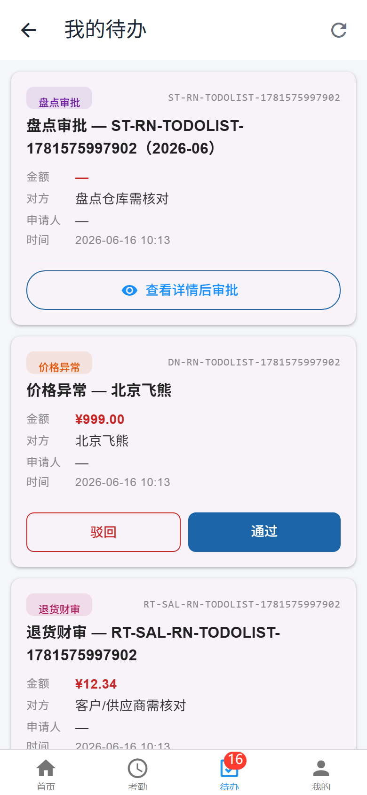
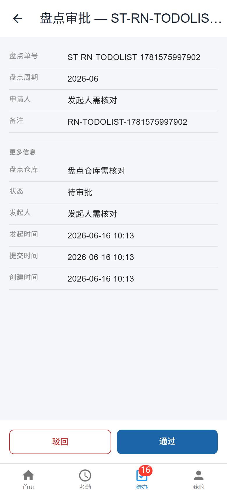
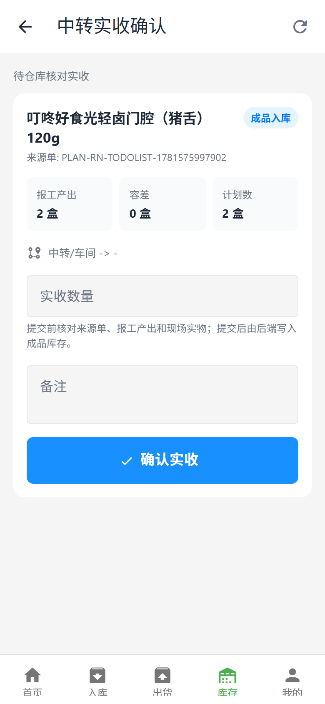
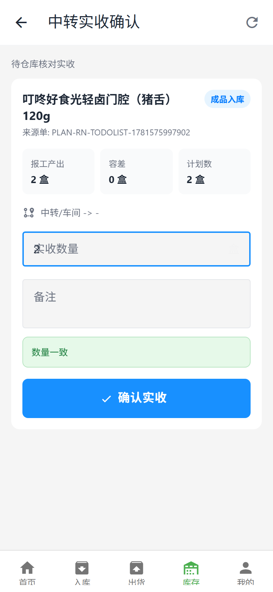
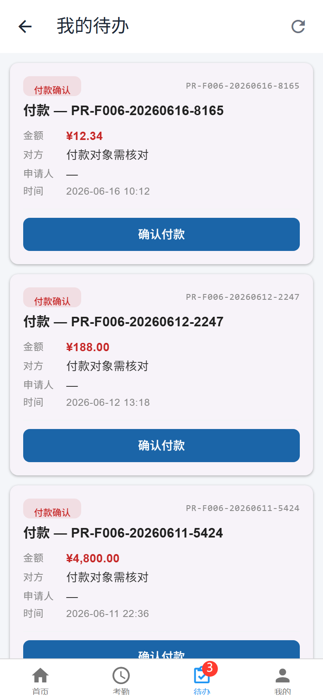
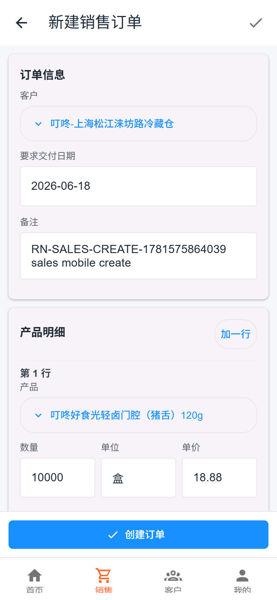

# F006 RN App 白话操作手册

版本: 2026-06-16  
对象: 六扇门 F006 一线员工、仓库、销售、采购、财务、出纳  
目标: 不懂系统的人，也能照着一步一步做  

## 0. 最重要的三句话

1. 手机 App 只做现场操作和简单审批。
2. 看不懂就不要点通过，先核对单号。
3. 金额、库存、付款、盘点，点错了会影响账和库存，所以必须慢一点。

## 1. 先认识底部菜单

打开 App 后，看屏幕最下面。

常见按钮:

- 首页: 看自己的工作入口。
- 待办: 财务、出纳、管理人员处理审批。
- 销售: 销售人员建销售单、看销售单。
- 采购: 采购人员建采购单、看采购单。
- 入库: 仓库收货。
- 库存: 仓库看库存、中转实收确认。
- 工序/报工: 生产人员报工。
- 我的: 退出登录、看账号信息。

如果你登录后看不到自己要用的按钮:

1. 先确认是不是登录错账号。
2. 退出重新登录。
3. 还是没有，就找管理员看权限。

不要自己乱点别的模块。

## 1.1 图文速查

培训时先看这几张图。员工不用记技术词，只要记住图上要看哪里。

### 财务待办列表

看这四个地方:

1. 左上角看类型，比如盘点审批、价格异常、退货财审。
2. 右上角看单号。
3. 中间看金额和对方。
4. 底部看按钮。能直接处理的会有“通过/驳回”；必须看详情的会有“查看详情后审批”。

看到“需核对”就先查详情，不要直接通过。

### 盘点详情

看这四个地方:

1. 盘点单号。
2. 盘点周期。
3. 盘点仓库。
4. 底部“通过/驳回”。

如果页面写“盘点仓库需核对”或“发起人需核对”，先找单号确认，不要直接通过。

### 仓库中转实收

看这五个地方:

1. 产品名称。
2. 来源单。
3. 报工产出。
4. 容差。
5. 实收数量输入框。

填数量前先到现场数货或称重。

填完后看绿色提示:

- “数量一致”: 可以确认。
- “差异在容差内”: 可以确认，但建议写备注。
- “差异超出容差”: 停止提交，找负责人确认责任。

### 出纳付款待办

出纳只看三件事:

1. 付款申请号。
2. 金额。
3. 付款对象。

如果显示“付款对象需核对”，先查付款申请明细。钱没付出去，不要点“确认付款”。

### 销售新建订单

销售保存前看四件事:

1. 客户。
2. 产品。
3. 数量。
4. 金额。

客户、产品、数量、价格有一个不对，就不要提交财审。

## 2. 登录怎么做

### 2.1 登录

1. 打开 App。
2. 输入账号。
3. 输入密码。
4. 确认工厂是 F006。
5. 点“登录”。

登录成功会看到首页。

如果登录失败:

- 提示密码错误: 重新输入。
- 一直转圈: 检查网络。
- 登录进去了但没有菜单: 多半是账号权限不对。

### 2.2 换账号

1. 点底部“我的”。
2. 点“退出登录”。
3. 回到登录页。
4. 输入新账号。

注意:

- 不要几个人共用一个账号。
- 仓库确认入库、出纳确认付款，必须用本人账号。

## 3. 财务怎么处理待办

财务每天先看“待办”。

### 3.1 进入待办

1. 用财务账号登录。
2. 点底部“待办”。
3. 看到“我的待办”列表。

每张卡片要看这些:

1. 左上角是什么类型: 采购财审、销售财审、退货财审、价格异常、盘点审批。
2. 右上角是什么单号。
3. 金额是多少。
4. 对方是谁。
5. 申请人是谁。
6. 时间是不是今天或你要处理的时间。

只要有一项看不懂，就不要点通过。

### 3.2 看到“通过”怎么点

适合这些:

- 采购财审。
- 销售财审。
- 退货财审。
- 价格异常。

操作:

1. 找到要处理的卡片。
2. 先看单号。
3. 再看金额。
4. 再看客户或供应商。
5. 都没问题，点“通过”。
6. 弹窗出来后，再看一遍单号、金额、对方。
7. 没问题，点“确认通过”。

成功后:

- 会提示成功。
- 这条待办会消失。
- 如果没有消失，下拉刷新。

不能点通过的情况:

- 对方显示“需核对”。
- 金额不对。
- 单号不认识。
- 备注没写清楚。
- 你只是觉得“应该没问题”，但没核对。

### 3.3 怎么驳回

如果单据有问题，就点“驳回”。

操作:

1. 点“驳回”。
2. 选择一个原因。
3. 如果选“其他”，一定要写清楚。
4. 点“确认驳回”。

驳回原因要这样写:

- “单价和合同不一致，请采购补报价。”
- “客户名称不对，请销售修改后重提。”
- “退货没有照片，请补现场照片。”

不要这样写:

- “不对。”
- “重做。”
- “有问题。”

## 4. 出纳怎么确认付款

出纳只做一件事: 钱真的付了，再在 App 里确认付款。

### 4.1 进入付款待办

1. 用出纳账号登录。
2. 点底部“待办”。
3. 找到“付款确认”。

### 4.2 点付款前要看什么

每张付款卡片先看:

1. 付款申请号，比如 `PR-F006-...`。
2. 金额。
3. 对方。
4. 时间。

如果对方显示“付款对象需核对”:

1. 不要直接点确认付款。
2. 先拿付款申请号去查明细。
3. 确认收款方是谁。
4. 确认银行付款对象一致。
5. 再回 App 点确认。

### 4.3 确认付款

1. 确认钱已经打出去了。
2. 找到对应付款卡片。
3. 点“确认付款”。
4. 弹窗里再看一遍金额和付款申请号。
5. 点“已核对并确认付款”。

成功后:

- 待办消失。
- 付款状态变成已付款。

绝对不要这样做:

- 钱还没付就点确认。
- 付款对象不清楚就点确认。
- 金额不一致还点确认。

## 5. 销售怎么建销售单

### 5.1 新建销售单

1. 用销售账号登录。
2. 点底部“销售”。
3. 进入销售订单列表。
4. 点“新建”。
5. 选择客户。
6. 选择产品。
7. 填数量。
8. 看单位对不对。
9. 看单价对不对。
10. 填备注。
11. 点“保存”。

成功后:

- 会生成销售单号，比如 `SO-20260616-0034`。
- 列表里能看到这张单。

如果保存不了:

- 没选客户: 先选客户。
- 没选产品: 先选产品。
- 数量是 0: 改成大于 0。
- 单价不对: 不要硬保存，先确认价格。

### 5.2 提交财务审核

1. 在销售列表找到刚才的销售单。
2. 打开它。
3. 看客户、产品、数量、金额。
4. 没问题，点“提交财审”或“确认”。
5. 等成功提示。

成功后:

- 销售单进入“待财务审核”。
- 财务的“待办”里会出现“销售财审”。

### 5.3 财务通过销售单

1. 财务登录。
2. 点“待办”。
3. 找到“销售财审”。
4. 看客户和金额。
5. 点“通过”。
6. 弹窗确认。

成功后:

- 销售单变成财务已审。

## 6. 采购怎么走到付款

采购流程比较长，按顺序来:

采购建单 -> 提交审核 -> 提交财审 -> 财务通过 -> 仓库收货 -> 发起付款 -> 出纳付款

### 6.1 采购建单

1. 用采购账号登录。
2. 点底部“采购”。
3. 点“新建采购单”。
4. 选择供应商。
5. 选择物料。
6. 填采购数量。
7. 看单位。
8. 填单价。
9. 填交货日期。
10. 填备注。
11. 点“保存”。

成功后:

- 会生成采购单号，比如 `PO-20260616-0004`。

### 6.2 采购提交审核

1. 打开采购单。
2. 看供应商。
3. 看物料。
4. 看数量。
5. 看金额。
6. 点“提交”。

业务审核通过后:

1. 再打开采购单。
2. 点“提交财审”。

成功后:

- 财务的“待办”里出现“采购财审”。

### 6.3 财务审核采购单

1. 财务登录。
2. 点“待办”。
3. 找到“采购财审”。
4. 看供应商和金额。
5. 没问题点“通过”。

成功后:

- 采购单变成财务已审。
- 仓库可以收货。

### 6.4 仓库按采购单收货

1. 仓库账号登录。
2. 点“入库”。
3. 找到采购收货。
4. 选择采购单。
5. 看供应商对不对。
6. 看物料对不对。
7. 看应收数量。
8. 填实收数量。
9. 有破损或少收，就写备注。
10. 点“提交收货”。
11. 再点“确认入库”。

成功后:

- 收货状态变成已确认。
- 原料库存增加。

不要确认的情况:

- 供应商不对。
- 物料不对。
- 实收数量没填。
- 现场有破损但没备注。

### 6.5 采购发起付款

1. 采购打开已财审的采购单。
2. 点“付款申请”。
3. 看付款金额。
4. 写付款说明。
5. 提交。

成功后:

- 出现付款申请号。
- 财务审核后，出纳会看到付款待办。

### 6.6 出纳确认付款

按第 4 章操作。

## 7. 仓库怎么做中转实收

这个很重要。

生产报工后，成品不会直接进成品库。仓库要先核对实收数量，再确认入库。

### 7.1 进入中转确认

1. 仓库账号登录。
2. 点底部“库存”。
3. 点“中转确认”。
4. 进入“中转实收确认”。

### 7.2 一张中转卡片怎么看

你会看到:

- 产品名称: 要入库的成品。
- 来源单: 这批来自哪个生产单。
- 报工产出: 车间说做出来多少。
- 容差: 系统允许差多少。
- 计划数: 原计划数量。
- 实收数量: 你要填这里。
- 备注: 不一致时写原因。

### 7.3 怎么填

1. 先看产品名称。
2. 再看来源单。
3. 再看报工产出。
4. 去现场数货或称重。
5. 在“实收数量”里填实际数量。
6. 如果数量不一样，在备注写原因。
7. 点“确认实收”。

成功后:

- 这张卡片消失。
- 系统把成品写入库存。

### 7.4 页面提示是什么意思

看到“数量一致”:

- 可以确认。

看到“差异在容差内”:

- 可以确认。
- 但最好写备注。

看到“差异超出容差”:

- 不要反复点。
- 先记录现场数量。
- 找生产、仓库、财务确认是谁的责任。
- 后面要走责任挂账或清账。

绝对不要:

- 没数货就直接填报工产出。
- 产品不对还确认。
- 来源单不对还确认。
- 超容差还一直点提交。

## 8. 财务怎么审盘点

### 8.1 进入盘点审批

1. 财务登录。
2. 点“待办”。
3. 找到“盘点审批”。
4. 点“查看详情后审批”。

### 8.2 审批前看什么

1. 看盘点单号。
2. 看盘点周期。
3. 看仓库。
4. 看发起人。
5. 看差异明细。

如果页面显示:

- “盘点仓库需核对”: 先确认仓库。
- “发起人需核对”: 先确认是谁发起。

这些没确认前，不要点通过。

### 8.3 通过或驳回

可以通过:

- 仓库确认清楚。
- 差异明细清楚。
- 备注清楚。
- 责任清楚。

必须驳回:

- 没有明细。
- 没有差异原因。
- 仓库不清楚。
- 发起人不清楚。

## 9. 财务怎么审退货

1. 财务登录。
2. 点“待办”。
3. 找到“退货财审”。
4. 看退货单号。
5. 看金额。
6. 看客户或供应商。
7. 看退货原因。
8. 有问题点“驳回”。
9. 没问题点“通过”。

如果看到“客户/供应商需核对”:

1. 不要直接通过。
2. 按退货单号查详情。
3. 确认对方是谁。
4. 再处理。

## 10. 财务怎么审价格异常

1. 财务登录。
2. 点“待办”。
3. 找到“价格异常”。
4. 看异常单号。
5. 看供应商或客户。
6. 看金额。
7. 看说明。
8. 有依据就通过。
9. 没依据就驳回。

必须驳回:

- 没写原因。
- 没报价依据。
- 金额明显不对。
- 对方不清楚。

## 11. 生产人员怎么报工

### 11.1 进入报工

1. 生产账号登录。
2. 点“工序”或“报工”。
3. 找到自己的任务。

### 11.2 填报工

1. 看产品。
2. 看批次。
3. 选择投入批次。
4. 填投入数量。
5. 填产出数量。
6. 需要照片就拍照。
7. 写备注。
8. 点“提交”。

成功后:

- 页面提示成功。
- 后台能看到报工记录。
- 后面要等仓库做中转实收，成品才入库。

不要提交:

- 批次不对。
- 数量为 0。
- 投入数量超过剩余数量。
- 该拍照没拍。

## 12. 常见报错怎么处理

### 12.1 “已被处理”

意思:

- 别人已经处理了这条待办。

你要做:

1. 点“知道了”。
2. 下拉刷新。
3. 不要再点。

### 12.2 “请填写实收数量”

意思:

- 仓库没有填数量，或填了 0。

你要做:

1. 重新数货。
2. 填大于 0 的数量。
3. 再确认。

### 12.3 “差异超出容差”

意思:

- 现场实收和报工数量差太多。

你要做:

1. 停止提交。
2. 记录实际数量。
3. 写备注。
4. 找负责人确认责任。

不要:

- 不要改成假数量。
- 不要重复点确认。

### 12.4 “付款对象需核对”

意思:

- App 没拿到供应商名字。

你要做:

1. 记下付款申请号。
2. 查付款明细。
3. 确认银行付款对象。
4. 再确认付款。

### 12.5 “客户/供应商需核对”

意思:

- App 没拿到客户或供应商名字。

你要做:

1. 记下单号。
2. 查详情。
3. 确认对方。
4. 再审批。

### 12.6 “盘点仓库需核对”

意思:

- App 没拿到仓库名字。

你要做:

1. 点详情。
2. 按盘点单号确认仓库。
3. 再审批。

## 13. 每天上班检查

### 销售

- [ ] 能登录。
- [ ] 能看到销售列表。
- [ ] 能新建销售单。
- [ ] 能提交财审。

### 采购

- [ ] 能登录。
- [ ] 能看到采购列表。
- [ ] 能新建采购单。
- [ ] 能提交财审。
- [ ] 能发付款申请。

### 财务

- [ ] 能看到待办。
- [ ] 能审采购。
- [ ] 能审销售。
- [ ] 能审退货。
- [ ] 能审价格异常。
- [ ] 能审盘点。

### 出纳

- [ ] 能看到付款待办。
- [ ] 能看到付款申请号。
- [ ] 能看到金额。
- [ ] 能确认付款。

### 仓库

- [ ] 能进“入库”。
- [ ] 能采购收货。
- [ ] 能确认入库。
- [ ] 能进“库存”。
- [ ] 能进“中转确认”。
- [ ] 能填实收数量。

### 生产

- [ ] 能看到任务。
- [ ] 能选批次。
- [ ] 能填投入。
- [ ] 能填产出。
- [ ] 能提交报工。

## 14. 哪些事情不要在手机上做

不要在手机上做这些:

- 大批量改资料。
- 大批量导入。
- 复杂财务凭证。
- 复杂成本分析。
- 复杂报表。
- 大批量调库存。
- 不清楚责任的超差处理。

这些留给电脑端或管理员处理。

## 15. 管理员排查顺序

员工说“我看不到”:

1. 看账号是不是对。
2. 看工厂是不是 F006。
3. 看角色权限是不是对。
4. 看这个单据有没有真的进入待办。
5. 看是不是已经被别人处理。
6. 看网络有没有问题。

员工说“我不敢点”:

1. 看界面是不是显示“需核对”。
2. 看单号是否清楚。
3. 看金额或数量是否清楚。
4. 看备注是否清楚。
5. 不清楚就不要让员工点，让负责人确认。

员工说“点了没反应”:

1. 截图。
2. 记下账号。
3. 记下单号。
4. 记下时间。
5. 刷新再看一次。
6. 交给研发查日志。

## 16. 本轮已经跑通的流程

2026-06-16 已经用 RN Web 和生产 API 跑通过:

- 销售建单 -> 提交财审 -> 财务通过。
- 采购建单 -> 财务通过 -> 仓库收货 -> 付款申请 -> 出纳确认付款。
- 销售财审。
- 退货财审。
- 价格异常。
- 盘点审批。
- 中转实收确认。

证据:

- `.playwright-mcp/codex-RN-SALES-CREATE-1781575864039/result.json`
- `.playwright-mcp/codex-RN-DEEP-1781575962692/result.json`
- `.playwright-mcp/codex-RN-TODOLIST-1781575997902/result.json`

## 17. 现在还不能吹的功能

这些先不要对客户说已经完整可用:

- 原料方向中转确认。
- 手机离线完整闭环。
- 手机系统推送通知。
- 手机端复杂凭证。
- 手机端大批量主数据维护。
- 多人同时写库存的压力场景。
