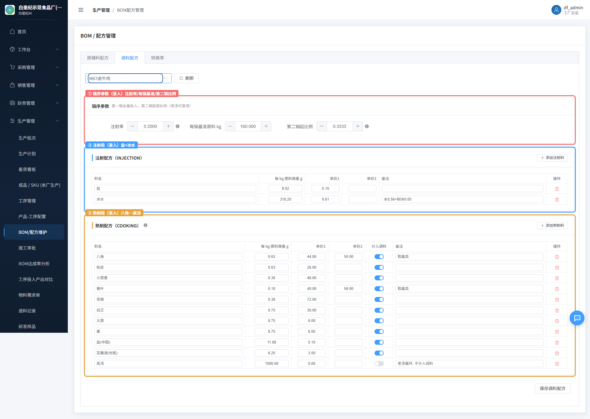
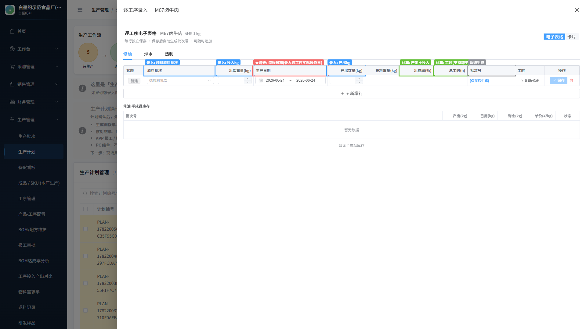
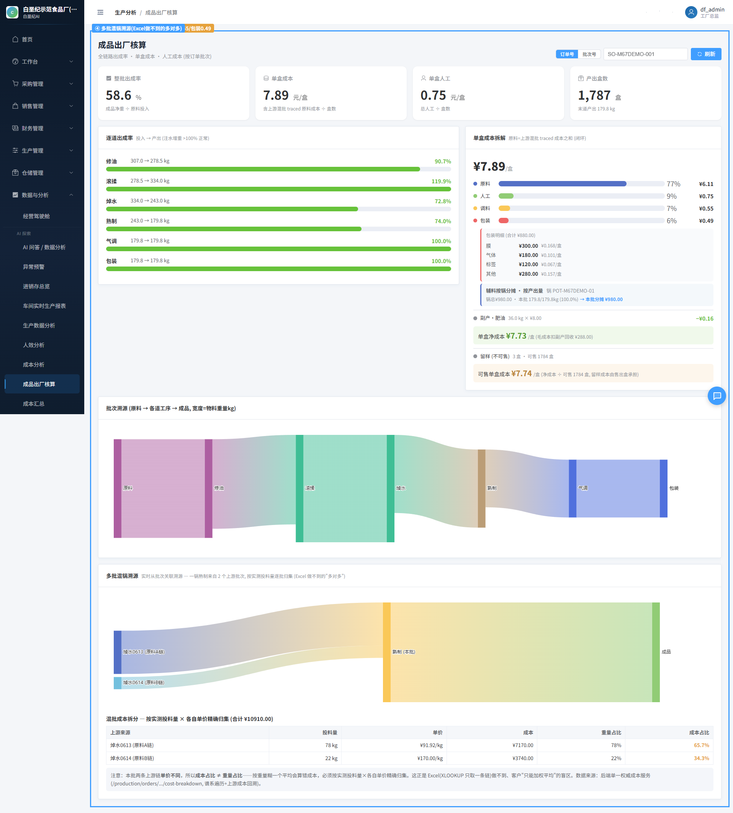

# 成本核算 — 完整操作流程指南

> 以「叮咚好食光轻卤澳洲和牛(M6-7)牛腱 100g」为例，演示从**配方录入 → 生产录入 → 单盒成本核算**的完整流程。
> 截图均为 prod 真实系统（DEMO 示范工厂，df_admin 登录）。

---

## 核心原则：哪些是「录入」，哪些是「计算」

客户在 Excel 里**手填配方 + 每批生产数据**，所有成本（调料 0.55/0.34、出成率、单盒成本）都是**公式算出来**的。系统完全照这个逻辑：

| | 录入（人填） | 计算（系统算） |
|---|---|---|
| **配方** | 注射/熟制调料、用量、单价、锅序比例、老汤是否计入 | 调料成本 元/kg（0.55 第一锅 / 0.34 第二锅起） |
| **主材** | 主材、单价 | 主材成本 = 单价 × 重量 ÷ 出成率 |
| **生产** | 每批：投入原料、锅数、逐锅量、产出、人工、**流程日期** | 出成率 = 产出÷投入；人工 = 工时×单价 |
| **结果** | — | **单盒成本** = (主材+调料+人工+包装) ÷ 盒数 |

---

## 第 1 步：配方录入 —— BOM「调料配方」

**路径**：生产管理 → BOM/配方维护 → 「调料配方」tab → 选产品

- **① 红框 锅序参数（录入）**：注射率 0.20、每锅基准 160kg、第二锅起比例 0.3333。这套定义「第一锅全量、第二锅起按 1/3」的锅序规则。
- **② 蓝框 注射段（录入）**：盐 9.02g/kg、冰水 318.2g/kg + 单价。
- **③ 橙框 熟制段（录入）**：八角/桂皮/小茴香/香叶/花椒/白芷/大葱/姜/盐/花雕酒/**高汤**，各填每kg用量 + 单价。
- **高汤「计入调料」开关关闭** → 老汤循环复用、**不计入成本**（红框标注）。

> 填完保存 → 系统按 `第一锅全量 + (n-1)锅×0.3333、老汤不计` 算出**调料成本 0.55/0.34 元/kg**（= 客户 Excel 汇总值，逐分一致）。这是「计算」项，不用人填。

---

## 第 2 步：生产录入 —— 逐工序电子表格（支持跨天）

**路径**：生产管理 → 生产计划 → 某计划「逐道录入」

- **修油 / 焯水 / 熟制** 三个 tab = 工艺链各道工序（对应 DAG 流程图）。
- **蓝框 录入**：原料批次（领料）、出库重量（投入kg）、产出数量（产出kg）。
- **★ 红框 跨天「流程日期」（录入）**：每道工序记**它实际操作那天**。焯水周一、熟制周三，各填各的日期 —— 成本就按真实日期归集，不是录入当天。
- **绿框 计算**：出成率（产出÷投入，自动算）、总工时（支持**跨午夜** 22:00→次日6:00 自动算 8 小时）。
- **灰框 系统生成**：批次号（保存后自动生成 CLK-…）。

> 多批生产：每批一行，投入不同原料量（703份/1080份/515份…），各自算出成率。熟制混锅（多批合一锅）走「上游来源」多选，按实测投料量×各自单价精确归集成本。

---

## 第 3 步：成本结果 —— 成品出厂核算（单盒成本）

**路径**：数据与分析 → 成品出厂核算 → 输入订单号

- **① 出成率（计算）58.6%** = 成品净重 179.8kg ÷ 原料投入 307kg。
- **② 单盒成本（计算）¥7.89/盒** = (主材+调料+人工+包装) ÷ 1787 盒。
- **③ 成本四拆**：原料 ¥6.11(77%) / 人工 ¥0.75(9%) / **调料 ¥0.55(7%)** / 包装 ¥0.49(6%)。调料 0.55 即第 1 步配方算出的值。
- 逐道出成率：修油 90.7% → 滚揉 119.9%(注水增重) → 焯水 72.8% → 熟制 74% → 气调/包装 100%。
- 包装明细（膜/气体/标签/其他）、副产·肥油回收 −¥0.16、留样 3 盒（可售 1784 盒）。
- **④ 多批混锅溯源**：一锅熟制来自 2 个上游批次（焯水0613 原料A 78kg×¥91.92 + 焯水0614 原料B 22kg×¥170），按实测投料量×各自单价**精确归集** —— 这是 **Excel(XLOOKUP 只取一条链) 做不到的「多对多」**，客户原来只能加权平均（会算错）。

---

## 与客户 Excel 的对应

| 客户 Excel | 系统 | 性质 |
|---|---|---|
| 注射配方 / 熟制配方表 | 第 1 步 调料配方 tab | 录入 |
| 注射成本 0.24 / 熟制 0.31 → 0.55/0.34 | 系统自动算 | 计算 |
| 订单批次（份数/原料重量/日期） | 第 2 步 逐工序录入（含流程日期） | 录入 |
| 出成率 55%~59% | 系统自动算 | 计算 |
| 当天单盒成本 | 第 3 步 单盒成本 | 计算 |
| ❌ 多批混锅（只能加权平均） | ✅ 按实测投料精确归集 | 系统优于 Excel |

**一句话**：客户手填的（配方 + 每批生产数据）系统都有录入口；客户用公式算的（调料成本 / 出成率 / 单盒成本 / 混锅分摊）系统全自动算出来，且混锅这块比 Excel 更准。跨天生产也支持（每道工序记真实操作日）。

---

## 补充：两个生产录入入口 + 完整性说明（审计后）

生产录入有**两个入口**，看场景选：

| 入口 | 覆盖 | 跨天 | 适用 |
|---|---|---|---|
| **逐道电子表格**（第2步截图） | 修油/焯水/熟制 3 道（快速逐行） | ✅ 流程日期列 | 快速逐道补录核心工序 |
| **逐道抽屉（全链）** | 半成品批(原料→焯水) + **成品批(熟制混锅→包装)** 完整链 | ✅ 每工序流程日期 | 录完整链到成品 + 盒数 |

> **要录完整链（含气调/包装/成品批）走「逐道抽屉」**；它现在每道工序也有流程日期，全链 + 跨天兼得。

**包装明细（膜/气体/标签/其他）** 不是每批录入，而是在**「产品-工序配置」**里配一次（`ProductWorkProcess` 成本配置），之后每批自动套用 → 成本结果里的包装明细就来自这。

**完整性活体验证（prod 实跑）**：一个完整批次（领料320kg → 熟制2锅 → 包装 + 三段人工）：
- 主材 2982.40 + **调料(经新BOM)136.55** + 人工 702 = 总 3820.95 ÷ 1750份 = **单盒 ¥2.18**
- **跨天**：修油成本归 6-18、熟制+包装归 6-19（一个批次的成本按各工序真实日期拆开）

→ 配方录入 → 全链生产录入（含包装、跨天）→ 单盒成本，**纯流程跑通**。
