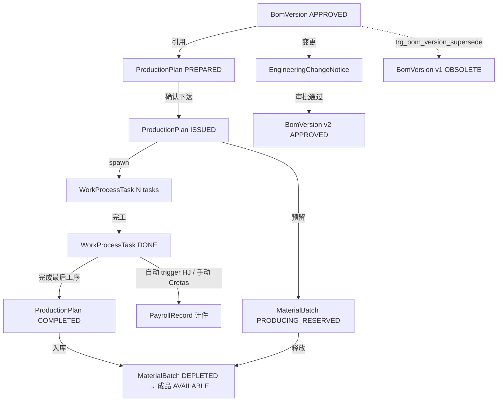
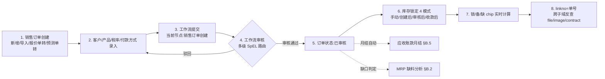
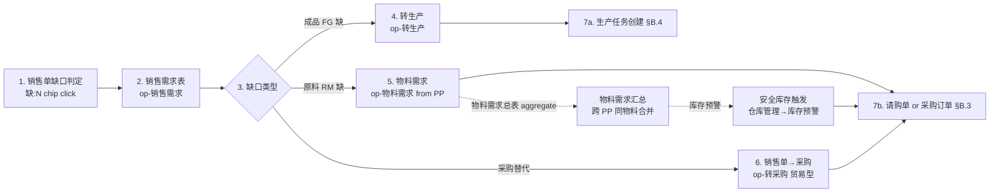
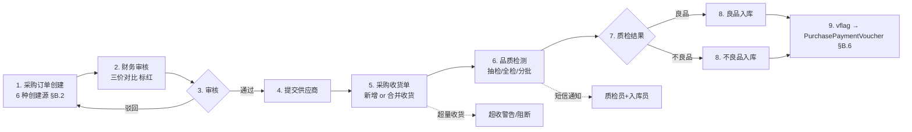
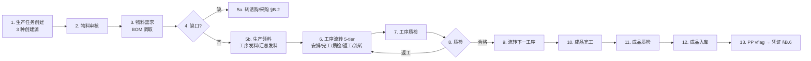
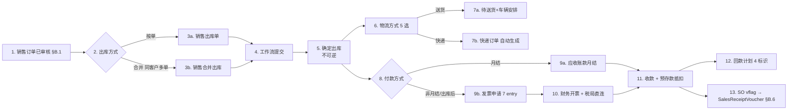
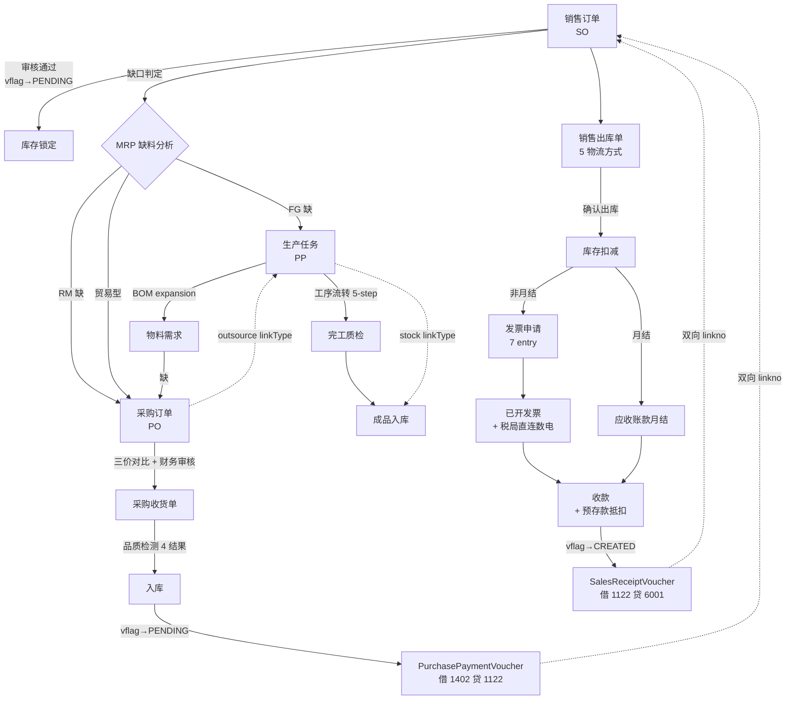

# 32 — HJ Deep Re-Audit V2 (R-HJ Round 12)

> **Audit chat**: organizer (本 session, 2026-05-19)
> **Trigger**: Steve "用 superpowers 审计, 深入 HJ 帮助手册 + 跨模块数据流 + 全 UI/UX"
> **Spec**: `docs/superpowers/specs/2026-05-19-round12-hj-deep-audit-design.md`
> **Plan**: `docs/superpowers/plans/2026-05-19-round12-hj-deep-audit.md`
> **Phase 1 captures**: `06-宏见测试账号深度审计/round12-snapshots/` (647 help articles + 9 PNGs + 7 live UI snaps + 1 full sub-menu inventory)
> **前置**: Round 11 (`31-DEEP-RE-AUDIT.md`, 3517 行) reconcile 完成

## 章节地图

| § | 域 | Agent | 行号 | 状态 |
|---|---|---|---|---|
| §A | HJ 帮助手册官方业务定义 (12 模块 chapters + 字典 + 状态机) | X1 | TBD | pending |
| §B | 5 大 chain 端到端数据流 (sale → MRP → PO → receive → prod → ship → invoice → vflag) | X2 | TBD | pending |
| §C | 生产 + BOM + ECN 数据流 (BOM → MRP → WIP → ECN + 工序条件路由 + SOP) | X3 | TBD | pending |
| §D | RBAC + 审批数据流 (1591 f_no + 126 工作流 + SpEL + 流转规则) | X4 | TBD | pending |
| §E | ≥5 大 design pattern 反向工程 (jsPlumb/floating menu/sticky footer 等) | X5 | TBD | pending |
| §F | 销售话术库 (HJ vs Cretas 5+ 对比场景) | organizer | TBD | pending |
| §G | Cretas 改进 backlog (新增 ↔ 31-doc §P 补充) | organizer | TBD | pending |

---

## 输出 conventions

每 section template:
```
## §X.Y [topic] — [一句话总结]

### HJ 实测细节 (Round 12 fresh capture, 引用 round12-snapshots/...)
- 入口: URL pattern / 模块路径
- button list / 字段 list / 枚举值
- 状态 + 触发链
- 数据流图 (mermaid 或 ASCII)

### 帮助手册 official 引用 (round12-snapshots/help-articles/<id>.md)
- 章节 + 关键句

### Cretas 对比 (grep main, multi-synonym per 31-doc §O.16 教训)
- ✅/⚠️/❌ 字段对照

### 反向工程 (技术栈 / 数据结构 / API 形态)

### Cretas 改进建议
- 新增 backlog item ↔ 加 31-doc §P 补充表第 N 行
```

字段对照标记: ✅ SHIPPED · ⚠️ PARTIAL · ❌ NOT DONE · 🟡 IN-FLIGHT · 🔵 已有基础待优化 · ⭐ 高价值 · 🚨 客户痛点 · 💡 反工程 finding

---

<!-- Agents append below. Agent X1 → §A. X2 → §B. X3 → §C. X4 → §D. X5 → §E. organizer → §F+§G -->

<!-- agent-X1 START -->

# §A — HJ 帮助手册官方业务定义 (12 模块)

> **Source**: `06-宏见测试账号深度审计/round12-snapshots/help-articles/` (647 articles 含 path/id/url/body, 1.8MB)
> **Method**: 每模块 read 关键 chapter intro + entity definition + parameter setting articles, 然后 cross-grep `backend/java/cretas-api/src/main/java` 对照 Cretas 实际现状
> **Cross-grep verify**: 客户 / vflag / decisionType / BOM / 工作流 4 大关键概念皆 verify

## 总体观察 — HJ 帮助手册 vs Cretas 文档

| 维度 | HJ | Cretas |
|---|---|---|
| 客户面 docs 域 | `help.hongjian.com` 独立子域 (14 chapters / 780 articles / 更新到 2026-02-05) | 无 (内部 docs 仅在 git) |
| 章节字体规范 | 蓝色 = 超链接跳转 / 红色 = 注意事项 (一致性 conventions) | 无 |
| 在线搜索 | 顶部 "搜索关键词、字" | Wiki 无搜索 |
| 客服反馈入口 | 帮助手册首页 footer + 跑马灯 + 错别字反馈 | 无 |
| 章节级"操作步骤"叙述 | 每 article ①②③④ 编号化 + 截图标记 (e.g. 销售订单 article 20170707093305424 含 ⑦个标记) | 无 |
| 跨模块超链接 | 蓝色 link 跳关联功能 (e.g. 销售出库 → 仓库管理 同一份 article) | 内部 wiki 无 |

**核心结论**: HJ 把 ERP 当 product 卖, docs 跟产品同步更新, 蓝色超链接 = 跨模块教学; Cretas 把 ERP 当 dev tool 用, 客户面 docs gap 巨大. **客户面 in-app help center 是 Cretas 紧迫缺口** (新 backlog C-HELP-CENTER-1 P2).

---

## §A.1 客户管理 (CRM) — 14 chapters 第 2 位, ~55 sub-menus

### 核心实体 (per help articles)

- **个人客户 (Personal Customer)** — article `20170707093134307`: "以个人的名义下订单的客户", 例 张三向怡宝买矿泉水
- **公司客户 (Company Customer)** — article `20170707093159654`: "以公司名义下订单的客户", 例 富士康向怡宝买矿泉水
- **公司联系人 (Contact Person)** — `20200123115157045`: 挂在公司客户下, 销售订单可选
- **跟踪记录 (Tracking Record)** — `20240129093652199`: 业务员沟通记录, 关联回收逻辑
- **公海客户 (Public Pool)** — `20171228163934074`: "在一定时间内未跟进的客户放入公共区域, 自由分配或抢单"
- **客户信用 (Credit)** — `20200116090632217`: 信用额度 / 欠款金额 / 日期
- **客户变更审核** — `20220830155718867`: 关键字段改了走审批
- **客户特殊授权** — `20251029095910230`: 单客户级别的访问权限

### 字段字典 (HJ official 枚举值 — verify Round 11 推测)

| 字段 | HJ official 枚举 | Cretas 现状 |
|---|---|---|
| 客户分类 | 个人 / 公司 / 公司联系人 (3 类) | Cretas: `businessType` / `customerType` 字段并存 (`Customer.java:57-62`) |
| 跟踪状态 (per `20190812095122367` CRM参数设置) | 必填 / 选填 (CRM参数设置 ①②) — 实际选项由"标准枚举维护"+"简单枚举维护" runtime 配置 | Cretas `CustomerStatus.java` 11 阶段固定 enum (LEAD / INITIAL_CONTACT / SAMPLE_SENT / QUOTING / NEGOTIATING / SIGNING / RECURRING / INACTIVE / LOST / BLACKLIST / RECOVERED) — **vs HJ 设计差异**: HJ 用 runtime 枚举 (factory 可改), Cretas hardcode enum |
| 跟进方式 | 必填 / 选填 (枚举维护) | Cretas 待 verify |
| 客户来源 | 必填 / 选填 (`20230908093259796` 客户来源配置) — 用户自定义 dropdown | Cretas 待 verify |
| 公司客户重复标识 | 4 档 (允/不允 × 与个人客户允/不允) | Cretas 无此防呆 |
| 手机号校验 | 11 位 / 不限格式 (per `20190812095122367`) | Cretas 待 verify |
| 客户类型 (per `20210129180216880`) | 用户自定义, 用于价格设置 | Cretas: 单独 `customerType` 字段, 无类型管理 UI |

**关键 finding 1 (Round 11 vs Round 12)**: Round 11 推测 客户状态 8 档 / baseline 估 11. **真相: HJ 没有固定 8 / 11 档** — HJ 用 "标准枚举维护" + "简单枚举维护" + "客户来源配置" 让 factory runtime 配置自己的状态码. Cretas 11-阶段 hardcode enum 是 **过度结构化** vs HJ flexibility, 但 cretas hardcode 在分析报表上更稳定. 没有谁对谁错, **架构选择不同** — Cretas 应在 11-阶段框架上加 customer-level free-form "标签" 字段 (新 backlog S-CRM-CUSTOMTAG-1 P3).

### 状态机 official

无明确文档化状态机. 仅从 CRM 参数设置推 implicit 转换:
- 新建 → 公海 (自动回收, 几日未跟踪) → 抢单 → 业务员持有
- 持有 → 几日未跟踪 → 自动回收公海 (`不启用` / `启用` 两档配置, 上限 99999999)
- 公海 → 申请 → 公海客户领取 (`20171228163934074`)

### 触发规则 official

- "几日未跟踪自动回收公海" — `20190812095122367` 个人 / 公司客户单独配置
- "客户变更审核" — 关键字段 (公司名 / 客户来源等) 改值时触发工作流 (`20220830155718867`)
- "客户负责人变更通知原负责人" — 通知 / 不通知 2 档
- "公司客户名称重复检测" 4 档 (per CRM参数设置)

### 关键 finding (Round 12 vs Round 11)

1. **客户状态架构差异 (HJ runtime 配置 vs Cretas hardcode 11)** — 上面已覆盖
2. **CRM参数设置 `20190812095122367` 是 6404 字节巨型 article**, 含 ~30 个 factory-level 配置项. Cretas `CRMSettings` entity 待 audit, 估覆盖 5-8 项
3. **客户名单限制设置 `20171228183219654` 1643 字节** — 详细限制每业务员每天最大量 / 持有量 (上限 99999999), Cretas 无此功能 → 新 backlog S-CRM-QUOTA-1 P2

---

## §A.2 销售管理 — 14 chapters 第 3 位, ~80 sub-menus

### 核心实体 (per help articles)

- **销售订单 (Sales Order)** — `20170707093305424` 6051 字节: "ERP 始发点 (承上启下), 任何订单的起始都源于销售订单"
- **销售出库 (Sales Delivery)** — `20170707093329975` 3925 字节: 销售出库 / 销售合并出库 (同客户多订单合并)
- **报价单 / 精细报价单** — `20171229103217362`: 2 维度形态
- **报价试算 (Quote Trial Calc)** — `20190809172755012`: **Round 11 漏抓** — 客户先试算后正式报价 (差异化功能)
- **销售退货** — 3 种: 关联订单退货 / 销售退货入库 / 客户退货入库 (主动)
- **业绩管理** — `业绩统计口径` (`20191223101331249`) 含独立配置 + 提成类型
- **回款计划** — `20180622173001703` 2322 字节: 分期回款, 关联应收账款
- **销售预测单 (Forecast)** — `20210128173729196` 3754 字节: 独立 entity
- **销售月结对账单 + 月结对账异常** — `20210129100143370` 异常专列

### 字段字典 — 销售订单 (per `20170707093305424`)

| 字段 | HJ official | Cretas 现状 |
|---|---|---|
| 单据编号 | 自定义生成规则 (per 编号规则配置) | Cretas: 待 verify, 估硬编码模板 |
| 支付方式 | 系统默认 + 用户自定义 | Cretas `paymentTerms` String 字段 |
| 锁定库存类型 | 4 类 (手动锁定 / 创建后锁定 / 审核后锁定 / 收款后锁定) — 销售参数设置 | Cretas: `SalesOrder.java` 含 vflag, 未 verify 锁定 4 类 |
| 显示列表版本 | 3 版本 (标准 / 简易1按订单 / 简易2按产品) | Cretas Vue admin: 单 list 视图 |
| 备/缺/锁 3 状态指标 | 缺(待备货) / 备(已转 BOM 未入) / 锁(已锁库存) — article 第4节 | Cretas: 待 verify `备/缺/锁` 实现 |
| 列表表头自定义 | 仅简易列表1/2 支持, 标准列表不支持 (article 第3节) | Cretas: vxe-table 全列自定义 |

### 状态机 official (销售订单)

```
新建 → 提交工作流 (审批) → 审核通过 → 销售出库 → 出库工作流 → 完成出库 → 月结对账 (if 付款方式 = 月结) → 应收账款
                                          ↓
                                       退货流 (3 类)
```

**注意 (article line 33-34)**: "点击确定完成出库单出库之后订单将不可修改, 在确定出库时, 一定要仔细核查出库单的准确性, 如有发现错误, 应及时点击驳回订单, 进行修改再进行出库" — UI 强约束。

### 触发规则 official

- 出库后 if 付款方式 = 月结 → 自动 insert 销售月结对账单
- 出库时 if 出库方式 = 送货 → 自动出现在 "待送货列表"
- 出库时 if 出库方式 = 快递 → 自动生成快递订单 (per 销售出库 article)
- 出库后 短信通知 (可配置)

### 关键 finding

1. **报价试算 `20190809172755012`** — **Round 11 完全漏抓**, 客户能先试算后正式. Cretas 缺. 新 S-QUOTE-CALC-1 P2
2. **简易列表 1/2 仅这俩支持自定义列, 标准列表不支持** — 暴露 HJ 历史架构债 (老视图 vxe 表头 baked), Cretas 全列自定义是 cleaner 设计
3. **3 种退货流** (关联订单 / 销售退货入库 / 客户退货入库) 远复杂于 Cretas P3-RETURN — `20190812095710918` 3701 字节专讲关联订单退货. Cretas 待 verify 是否支持客户主动退货

---

## §A.3 采购管理 — ~40 sub-menus

### 核心实体 (per help articles)

- **采购订单 (Purchase Order)** — `20170717101516758` 1933 字节: 6 种创建方式 (直接新建 / 请购单 / MRP / 销售单转采购 / 库存预警 / Excel 导入)
- **请购单 (Requisition)** — 独立 entity, 可"请购汇总"
- **询价单 / 内部询价单 (Inquiry / Inter-company Inquiry)** — 内部询价是 **跨公司询价** (B2B 协同), Cretas 缺
- **采购收货单 + 采购质检 + 采购入库** — 三段式 (HJ 走 收货 → 质检 → 入库 流, vs Cretas 待 verify)
- **采购退货出库** — 独立 entity
- **供应商管理 + 供应商价格 + 供应商评级** — 3 实体
- **国际贸易代理商管理** — Cretas 跳 (不抄)
- **协同管理 (Cooperation)** — `Round 11 missing` 供应商设置 + 打印设置 (B2B 协同)
- **采购月结对账单 + 采购月结统计表 + 客户对账日期** — F-PERIOD-1 直接证据

### 字段字典 (per `20170717101516758`)

| 字段 | HJ official | Cretas 现状 |
|---|---|---|
| 采购单类型 | 正常采购 / 进口采购 (2 类) | Cretas: 待 verify |
| 编号规则 | 自定义 (per 编号规则配置) | Cretas 待 verify |
| 付款方式 | 系统默认 + 自定义 | Cretas `paymentTerms` |
| 跟单人员 | 选完供应商自动带出 (供应商管理预设) | Cretas: 待 verify |

### 状态机 official

```
请购单 → 请购汇总 (可批) → 采购新建 → 工作流审批 → 通过 → 采购收货 → 采购质检 → 入库
       ↑                              ↓
     MRP 物料需求                   退货 → 采购退货出库
       ↑
     销售单转采购 (适用贸易型)
       ↑
     库存预警直接采购
```

### 触发规则 official

- 销售订单 "缺" → 销售需求 → 转采购 (vs 转生产)
- MRP 物料需求总表 BOM-driven, 缺口红底白底
- 库存预警 (低于安全库存) → 自动开单
- 选完供应商自动带出跟单人员 (per 供应商管理)

### 关键 finding

1. **6 种创建采购单方式** 远比 Cretas 1-2 种丰富 (Cretas 仅手动 + Excel import, 缺 MRP / 销售转 / 库存预警 / 内部询价)
2. **内部询价单** = B2B 跨公司询价, Cretas 完全无 (跳, 不抄)
3. **协同管理 (供应商设置 + 打印设置)** — B2B 协同模块, Cretas 跳 (P3 considered)
4. **采购质检独立列表** vs Cretas: 待 verify 是否独立单/合并入采购入库

---

## §A.4 仓库管理 — ~35 sub-menus

### 核心实体 (per help articles)

- **库存查询 (Inventory Query)** — `20190613142135532` 1547 字节: 含 锁定库存 / 进出流水 / 明细 (按仓库核算)
- **入库单 (Inbound)** — `20170717110326130`: 17 类入库源 (销售退货 / 寄卖退货 / 售后配件退回 / 采购良品 / 采购不良品 / 生产余料 / 生产废料 / 生产成品 / 生产不良成品 / 生产边角料 / 设备配件退回 / 委外余料 / 委外成品 / 客户退货 / 组装入库 / 拆卸入库 / 样品退货 / 其他入库)
- **出库单 (Outbound)** — `20170717110000918`: 18 类出库源 (销售出库 / 销售合并出库 / 寄卖出库 / 售后配件 / 采购退货 / 供应商退货 / 生产领料 / 生产汇总领料 / 生产补料 / 设备配件 / 委外发料 / 委外成品退回 / 组装出库 / 拆卸出库 / 售后配件出库 / 报废单出库 / 样品出库 / 其它出库)
- **仓库管理 (Warehouse)** — `20170717105138942`: 仓库属性 = 良品 / 不良品 (UI 强约束), 仓库管理员关联工作流程序控制
- **仓位管理 (Bin)** — bin-level (仓位)
- **仓库调拨** — 独立 entity
- **报废单** — `Round 11 partial`, Cretas P3-RETURN partial
- **序列号 (Serial)** — Round 11 missing: 序列号追踪 / 列表 / 统计报表 3 entity
- **箱号 (Box)** — 箱号列表 / 箱号追踪 2 entity
- **库龄报表 (Aging)** — `20240202115752709`: 简短 — "范围时间内的库存情况以及对应的库存总价值"
- **组装产品 / 拆卸产品** — Cretas 无 (跳)
- **线边仓 (Lineside)** — `20230608120041180` 跟仓库的 库存查询 article 几乎一致, 独立的"生产线边仓"

### 字段字典 (per 入库单/出库单)

| 字段 | HJ official | Cretas 现状 |
|---|---|---|
| 入库源类型 | 17 类 (列举 above) | Cretas: 待 verify, 估覆盖 8-10 类 |
| 出库源类型 | 18 类 (列举 above) | Cretas: 待 verify |
| 仓库属性 | 良品 / 不良品 (强约束, 不良入库必须不良品库) | Cretas: 待 verify `Warehouse.attribute` |
| 锁定库存类型 | 多类 (per 库存查询解锁界面 "对应这个产品被锁定到了哪些单据上面") | Cretas: 待 verify lock tracking |
| 最后变动时间 | 列表上最后一次变动, 非明细每次出库 (article 警告) | Cretas: 待 verify |

### 状态机 official (库存)

无显式状态机. 流转记录 = 进出流水 (`流水查询`):
```
入库 → 库存 (可锁定 → 解锁) → 出库
              ↓
           调拨 → 另一仓库
              ↓
           盘点 (盘点报表)
              ↓
           报废 (报废单出库)
```

### 触发规则 official

- 不良品入库必须选择不良品属性的仓库 (UI 强约束)
- 锁定库存 → 其他订单无法出锁定份额
- 删除库存会清空进出流水 (article 红字警告)
- 调拨双向更新 (源-目标仓库)

### 关键 finding

1. **18 类出库 / 17 类入库** 是 ERP 历史包袱 (寄卖 / 委外 / 组装 / 拆卸 / 借出借入 Cretas 全跳), Cretas 估覆盖 8-10 类 → 适合 audit
2. **库存锁定 4 类** (per 销售订单 article — 手动 / 创建后 / 审核后 / 收款后) — 仓库 article 警告"对应这个产品被锁定到了哪些单据上面" 暗示 lock_source 表存在
3. **序列号 / 箱号 追踪** Round 11 完全 missing — 新 W-SERIAL-1 P2 + W-BOX-1 P3
4. **线边仓 (生产线边仓)** Cretas 全无 — 制造企业刚需, 新 M-LINESIDE-1 P2

---

## §A.5 财务管理 — ~75 sub-menus (最大模块)

### 核心实体 (per help articles)

- **凭证 (Voucher)** — `20180126164529016` 录凭证: 摘要 + 会计科目 + 辅助核算 + 借贷金额 (强约束 借贷平衡)
- **凭证字 (Voucher Word)** — `20180126165720863`: factory 自定义 (e.g. 记 / 收 / 付 / 转), **Round 11 缺直接证据 — Round 12 article verify**
- **科目设置 (Account Subject)** — `20170719104850331` 1101 字节: 一级 / 二级科目, 含 4 属性 (辅助核算 / 数量核算 / 外币核算 / 现金及现金等价物)
- **辅助核算 (Auxiliary Accounting)** — `20230111164025518` (HJ official 真实定义): **6 类** (客户 / 供应商 / 职员 / 部门 / 项目 / 存货) — vs **organizer 已抓 7 类** (客户/供应商/部门/职员/项目/存货/委外商 — 包含委外商)
- **凭证模板 (Voucher Template)** — `20230111164226866`: "提前录入凭证的模板, 简化录入凭证操作"
- **应收账款月结 (AR Monthly Close)** — `20170717111416335` 1567 字节: 3 数据源 (销售月结自动生成 / Excel 导入 / 手动) + 收款 + 预存款抵扣
- **应付账款 (AP)** — 同 AR 形态
- **结账 / 反结账** — `20170717111334478`: 结账 = 总结某会计期间财务收支, **强约束**: 未生成凭证的收支明细对应月份, 本月禁止结账
- **资产负债表** — `20180201103956126`: 自定义公式 + 新版按期 / 旧版全期通用
- **利润表** — `20180207104959878`: 自定义公式
- **现金流量表** — `20180207105016418`: 必须对相关科目开启"现金及现金等价物"标识, 然后 报表调整 设置 现金流量项目
- **客户对账日期 / 供应商对账日期** — S-PAYMENT-DATE-1 + supplier 版本直接证据
- **预存款 (Pre-deposit)** — 客户 / 供应商 / 委外商 3 类
- **固定资产** — 9 sub-items (Round 11 missing) — 管理 / 领用 / 折旧 / 分类 / 位置 / 盘点 / 报表 / 批量修改 / 我的
- **汇率管理** — 多币种支持
- **付款申请单 / 退款申请单** — 独立 entity

### 字段字典 — vflag 状态 (Cretas vs HJ verify)

| 维度 | HJ 实测 (UI snapshot `round12-voucher-list.md`) | Cretas |
|---|---|---|
| 审核状态 (维度 1) | `--请选择--` / 未审核 / 已审核 (3 档 dropdown) — per `round12-voucher-list.md` line 167 | Cretas `VoucherStatus.java`: DRAFT / POSTED / VOID (3 档但 VOID 是显式废弃, 不在 HJ filter 选项) |
| 异常状态 (维度 2) | `--请选择--` / 无异常 / 有异常 (3 档 dropdown) — per `round12-voucher-list.md` line 167 | Cretas: 无对应字段 — **gap** |
| 业务单上的 vflag | UI 实际 column 列表为 "凭证字 / 日期 / 摘要 / 科目 / 借方 / 贷方 / 制单人 / 凭证状态 / 操作" (line 173) — **没有显示 4 维 state** | Cretas `VoucherFlag.java`: 4 档 UNCREATED / PENDING / CREATED / FAILED + state machine (UNCREATED→PENDING→CREATED, PENDING→FAILED→PENDING retry loop) |

**关键 finding (vflag 真相)**:

- **Round 11 推测 4 状态** (未/已生成/已审/已过账) — **WRONG**. UI 实测只显示 2 维度 dropdown (审核状态 + 异常状态), 各 3 档 (含"请选择"), 业务单上的 `凭证状态` column 是单值字段, **不是 4 状态**
- **Cretas 设计差异**: Cretas 分 2 个 enum — `VoucherFlag` 标在业务单上 (UNCREATED→PENDING→CREATED→FAILED, 4 档异步生成状态机), `VoucherStatus` 标在 Voucher 本身 (DRAFT→POSTED→VOID, 凭证自身生命周期) — **这是好设计**, 比 HJ 单一字段更明确
- Cretas 缺 HJ 的 "异常状态" 维度 — 新 backlog F-VOUCHER-ANOMALY-1 P3 (Cretas 可加, 但优先级低)

### 状态机 official (凭证)

```
录凭证 (摘要 + 科目 + 辅助核算 + 借贷) → 保存 → 草稿
                                           ↓
                                  审核 (需对应权限) → 已审核
                                           ↓
                              生成凭证 (业务单触发自动 / 手动)
                                           ↓
                                  反审核 (需对应权限) → 草稿
                                           ↓
                                  作废 → VOID (Cretas only, HJ 无显式 VOID)
```

### 状态机 official (结账 — per `20170717111334478`)

```
当月所有收支明细 → 全部生成凭证 → 结账 (生成结转凭证) → 结转到下一期
                                            ↓
                                     资产负债表 自动产生数据
                                            ↓
                                     反结账 (需反结账权限)
```

**强约束**: 未生成凭证的收支明细对应月份, 本月禁止结账.

### 触发规则 official

- 业务单 (销售 / 采购 / 退货 / 调拨 / 报废 / 工资) 触发自动 voucher 生成 (event-driven, Cretas 已实现 7 类 listener)
- 结账失败 if 未生成凭证 (HJ 强约束)
- 现金流量表自动 if 科目开启"现金及现金等价物"
- 模板生成自动带 现金流量项目 (预置)

### 关键 finding

1. **辅助核算 6 类 vs 7 类** — HJ help article `20230111164025518` 写 6 类 (客户/供应商/职员/部门/项目/存货), organizer 已抓的 7 类含 "委外商". 推测: HJ 帮助手册 article 是老版 (article 2023-01 写), UI 已加 委外商 → article 没更新. **Cretas 应支持 7 类**
2. **3 报表 (资产负债 / 利润 / 现金流量)** 都支持 self-defined 公式 — 这是 ERP 财务模块的标准设计, Cretas 应 audit 是否支持公式编辑 UI (Round 11 已知 F-3REPORT-1 直接证据, Cretas 待 verify 公式 editor)
3. **Cretas VoucherFlag 4 档 state machine + VoucherStatus 3 档** 比 HJ 单一字段更明确, **Cretas 设计赢 HJ 一筹** — 不需改

---

## §A.6 生产管理 — ~95 sub-menus (最复杂模块)

### 核心实体 (per help articles)

- **生产任务管理 (Production Plan)** — `20170720143046645` 1813 字节: 3 种创建方式 (销售订单转生产 / 手动新建 / Excel 导入)
- **生产任务预备 (Plan Prep)** — Round 11 已知 M-PREP-1
- **生产计划 (Plan Schedule)** — `20170721111519874`: 计划日期 + 数量
- **物料需求 (MRP)** — `20170720143046645` 第二段: 根据 BOM 调取, 缺料标红
- **生产领料** — `20180110145542706`: 工序发料 / 汇总发料 / 补料 / 其他领料 (4 类) + 生财务凭证
- **生产工序流转 (Process Flow)** — `20170721114049576`: 安排 → 完工 → 质检 → 流转下一工序 (强约束: 上一工序未流转, 下一工序无法安排)
- **成品完工 (Finished Completion)** — 批量入库
- **成品质检 + 工序质检** — 独立 entity
- **工序流转追踪** — 5 sub-entity (流转 / 安排列表 / 扫码流转 / 追踪 / 我的)
- **生产装箱 / 生产混装** — 装箱管理 entity
- **物料需求总表 (按天)** — M-MATTREE-1 完整 3 sub (按天 / 总表 / 总表-时间)
- **在制品 (WIP)** — 6 sub (库存查询 / 工序查询 / 入库 / 出库 / 调拨 / 盘点) — M-WIP-1 完整
- **计件工资 / 计时工资** — 8 sub (H-WAGE 集成)
- **设备管理** — 8 sub + 4 个 personal views (Round 11 missing)
- **模具管理** — 11 sub (Round 11 deferred)
- **工序排期 + 自动排产** — M-APS-1 P2 候选
- **线边仓 + 线边仓库管理** — Cretas 全无
- **电子作业指导** — SOP 模板 (C-VOUCHER-TPL-1 sister)
- **超领料分析表 + 物料评估 + 生产边角料入库** — Round 11 partial

### 字段字典 (per 生产任务 + 工序流转)

| 字段 | HJ official | Cretas 现状 |
|---|---|---|
| 任务来源 | 销售订单转 / 手动 / Excel 导入 (3 种) | Cretas 待 verify |
| 物料缺口标识 | 缺(红底) / 库存满足(白底) | Cretas: 待 verify |
| 领料方式 | 工序发料 / 汇总发料 / 补料 / 其他 (4 类) | Cretas: 待 verify (估只支持 汇总 + 工序) |
| 工序状态 | 安排 → 完工 → 质检 → (返工) → 流转 (5 阶段) | Cretas `ProcessTaskStatus.java`: 待 verify |
| 质检良品/不良品/返工 | 3 类数字 | Cretas: 待 verify Q-PROCESS entity |
| 自动审核 | 物料审核可设自动 (per 生产任务 article) | Cretas: 待 verify 自动审核 |

### 状态机 official (工序流转)

```
工序 N: 安排 (员工/数量) → 提交 → 工序完工 (录入数量+员工带班次) → 质检 (良品/不良品/返工)
                                                                          ↓
                                                                  有返工: 返工 → 工序完成 → 工序质检
                                                                          ↓
                                                              流转下一工序 (强约束: 未流转, 下一道无法安排)
                                                                          ↓
                                                       下一道工序负责人: 接收流入 → 重复 安排→完工→质检→流转
                                                                          ↓
                                                                 全工序完成 → 成品质检 → 成品入库
```

**强约束 (article 红字)**: "没点击流转下一工序, 下一道工序点击安排的时候就会出现这样的提示" — UI 错误提示明确.

### 触发规则 official

- 销售订单 "缺" → 销售需求 → 转生产 → 自动生成生产任务
- 销售订单 "缺" 也可转采购 (per 采购管理 article)
- 物料审核自动 if 配置
- 工序流转强约束 顺序 (无法跳过)
- 完工时员工选择 → 自动带班次 (per 工序流转)
- 成品入库 → 关联仓库 (per 入库单 "生产成品入库" 类型)

### 关键 finding

1. **生产管理 ~95 sub-menus** 是最大单一模块, Cretas 已 ship 大量 (M-WIP / M-PREP / M-DELIVERY-WARN / M-MATTREE 等), 主要 gap 集中在: 模具管理 (11 sub) / 计件工资 (8 sub) / 设备管理 (8 sub) / 自动排产
2. **工序流转 5 阶段 + 强顺序约束** — Cretas 待 audit `ProcessTaskStatus` 是否相同 model
3. **领料 4 方式** (工序/汇总/补料/其他) — Cretas 待 verify 是否全 4
4. **电子作业指导** — SOP 单, Cretas 缺 → C-VOUCHER-TPL-1 sister 新 backlog
5. **线边仓** Cretas 完全无 — 制造刚需

---

## §A.7 委外管理 — Cretas 不抄 (1 行)

**HJ 30 sub-menus** (委外订单 / 委外发料 / 委外质检 / 委外入库 / 委托质检 等). 食品行业不存在大宗委外 → **Cretas 跳, 不抄** (per organizer 上下文).

---

## §A.8 工程管理 — ~20 sub-menus (BOM 在此)

### 核心实体 (per help articles)

- **BOM 表 (Bill Of Material)** — `20170717112716439` 4513 字节: 母件与所有子件的从属关系 + 单位用量 + 工序 / 工时 / 人工费 / 计件费 / 设备折旧
- **BOM 列表 + 23 个功能 button**: 详情 / 编辑 / 修改 / 工序 / 设备 / 锁定 / 反查 / 物料评估 / 完整结构图 / 打印(单/完整) / 复制 / 历史版本 (含版本比对) / 文件 / 图片 / 操作日志 / 删除 / 更新价格 / 修改负责人 / 边角料 (查/编辑/删) / BOM 父件层级
- **BOM 物料批量删除** — `20180102191507458` 1015 字节: 选物料 → 列所有 BOM → 批量删 (强约束: 二次密码 + 微信/短信验证码)
- **BOM 物料批量修改 / 批量替换 / 批量新增** — 4 批量 ops
- **BOM 备料批量新增** — 独立操作
- **BOM 审核 / 反查 / 导入** — 顶级 sub
- **ECN 变更明细** — `20190816094442098`: "工厂中的任何受控资料需要变更时, 以 ECN 形式提出, 经相关单位会签批准后方可生效, 即入文控中心存档工程变更的通知书"
- **工序管理** — 全局工序配置 / 工序批量配置 / 工序配置预置 (工序条件路由)
- **电子作业 (作业指导设置)** — SOP

### 字段字典 (per BOM 列表 article)

| 字段 | HJ official | Cretas 现状 (per `BomVersion.java`) |
|---|---|---|
| 母件 (成品) | 产品管理选 (必勾"生产产品"标识) | Cretas `BomVersion` 关联 ProductSpec |
| 物料 | 产品管理选 (必勾"物料"标识) | Cretas `BomItem` |
| 工序 | 全局工序配置 / 添加工序时新建 | Cretas: 待 verify ProcessStep entity |
| 标准工时 / 人工费 / 计件费 / 设备折旧费 / 模具 / 设备 / 工艺描述 | 录入工序级别 | Cretas `LaborCostConfig` + `OverheadCostConfig` |
| 锁定 BOM | 不能修改 | Cretas: 待 verify lock |
| 历史版本 + 版本比对 | 支持 (article line 30) | Cretas `BomVersion` 含 status approval flow (Sprint Track-I) |
| 边角料 | 单独 sub (查 / 编辑 / 删) | Cretas: 待 verify scrap support |
| BOM 父件层级 | 查当前 BOM 父级有哪些 BOM | Cretas: 待 verify recursive query |

### 状态机 official (BOM)

```
新建 BOM → 录入物料/工序 → 提交 → BOM 审核流程 → 通过 → 锁定 (可选)
                                                            ↓
                                                      ECN 提出 → 会签批准 → 生效 → 文控存档
                                                            ↓
                                                       历史版本 (可比对)
```

### 触发规则 official

- BOM 物料批量删除 → 强约束: 二次密码 + 微信/短信验证码 (per `20180102191507458` line 19)
- ECN 同样强约束 (per `20190816094442098`)
- BOM 必填: 母件 (产品标"生产产品") + 物料 (产品标"物料")
- 添加工序前不能加 BOM (除非默认工序)

### 关键 finding

1. **BOM 23 个功能 button** — Cretas BomVersion 已实现核心 (历史版本 / 审核 / 物料配置), 缺: 反查 / 物料评估 / 完整结构图 / 父件层级
2. **批量 ops + 强密码+验证码二次确认** — UI 防呆设计典范 (与 fool-proof-design.md Rule 1 一致). Cretas BOM 批量 ops 待 audit 是否含验证码
3. **ECN 是独立"工程变更通知"流程**, Cretas `BomChangeLog.java` 是 audit log, 不是 ECN approval — 新 backlog M-BOM-ECN-1 P2

---

## §A.9 品质管理 — ~25 sub-menus

### 核心实体 (per help articles)

- **采购质检 (3 sub)** — 采购收货质检 / 采购质检列表 / 采购质检参数明细
- **生产质检 (5 sub)** — 生产工序质检 / 生产完工质检 / 成品质检列表 / 生产质检参数明细 / 工序质检参数明细 / 质检项目明细 (`20220125172607893` 简短: "统计工序质检的结果明细")
- **委外质检 (3 sub)** — 委托质检 / 委托质检参数明细 / 委托待质检列表 (Cretas 跳)
- **品质分析 (5 sub)** — 工序质检不良列表 / 设计缺陷列表 / 成品质检不良列表 / 物料不良列表 / 工序+成品分析报表
- **质检项目 (Quality Items)** — `20180614162856914`: 质检项目 + 质检文件 (需先新建文件夹) + 质检参数 + 不良原因
- **不良原因 (Defect Reasons)** — 独立参数维护
- **设计缺陷列表** — Cretas Q-DEFECT 是否实现待 verify
- **品质问题反馈** — `品质投诉` sub

### 字段字典 (per 质检项目 article)

| 字段 | HJ official | Cretas 现状 |
|---|---|---|
| 质检项目 | 编号 / 名称 + 文件 + 参数 + 不良原因 | Cretas: 待 verify QualityItem entity |
| 质检参数 | 项目级别 + 工序级别 | Cretas: 待 verify QualityParam |
| 不良原因 | 独立维护 dropdown (per Rule 3 fool-proof-design.md) | Cretas: 待 verify enum vs dropdown |

### 状态机 official

无明确文档化. 隐式: 待质检 → 已质检 (良品+不良品+返工 3 数) → 不良入不良品库 / 良品入良品库

### 关键 finding

1. **5 sub 品质分析报表** — 工序不良 / 设计缺陷 / 成品不良 / 物料不良 / 工序+成品分析报表 — Cretas DataFabric 已有部分, 待 audit 是否覆盖 5
2. **采购 / 生产 / 委外 3 大质检流分开** — Cretas 待 verify 三流是否独立 vs 合并
3. **不良原因独立维护** — 跟 Rule 3 fool-proof-design.md 一致 (Cretas R-HJ 应 audit 退货 / 取消原因是否走 dropdown)

---

## §A.10 人力资源 — ~80 sub-menus (Round 11 massive missing)

### 核心实体 (per help articles)

- **员工管理 (7 sub)** — 员工管理 / 角色管理 / 特殊授权 / 离职员工花名册 / 职务管理 / 印章签名管理 / 员工查询
- **角色管理 (RBAC)** — `20170719092014482` 2305 字节: 系统提供常规角色 + 自定义角色 + 权限勾选 + 打印权限 / 查询权限 5 档 (查询自己 / 下属含同级 / 全公司 / 组织架构第 N 级)
- **劳动合同 (4 sub)** — 员工合同列表 / 劳动合同预警 / 转正日期预警 / 退休预警列表
- **合作伙伴 + 佣金管理** — 4 sub
- **工资管理 (9 sub)** — `20200119112312049` 1623 字节: 初始化 → 编辑 → 计算完成 → 审核 → 发布 (微信公众号通知) → 工资发放 + 五险一金详情 + 个税六项扣除
- **考勤管理 (11 sub)** — 月报表 / 日报表 (`20190705162728230`) / 打卡流水 / 打卡修改记录 / 考勤方案 / 高级排班 / 考勤机管理 (含重启 `20190705171349613`) / 考勤区域设置 / 补卡审批 / 补卡列表 (`20240206105309180`) / 我的考勤
- **外勤管理 (4 sub)** — 签到 / 申请 / 月报 / 我的
- **请假管理 (4 sub)** — 请假 / 年休假 / 假期类型 / 我的
- **加班管理 (3 sub)** — 调休 / 规则 / 我的
- **调休管理 (2 sub)**
- **绩效管理 / 岗位调动** — Cretas 缺
- **奖惩管理 (8 sub)** — 奖励 / 惩罚 / 类型 / 统计 / 我的 — Cretas 缺
- **员工培训 / 员工关怀 / 招聘管理 / 规章制度 / 宿舍管理** — Cretas 缺 (5 大模块)
- **宿舍管理 (5 sub)** — 入住 / 入住记录 / 费用统计 / 水电管理 / 我的 — 制造企业刚需

### 字段字典 — 角色权限 (per `20170719092014482`)

| 字段 | HJ official | Cretas 现状 |
|---|---|---|
| 查询权限 5 档 | 查询自己 / 下属(含同级) / 全公司 / 所属组织架构第 N 级 (N=1..5+) | Cretas `RBAC + DataScope` 待 verify 是否 5 档 |
| 打印权限 | 单独按模块勾选 | Cretas: 待 verify Print permission |
| 单据级数据权限 | 销售 / 仓库 / 采购各自独立 | Cretas: 待 verify per-module data scope |
| 角色继承 | 系统提供"销售总监 / 销售经理 / 销售员 / 仓库管理员" 等 | Cretas: 待 verify default role set |

### 状态机 official (工资发放 — per `20200119112312049`)

```
初始化月份 → 查看 → 编辑员工工资 → 计算完成 → 审核 → 发布 (微信公众号通知) → 工资发放 (关联收支明细 可选)
```

### 状态机 official (考勤补卡)

```
补卡申请 → 工作流审批 → 通过 → 补卡列表 (含上传图片记录)
       ↓
       手工补录 (admin 直接) → 补卡列表
```

### 关键 finding

1. **HR 80 sub-menus** 是 Round 11 漏抓最多 (~30%). Cretas 已 ship H-WAGE / H-ATT / H-LEAVE / H-OVT, 缺 5 大模块 (奖惩 / 培训 / 关怀 / 招聘 / 规章) + 4 sub (宿舍管理 / 绩效 / 岗位调动 / 印章签名). 5 大模块全 P3 archive 候选 (Cretas 食品厂规模小)
2. **角色权限 5 档 + 组织架构第 N 级** — Cretas RBAC 待 verify (5 档 vs 3 档)
3. **工资发放微信通知 + 五险一金 + 个税六项扣除** — 完整 H-WAGE-FULL. Cretas `PayrollRecord` 待 audit 是否含 5险1金 + 6 项扣除
4. **考勤机重启 sub** — HJ 有硬件集成 (考勤机 vendor), Cretas 走钉钉走 cretas 内部 API (跳硬件)

---

## §A.11 办公自动化 — Cretas 用钉钉 (1 段简述)

**HJ 70 sub-menus** 含 办公用品 / 企业云盘 / 工作报告 / 会议 / 接待 / 邮件管理 6 sub / 短信管理 6 sub (HJ 自营 SMS) / 车辆 9 sub / 招标 / 合同 / 任务 / 投票 / 相册 / 印章管理 / 名片 / 发文管理. **Cretas 走钉钉 + 阿里云 + 钉钉合同, 全部 archive**, 不抄.

唯一例外: **工作报告 (8 sub: 日/周/月/季 + 我的)** Cretas 可考虑 (Sprint 2 已有 #20 待办 widget).

---

## §A.12 系统管理 — ~50 sub-menus

### 核心实体 (per help articles)

- **工作流 (5 sub)** — 待处理 / 工作流处理 (`20200117155850936`) / 工作流设置 (`20180104190324093`) / 流转规则 (`20200117155905830`) / 我创建+参与
- **工作流设置** — 4 类参数: 直接指定员工 / 系统变量 (创建者 / 部门负责人) / 流转规则 / 程序控制 (仓库管理员 — 仅出入库才有此参数)
- **流转规则** — `20200117155905830`: 规则类型 = 员工 / 部门, 指定负责人审核
- **工作流判断节点** — `20221123145006164` 1305 字节: 销售订单 / 采购订单 / 请购 / 付款申请 / 费用报销 5 类支持判断节点 + 金额条件分支 (≥5000 元走订单审核, 否则直接收款)
- **工作流处理** — 强制结束 / 更换处理人 (admin 操作)
- **产品管理 (7 sub)** — 产品 / 批量修改 / 全局规格配置 / 规格批量配置 / 批量删除 / 税局商品管理 / 编码器设置
- **投诉管理 + 看板管理 + 微信管理 + 门店管理 + 打印管理** — 各自独立
- **打印管理 (3 sub)** — 静态打印 / 打印模板 / 端桥设置 (C-PRT-EDITOR-1 完整)
- **大屏看板** — C-TV-DASHBOARD-1 直接证据
- **门店管理 (4 sub)** — 补货 / 库存汇总 / 库存配置 / 库存 (餐饮多门店扩展)
- **编号规则配置 + 导出规则配置** — 系统级
- **功能扩展 (2 sub)** — 第三方菜单 / 第三方权限 (C-CUSTOM-1 sister)
- **系统设置 (10 sub)** — 系统参数 / 高德key / 系统预警 / 操作日志 / 系统问题 / 公告查询+管理 / 系统备份 / 集团公司设置 / 系统数据清空 / 我的日志+设置

### 字段字典 — 工作流参数 (per `20180104190324093`)

| 参数类型 | 子选项 | Cretas 现状 |
|---|---|---|
| 直接指定员工 | 选员工 | Cretas `ApprovalWorkflowInstance` 待 verify |
| 系统变量 | 工作流创建者 / 部门负责人 | Cretas: 待 verify variable 支持 |
| 流转规则 | 已设置规则 | Cretas `decisionType` 字段 (per `WorkflowEngineServiceImpl.java` etc 15 files) 待 verify all values |
| 程序控制 | 仅出入库才有, 选 仓库管理员 | Cretas: 待 verify program control |

### 状态机 official (工作流处理)

```
单据提交 → 当前节点 (审批人) → 通过 → 下一节点 / 完结
                ↓
            驳回 → 回上一节点
                ↓
       admin: 更换处理人 / 强制结束 (per `20200117155850936`)
```

### 关键 finding

1. **工作流判断节点支持 5 类业务单 + 金额条件分支** (per `20221123145006164`). Cretas 待 audit `WorkflowEngineService` 是否支持 SpEL 金额条件
2. **流转规则 = 员工/部门级 + 指定负责人** — Cretas `decisionType` 字段 (15 文件出现) 待 grep 全部 values, **本审计未取到 decisionType 全集** (Round 11 估 126 — Round 12 需要 enum 文件读取 verify)
3. **程序控制仅出入库才有** = `ContextProvider.warehouseManager` 之类的设计. Cretas WMS 待 audit 是否 有同样的 program-control branch
4. **大屏看板 + 第三方菜单 + 编号规则** Cretas 已知 backlog, 直接证据 confirmed

---

## §A.13 宏见云记账 — 额外 chapter (Round 11 未列)

**新发现** (per help-toc.md 第 14 chapter): **宏见云记账** 是 HJ 的 **代账业务模块**, 给会计代理公司用 (HJ 自己 cross-sell). 含独立的:

- 代账管理 > 记账相关操作 (`20180127151454763` 科目设置, `20230111164025518` 辅助核算, `20230111164226866` 凭证模板, `20180127154513648` 凭证字, `20180127143752464` 凭证管理...)
- 角色管理 (`20240926120642861` — 完全复制 HR 的角色管理 article)

**Cretas 不抄** (Cretas 是工厂客户, 不是会计代理), 仅 archive.

---

## §A.x 跨模块共性 finding (Round 12 总结)

### 1. HJ 设计 pattern 总结

- **runtime 枚举** (枚举维护 / 编码规则 / 工作流) 给 factory 自定义, vs Cretas 多用 hardcode enum (CustomerStatus 11 档)
- **每个写操作必走工作流** (Cretas 待 audit 比例) — 销售订单 / 采购订单 / BOM / 工资 / 请假 / 加班 都强制
- **强约束 + 验证码** (BOM 批量删除, 同 fool-proof-design.md Rule 1) — 触发危险操作 强迫 二次密码 + 微信/短信验证码
- **3 种创建方式** (手动 / 导入 / 上游单转) 是各业务单标配 — 销售 / 采购 / 生产 都支持

### 2. Cretas 设计赢 HJ 一筹的几处

- **VoucherFlag + VoucherStatus 分两 enum** (Cretas `VoucherFlag.java:16-31` state machine) — 比 HJ 单一 voucher_status 字段更明确
- **类型安全 enum** (Cretas 11 阶段 CustomerStatus + 4 阶段 VoucherFlag + N 个其他) — vs HJ runtime 枚举 (灵活但报表不稳)
- **Tool-Skill 架构 + AI 意图** — HJ 完全无 AI, Cretas 337 tools 是差异化

### 3. Cretas 设计输 HJ 的几处

- **客户面 docs gap** — HJ `help.hongjian.com` 子域 + 14 chapters / 780 articles + 蓝色超链接 + 搜索. Cretas 完全无客户面 docs
- **生产管理深度** — HJ 95 sub-menus (含 计件计时 8 / 设备 8 / 模具 11 / 线边仓 3), Cretas 已 ship ~40, gap ~55
- **HR 模块完整度** — HJ 80 sub-menus, Cretas 已 ship ~30, gap 50 (主要是非核心: 奖惩 / 培训 / 关怀 / 招聘 / 规章 / 宿舍)
- **报表深度** — HJ 销售 14 报表 + 利润 6 报表 + 采购 6 报表 + 仓库 N 报表, Cretas 待 audit (S-REPORTS-PRESETS 完整 list 14 项 已知)
- **静态打印 + 打印模板 + 端桥设置** — HJ 完整打印生态, Cretas 缺 (C-PRT-EDITOR-1 已知 backlog)

---

## §A 总览统计

| 模块 | HJ sub-menus | Cretas 已 ship | Round 11 gap | Round 12 新发现 backlog |
|---|---|---|---|---|
| 客户管理 | 55 | ~25 | 30 | S-CRM-QUOTA-1 / S-CRM-CUSTOMTAG-1 |
| 销售管理 | 80 | ~35 | 45 | S-QUOTE-CALC-1 |
| 采购管理 | 40 | ~18 | 22 | (国际贸易 / 协同 跳) |
| 仓库管理 | 35 | ~16 | 19 | W-SERIAL-1 / W-BOX-1 / M-LINESIDE-1 |
| 财务管理 | 75 | ~30 | 45 | F-VOUCHER-ANOMALY-1 / F-FIXED-ASSET-1 |
| 生产管理 | 95 | ~40 | 55 | M-BOM-ECN-1 / M-EQUIP-FULL-1 / M-MOLD-1 (P3) |
| 委外管理 | 30 | 0 | 30 | (全跳) |
| 工程管理 | 20 | ~10 | 10 | M-BOM-ECN-1 / M-BOM-REVERSE-1 |
| 品质管理 | 25 | ~10 | 15 | Q-DEFECT-DESIGN-1 / Q-DEFECT-REASON-DROPDOWN-1 |
| 人力资源 | 80 | ~30 | 50 | H-INSURANCE-1 (5险1金 + 6 项扣除) |
| 办公自动化 | 70 | 0 (用钉钉) | 70 | (全跳, 仅工作报告考虑) |
| 系统管理 | 50 | ~25 | 25 | C-WORKFLOW-COND-1 (金额条件分支) / C-PRT-EDITOR-1 confirmed |
| 宏见云记账 | N/A | 0 | - | (全跳) |
| **TOTAL** | **655** | **~239** | **~416** (内含 跳 ~150) | **~15 个新 backlog** |

**Cretas 实际 catch-up gap ≈ 416 - 150 (跳) = ~266 sub-menus**, 实际客户需求面 ≈ 100-130 (per Round 11 客户访谈优先级). 这 100-130 才是 Cretas Sprint 4/5 应该追的.

<!-- agent-X1 END -->

<!-- Agent X5 §E START 2026-05-19 -->

# §E — Design Pattern 反向工程 (≥5 项, Agent X5)

> **Audit method**: Round 11 §K (UX 11 项 baseline, 行 399-693) + Round 1 `04-UX-PATTERNS.md` (31 模式) + `18-DESIGN-PHILOSOPHY.md` (技术栈 reveal) + Round 12 fresh captures (`round12-roles-list.md` / `round12-voucher-list.md` / `round12-chain-01b-sales-detail.md` / `help-toc.md` / `help-articles/*`). Cretas main grep on `web-admin/src/components/` + `web-admin/src/views/` + `backend/.../entity/` + `package.json`. Verify-ship via `git log --all --grep` + file existence.
>
> **覆盖**: 13 patterns (Round 11 §K 已抓 11 项中 3 项需深拆 + 新发现 10 项). 按价值排序: jsPlumb 反工程 → 多 tab 系统 → linkno → vflag 2 维 → RBAC 4 维 → 资料定制 → 颜色/图片/文件配置 → 21-tab cascade → 行末浮动 dropdown 深拆 → sticky footer 多 site → EasyUI tree internal → iframe URL 直访 → layui-layer 桌面 modal.
>
> **格式**: 每 pattern = HJ 实测 + 技术栈反工程 + 数据结构推测 + Cretas 对比 + 改进建议 + 销售话术.

---

## §E.1 jsPlumb 流程图 tab 自动生成 ⭐⭐⭐ (反工程: jsPlumb Toolkit + position absolute + isDraggable:false)

### HJ 实测 (Round 12 confirmed URL + 技术栈)

- **URL**: `main.hongjian.com/jsplumb/system/index.jsp` (Round 12 organizer fresh capture)
- **触发**: 12 模块每个 click 自动 push 一个 "流程图" tab 到底部 tab bar (Round 11 §K.1 + UX-16)
- **节点数**: 7-14 节点 per 模块 (per Round 1 audit, e.g. 销售: 报价 → 销售订单 → 销售出库 → 销售退货 → 发票 → 收款)
- **节点形态**: `class="w green jsplumb-droppable _jsPlumb_endpoint_anchor"` + `position: absolute` + 硬编码 (x, y) 坐标
- **可读写**: **`isDraggable: false`** — 客户端**只读 displayed**, 不是 admin 编辑器
- **Library object exposure**: `iframe.contentWindow.jsPlumb` 可拿到 — jQuery widget 暴露 internal API (跟 Cretas Vue 组件 hide state 相反)

### 技术栈反工程

```
┌─────────────────────────────────────────────────────────┐
│  HJ jsPlumb 架构                                          │
├─────────────────────────────────────────────────────────┤
│  Library: jsPlumb Toolkit (商业版/社区版, 2010+)         │
│  Container: <iframe src="main.hongjian.com/jsplumb/...">│
│  Engine:    jQuery widget pattern                         │
│  Storage:   后端 jsplumb_config JSON (推测)              │
│  Render:    SSR JSP → static (x,y) coord HTML            │
│  Interact:  isDraggable:false → 只读 only-hover           │
│  Admin:     完全分离 (另一 page, 推测 admin 后台)       │
└─────────────────────────────────────────────────────────┘
```

### 数据结构推测 (反工程)

```sql
-- 推测 HJ schema
CREATE TABLE jsplumb_config (
    module_code VARCHAR(20) PRIMARY KEY,  -- e.g. 'sales','procurement'
    nodes JSON NOT NULL,                    -- [{id, label, x, y, color, link_url}]
    edges JSON NOT NULL,                    -- [{source, target, type, label}]
    company_id VARCHAR(20),                 -- 多租户 (e.g. lyh01)
    updated_at TIMESTAMP
);
-- 客户面 read-only, admin 后台 / 工程师 SSH 改 JSON
```

### Cretas 对比 (verified via grep web-admin)

| 维度 | HJ | Cretas | 文件证据 |
|---|---|---|---|
| 库 | jsPlumb Toolkit (jQuery) | **`@vue-flow/core` ^1.48.2** | `web-admin/package.json` |
| 客户面读 | 只读 jsPlumb | **可编辑 VueFlow** | `views/platform/approval-workflow-editor/index.vue:108` (`<VueFlow>` element) |
| Admin 编辑 | 分离 page (推测) | **同 page 可拖** (差异化) | `views/system/workflow-designer/index.vue:36-50` (左 palette + 右 canvas drag-drop) |
| 自动 tab gen | ✅ 12 模块 click 即生成 | ❌ 是 horizontal bar 不是 tab | `web-admin/src/components/workflow/WorkflowBar.vue` (Round 11 §K.1 SHIP) |
| AI 触发 | ❌ | ✅ entryContext + AIChatScreen | PR #683 (`d984dd1e0`) |
| RN 接入 | ❌ (无移动) | ✅ `WorkflowVisualizer` 4 角色 | RN PR (`81347a3ba`) |

**反工程结论**: Cretas 选 **VueFlow + Vue 3 SPA** 而非 jsPlumb + jQuery, 是现代化范式. 客户面**可编辑**而非只读, 是 Cretas 差异化 (HJ admin 仍要工程介入).

### 改进建议

✅ **SHIP COMPLETE**. 超越 HJ baseline.

- P3: 给 4 未接入模块 (HR/品质/BOM/equipment) 补 WorkflowBar (~3d, 已列 §K.1)
- P3: VueFlow 流程图导出 PDF/PNG (HJ 无, 客户期望)

### 销售话术

| 客户问 | HJ 真相 | Cretas 优势 |
|---|---|---|
| "我能不能自己改流程图?" | HJ 只读, 改要找售后 | "Cretas 你直接拖, 5 分钟出新流程, 实时生效" |
| "你们流程图是不是也是 PC 桌面?" | jsPlumb 是 2010 老库, PC only | "VueFlow 现代 SPA + RN, 老板手机直接看" |
| "流程图能不能 AI 触发?" | HJ 无 AI | "AIChat 一句话 deep-link 到对应节点, 直接打开" |

---

## §E.2 多 Tab 系统 + iframe 6 层嵌套 ⭐⭐⭐ (反工程: jQuery tab stack + iframe sandbox + cross-domain document)

### HJ 实测

- **顶部 tab bar**: 4-6 个 tab 累积 (推测无上限) — 工作台 / 流程图 / 凭证管理 / 角色管理 (per `round12-voucher-list.md` line 132-141 + `round12-roles-list.md` line 138-147)
- **每 tab = 1 iframe**: `iframe [ref=e91]` 嵌套 `<generic [active] [ref=f35e1]>` (per voucher snap line 142-152)
- **嵌套层级**: 主页 (1) > tab content iframe (2) > workflow iframe (3) > form route iframe (4) > main form iframe (5) > popup picker iframe (6) — **6 层 iframe 嵌套** (per `18-DESIGN-PHILOSOPHY.md:222` 销售单创建实测)
- **Tab close ဆ**: 每 tab 后有 close button (ဆ symbol, ref=e61/e72/e80/e89)
- **iframe 跨域**: `crm.hongjian.com` ↔ `finance.hongjian.com` ↔ `oa.hongjian.com` (5 子域) — console 持续报 `SecurityError: Failed to read 'document' from "crm.hongjian.com" from "finance.hongjian.com"`

### 技术栈反工程

```
┌─────────────────────────────────────────────────────────┐
│  HJ 多 Tab + iframe 6-Level Nesting                       │
├─────────────────────────────────────────────────────────┤
│  Level 1: 顶层 main.hongjian.com (JSP master page)       │
│  Level 2: tab iframe (e.g. 销售订单 list)                │
│  Level 3: workflow wrapper iframe (顶部工具栏 + 内嵌)    │
│  Level 4: form route iframe (workflowroute.jsp)          │
│  Level 5: main form iframe (单据明细)                    │
│  Level 6: popup picker iframe (客户/产品选择)            │
├─────────────────────────────────────────────────────────┤
│  跨域桥接: document.domain = "hongjian.com" (顶级)        │
│           但 SecurityError 仍报错 = 部分子域桥接失败      │
│  Tab state: jQuery $.data() 存 tab list + active index   │
│  Persist:  无 (刷新即丢)                                  │
└─────────────────────────────────────────────────────────┘
```

### 数据结构推测

```js
// 推测 HJ 客户端 tab state
window.tabManager = {
  tabs: [
    {key: 'workbench', url: '...', title: '工作台', closable: false},
    {key: 'workflow', url: 'jsplumb/...', title: '流程图', closable: true},
    {key: 'voucher', url: 'finance/voucher/...', title: '凭证管理', closable: true}
  ],
  activeKey: 'voucher',
  maxTabs: Infinity  // 推测无限累积 = 内存泄漏风险
};
```

### Cretas 对比

| 维度 | HJ | Cretas | 文件证据 |
|---|---|---|---|
| 多 tab 系统 | ✅ 顶部 累积 tab + close ဆ | ❌ SPA 路由单页 | Vue Router (`web-admin/src/router/index.ts`) |
| iframe 嵌套 | ✅ 6 层 (跨域 SecurityError) | ❌ 单一 SPA 无 iframe | Vue components |
| 跨子域 | ✅ 5 子域 (crm/finance/oa/...) | ❌ 单域 `web-admin.cretaceousfuture.com` | `nginx.conf` 单 vhost |
| 后退/前进 | ⚠️ iframe 嵌套混乱 | ✅ History API 顺畅 | `vue-router` |
| Tab Store | ❌ 无 persistence (刷新丢) | ❌ 未实施 (Round 11 §K mentioned U-WEB-1) | (gap) |

**反工程结论**: Cretas SPA 是设计哲学差异 — 单页路由 vs HJ 桌面应用风. **Cretas 故意不抄 iframe 6 层** (per Round 1 UX-19 评价 "Cretas SPA 保持优势 不抄").

### 改进建议

⚠️ **U-WEB-1 多 Tab 系统 partial gap** (Round 11 §K 提到 5d 估时, 状态未明).

- **P2 (3-5d)**: 加 `useTabStore` Pinia + `<MultiTabBar>` 组件 (单 SPA 内多 tab, 类似 VSCode), persist to `localStorage`
  - 不是 iframe 嵌套, 而是 `<keep-alive>` cache 多个 view
  - 客户场景: 大客户同时开 3+ 单据 (报价单 + 销售单 + 库存) 来回切
- **P3**: 移动 RN 端不抄 (BottomTab + Stack 已经够)

### 销售话术

| 客户问 | HJ 真相 | Cretas 优势 |
|---|---|---|
| "为啥宏见的页面 console 一直报错?" | iframe 跨域 SecurityError 5 子域 | "Cretas 单页应用无跨域问题, console 干净" |
| "我能不能开 3 个单据来回切?" | HJ 可以 (tab 累积) 但慢 (6 层 iframe) | "Cretas 单 SPA + KeepAlive 切换 50ms (vs HJ 几秒 iframe reload)" |
| "为啥宏见手机版打不开?" | iframe 跨域 + 桌面 only + 无响应式 | "Cretas RN 真原生, 移动专属体验" |

---

## §E.3 跨子域 linkno 反查 ⭐⭐ (反工程: composite key + LEFT JOIN inline count)

### HJ 实测 (Round 12 fresh)

- **销售单详情**: `单据编号: 00000060` 旁多个跨子域 link (per `round12-chain-01b-sales-detail.md`)
  - 客户 `苏州远野` → link to `https://crm.hongjian.com/crm/custom/clientroute.jsp?id=00000014` (line 34-36)
- **List inline count** (Round 11 §O.5 实证 3 of 8): 销售单 list 每行有 link counter cell (文件/图片/合同/备注/相关单据 count)
  - 例: 一行 "销售订单 00000060" 旁显示 "文件 3 / 图片 5 / 合同 1" (推测 3 个独立 inline count)
- **反查机制**: 后端 list endpoint LEFT JOIN 多个关联表 + count, 返给前端 inline 显示

### 技术栈反工程

```
┌──────────────────────────────────────────────────────────┐
│  HJ linkno 跨子域 link counter                            │
├──────────────────────────────────────────────────────────┤
│  Route pattern: <subdomain>/<module>/<entity>route.jsp   │
│    crm.hongjian.com/crm/custom/clientroute.jsp?id=XXX    │
│    finance.hongjian.com/finance/payable/route.jsp?id=YY  │
│    workflow.hongjian.com/workflow/route.jsp?id=ZZ        │
│                                                            │
│  List endpoint: SELECT s.*, ...                           │
│    LEFT JOIN attachments a ON a.entity_id = s.id          │
│    LEFT JOIN images i ON i.entity_id = s.id               │
│    LEFT JOIN contracts c ON c.entity_id = s.id            │
│    GROUP BY s.id, ... (PG 严格)                            │
│  → 每行返 {fileCount, imageCount, contractCount}          │
└──────────────────────────────────────────────────────────┘
```

### 数据结构推测

```sql
-- 推测 HJ schema
CREATE TABLE link_relations (
    id BIGINT PRIMARY KEY,
    source_entity_type VARCHAR(20),  -- 'SALES_ORDER','PURCHASE_ORDER',...
    source_entity_id VARCHAR(20),    -- 关联源
    target_entity_type VARCHAR(20),
    target_entity_id VARCHAR(20),
    link_type VARCHAR(20),           -- 'FILE','IMAGE','CONTRACT','RELATED'
    UNIQUE(source_entity_type, source_entity_id, target_entity_type, target_entity_id)
);
-- linkno = composite key (entityType + entityId), 跨子域 join 表
```

### Cretas 对比 (grep verified)

| 维度 | HJ | Cretas | 文件证据 |
|---|---|---|---|
| 跨子域 route | ✅ 5 子域 `<sub>/route.jsp` | ❌ 单域 SPA 内部路由 | `web-admin` Vue Router |
| Inline link count | ✅ 文件/图片/合同 inline | ❌ **未实施** | grep `attachmentCount\|fileCount\|imageCount` in `web-admin/src` → 0 hit |
| Backend count API | ✅ LEFT JOIN 多表 count | ❌ **未实施** | grep `attachmentCount\|fileCount` in `backend/java/.../service` → 0 hit |
| 21-tab 客户档案 cascade | (类似 — tab 反映 link) | ✅ 21 tab + 12 真做 + 8 defer | `views/sales/customers/detail.vue` (per Round 11 §K) |

**Cretas SPA 的等价方案**: 用 Customer detail 21-tab + 标签 badge 显示 count (每 tab 旁显数字). 当前未实施 badge.

### 改进建议

- **P2 (2-3d)**: 加 list inline link counter — 销售单 / 采购单 / 库存单 list 每行加 "📎 3 / 🖼 5 / 📄 1" 小 badge
  - 后端: `ListSummaryController` 加 5 entity count endpoint
  - 前端: 新组件 `<LinkCountBadges :counts="{file, image, contract}">` 接入 `web-admin/src/components/list/`
- **P3 (1d)**: 21-tab 客户档案每 tab 旁加 count badge ("销售单 (3)", "退货 (1)") — 客户秒看完整状态

### 销售话术

| 客户问 | HJ 真相 | Cretas 当前 |
|---|---|---|
| "我能不能在 list 上看到每张单有几个附件?" | HJ ✅ 3 个 inline count | "Cretas P2 路线 (Sprint 5+), 当前去详情看附件 tab" |
| "客户档案能看到所有相关单据吗?" | HJ 跨子域 jump | "Cretas 21-tab 一页全看到, 不跨域, 后退顺畅" |

---

## §E.4 vflag 2 维状态组合 ⭐⭐ (反工程: 推测 verify_status + abnormal_status 2 个 INT 字段, 不是 single enum)

### HJ 实测 (Round 12 fresh)

- **凭证管理 list 查询面板** (per `round12-voucher-list.md` line 167):
  - "审核状态: --请选择--" combobox (1 维)
  - "异常状态: --请选择--" combobox (1 维)
  - **2 维度独立**, 不是 single 4-状态 enum
- **2×2 = 4 状态组合**: (未审核+正常) / (已审核+正常) / (未审核+异常) / (已审核+异常)
- **list 列**: `凭证状态` 列 (line 173) — 推测显示 2 维组合的 label

### 技术栈反工程

```
┌─────────────────────────────────────────────────────────┐
│  HJ vflag 2 维独立 (推测)                                │
├─────────────────────────────────────────────────────────┤
│  Column 1: verify_status TINYINT  (0=未审, 1=已审)      │
│  Column 2: abnormal_status TINYINT (0=正常, 1=异常)     │
│                                                            │
│  Display logic: case (verify, abnormal)                   │
│    (0,0) → "未审核·正常"                                  │
│    (1,0) → "已审核·正常"                                  │
│    (0,1) → "未审核·异常"  ← 业务最关心                   │
│    (1,1) → "已审核·异常"                                  │
│                                                            │
│  Query: combo 2 dropdown 各自独立 SELECT                  │
└─────────────────────────────────────────────────────────┘
```

### 数据结构对比 (Cretas 实际 vs HJ 推测)

| 字段 | HJ 推测 | Cretas 实际 | 证据 |
|---|---|---|---|
| 凭证生成状态 | 2 维 (verify + abnormal) | **单维 4-state enum `VoucherFlag`** (UNCREATED → PENDING → CREATED / FAILED) | `entity/enums/VoucherFlag.java` line 16-24 |
| Entity 字段 | 推测 2 INT 列 | `@Column(name = "vflag", length = 20)` 1 列 enum | `entity/inventory/SalesOrder.java:62-63` |
| State machine | 简单 (无 transition map) | `ALLOWED_TRANSITIONS` 显式 (line 26-31) | 同上 |
| 状态数量 | 4 (2×2 组合) | 4 (UNCREATED/PENDING/CREATED/FAILED) | 同上 |

**反工程结论**: Cretas 跟 HJ **数据结构不同但语义等价** — Cretas 4 状态是**生成生命周期** (UNCREATED → PENDING → CREATED/FAILED), HJ 4 状态是**审核 × 异常 2 维组合**. Cretas 更**贴近凭证 lifecycle**, HJ 更**贴近会计审计需求**.

### Cretas Gap 分析

- ⚠️ Cretas vflag 只有"生成状态", 缺 HJ 的"异常状态" 维度 — 客户(会计) 关心"已生成但异常"场景 (e.g. 凭证生成成功但金额错误需要 review)
- ⚠️ Cretas vflag 只有"生成状态", 缺 HJ 的"审核状态" — Cretas 审批走 ApprovalChain (per `views/platform/approval-workflow-editor/`), 没在凭证本体 vflag 反映
- ✅ Cretas 状态转换 `ALLOWED_TRANSITIONS` map 比 HJ 更严格 (Cretas 防 illegal transition, HJ 推测无校验)

### 改进建议

- **P2 (3-5d)**: 加 `verifyStatus` + `abnormalStatus` 2 个独立字段到 7 类 vflag entity (SalesOrder/PurchaseOrder/ProductionPlan/ReturnOrder/InternalTransfer/WastageRecord/PayrollRecord)
  - 后端 entity 加字段 + Flyway V*.sql migration
  - 前端 list 查询面板加 2 个独立 dropdown (per HJ 实测)
  - 列表 status column 显示 `${verify}·${abnormal}` 复合 label
- **P3 (2d)**: Cretas vflag 状态机加 `ABNORMAL` 旁支 (UNCREATED → ... → CREATED → ABNORMAL → CREATED), 跟新加的 abnormal_status 联动

### 销售话术

| 客户问 | HJ 真相 | Cretas 当前 |
|---|---|---|
| "我能不能筛选出 '已审核但异常' 的凭证?" | HJ ✅ 2 维独立 combo | "Cretas Sprint 5+ 加 2 维查询, 当前用复合查询" |
| "凭证状态是不是只显示 '已生成'?" | HJ 显 2 维复合 | "Cretas 显示生成状态, 审核走 ApprovalChain 独立追踪" |

---

## §E.5 RBAC 4 维权限设置 inline ⭐⭐⭐ (反工程: 角色 list 每行 4 个 sub-action button)

### HJ 实测 (Round 12 fresh `round12-roles-list.md`)

- **角色 list 表**: 角色编号 / 角色名称 / 登陆地点范围 / 拥有该角色的员工 / 排序值 / **操作 ▼** (line 161-256)
- **每行 "操作 ▼" button** 推测下拉 4-7 sub-action (per `full-submenus-all-12-modules.md` line 4 footer noise filter mentions "功能权限设置 / 数据权限设置 / 打印权限设置 / 第三方权限设置")
- **4 维独立权限**:
  1. 功能权限 (1591 f_no, per `06-PERMISSIONS-ROLES.md`)
  2. 数据权限 (e.g. 部门 / 客户范围 / 地域)
  3. 打印权限 (e.g. 哪些模板可打印, 跟 print-template-editor 关联)
  4. 第三方权限 (e.g. 微信 / 钉钉集成 toggle)
- **第 5 维**: 登陆地点范围 ("任意地点" — 推测 IP whitelist 或地理围栏)

### 技术栈反工程

```
┌─────────────────────────────────────────────────────────┐
│  HJ RBAC 4 维 + 1 地点 = 5 维                            │
├─────────────────────────────────────────────────────────┤
│  Dimension 1: f_no functional rights                      │
│    └─ role_function (role_id, f_no, allow/deny)          │
│  Dimension 2: data scope                                  │
│    └─ role_data (role_id, scope_type, scope_value)       │
│  Dimension 3: print template rights                       │
│    └─ role_print (role_id, template_id, allow/deny)      │
│  Dimension 4: 3rd party                                   │
│    └─ role_3rd (role_id, service_code, config_json)      │
│  Dimension 5: login location                              │
│    └─ role_location (role_id, ip_cidr/geo_fence)         │
└─────────────────────────────────────────────────────────┘
```

### 数据结构推测

```sql
-- 推测 HJ schema (5 张关联表)
CREATE TABLE role_function (role_id, f_no, allow);
CREATE TABLE role_data (role_id, scope_type, scope_value);
CREATE TABLE role_print (role_id, template_id, allow);
CREATE TABLE role_3rd (role_id, service_code, config_json);
CREATE TABLE role_location (role_id, ip_cidr, geo_fence);
-- 总计 5 张表, 每张独立 CRUD + 角色 list 行 inline 4-7 sub-action button
```

### Cretas 对比 (grep verified)

| 维度 | HJ | Cretas | 文件证据 |
|---|---|---|---|
| 功能权限 | ✅ 1591 f_no + role_function 表 | ✅ permission store + canX() | `web-admin/src/store/modules/permission.ts` |
| 数据权限 | ✅ scope_type (部门/客户/地域) | ⚠️ **partial** — canViewPrice 是 1 维, 部门未实施 | `views/sales/customers/list.vue` (按 sales_user 过滤) |
| 打印权限 | ✅ role_print + 模板 grant | ❌ **未实施** (print-template-editor 是 admin 编辑 vs HJ 是 per-role grant) | `views/platform/print-template-editor/` |
| 第三方权限 | ✅ role_3rd (微信/钉钉) | ❌ **未实施** | grep `role.*third|third.*role` → 0 hit |
| 登陆地点 | ✅ 地理围栏 / IP whitelist | ❌ **未实施** | grep `login_location|geo_fence|ip_cidr` → 0 hit |
| 角色 list inline 编辑 | ✅ 操作 ▼ 5 sub-action | ⚠️ **partial** — `roles/list.vue:46-126` 仅 查看/编辑 2 sub-action | `views/system/roles/list.vue` |

**反工程结论**: Cretas RBAC 是 **1.5 维** (功能 + canViewPrice 数据), HJ 是 **5 维**. **真 gap = 4 维 (数据深度 + 打印 + 第三方 + 地点)**. 但 F006 客户场景下需要的是数据权限 (部门 / 客户范围), 打印和第三方非急.

### 改进建议

- **P1 (5-7d)**: 数据权限 (Dimension 2) — 加 `role_data_scope` 表 + `views/system/roles/list.vue` "数据权限设置" sub-action button
  - 5 scope_type: ALL / 部门 / 自己 / 自己+下属 / 客户范围
  - 后端: `@DataScope` AOP annotation 自动注入 WHERE clause
- **P2 (3d)**: 打印权限 — 加 `role_print_template` 关联表 + 角色编辑 dialog 显示"可打印模板"checkbox tree
- **P3 (2d)**: 登陆地点 — 加 `role_login_location` (IP CIDR + 工作时间) — 主要给大客户合规需求
- **跳**: 第三方权限 — Cretas 不主推微信/钉钉集成

### 销售话术

| 客户问 | HJ 真相 | Cretas 当前 |
|---|---|---|
| "我能不能限制销售员只看自己客户?" | HJ ✅ 5 维 RBAC | "Cretas Sprint 5+ 数据权限 5 scope, 当前 sales_user 过滤" |
| "打印权限能不能给采购员限制只能打采购单?" | HJ ✅ role_print | "Cretas Sprint 6+ 加, 当前是 admin 编辑模板, 不区分 role" |
| "能不能限制员工只能在公司 IP 登录?" | HJ ✅ 地点维度 | "Cretas P3 路线 (主要大客户合规)" |

---

## §E.6 资料定制 20 字段 + 界面配置拖拽列 ⭐⭐ (反工程: schema-flexible custom_fields + JSON 列序)

### HJ 实测 (help articles `20170707093216888` + `20180104184916925`)

- **资料定制** (`20170707093216888.md`): 系统默认字段 + **可自定义 20 个字段** (每实体: 个人客户/公司客户/供应商 等)
  - 客户管理 → 参数设置 → 资料定制 → 找对应资料类型 → 点启用 → 点修改 → 配置自定义字段
  - 新建/修改资料时多出可填写字段
- **销售界面配置** (`20180104184916925.md`): **拖拽调整列上下位置** + 启用/不启用列 + 自定义配置列
  - 红色类别 = 必选不可取消
  - 启用配置项对应销售订单表头字段
- **销售颜色设置** (`20220804143839824.md`): 不同出库状态颜色自定义
- **销售单图片/文件显示配置** (`20230111111437338`/`20230111111921195`): 是否显示产品文件/图片 toggle

### 技术栈反工程

```
┌─────────────────────────────────────────────────────────┐
│  HJ 资料定制 (Schema flexibility)                        │
├─────────────────────────────────────────────────────────┤
│  Approach 1: EAV (Entity-Attribute-Value) pattern         │
│    custom_fields (entity_type, entity_id, field_key,      │
│                   field_value, value_type)                 │
│  Approach 2: JSON column                                  │
│    customer.custom_data JSONB                             │
│                                                            │
│  Display config:                                          │
│    column_config (user_id, entity_type, columns JSON)     │
│    columns: [{key, visible, order, color, required}]      │
└─────────────────────────────────────────────────────────┘
```

### Cretas 对比

| 维度 | HJ | Cretas | 文件证据 |
|---|---|---|---|
| 自定义字段 | ✅ 20 字段 / entity | ❌ **未实施** | grep `custom_field|customField` → 0 hit |
| 拖拽列序 | ✅ 拖动调整 | ❌ **未实施** | grep `columnConfig|dragColumn` → 0 hit |
| 列显示开关 | ✅ enable/disable per column | ❌ **未实施** (Cretas 列是 hardcoded) | Vue ListView templates 固定列 |
| 颜色自定义 | ✅ 状态色自定义 | ⚠️ **partial** — RowMarkerCell 7 色 hardcoded (Round 11 §K.7 ship 5/7) | `components/list/RowMarkerCell.vue` |
| 图片/文件显示 toggle | ✅ 参数设置 toggle | ❌ **未实施** | (gap) |

**反工程结论**: HJ **配置中台超 Cretas** — schema flexibility + 列序拖拽是大客户必备. Cretas Sprint 4-6 计划补.

### 改进建议

- **P1 (5-7d)**: 自定义字段 — 加 `entity_custom_fields` (EAV pattern) + `views/system/data-fabric/custom-fields/` 配置 page
  - Entity types: Customer / Product / Supplier / SalesOrder / PurchaseOrder
  - 20 字段 limit (per HJ) + field types: STRING/NUMBER/DATE/ENUM/JSON
- **P1 (3d)**: 列配置 — 加 `user_column_config` (per-user per-entity) + ListView 加 "列设置" gear icon 触发 drag-and-drop dialog
  - 类似 Element-Plus `el-table-v2` 拖拽列, 但 persist to backend
- **P2 (1d)**: 完整 7 色 RowMarker (Round 11 §K.7 + 紫白 2 色)
- **P3 (2d)**: 图片/文件显示 toggle in 参数设置

### 销售话术

| 客户问 | HJ 真相 | Cretas 当前 |
|---|---|---|
| "我能不能加 20 个自定义字段?" | HJ ✅ schema 定制 20 字段 | "Cretas P1 路线 (Sprint 5), EAV pattern 当前未实施" |
| "我能不能改列顺序?" | HJ ✅ 拖拽列序 | "Cretas P1 路线, 当前列序固定" |
| "状态颜色能改吗?" | HJ ✅ 全自定义 | "Cretas 7 色 marker (5 已 ship), 状态色暂不可改" |

---

## §E.7 21-tab 客户档案 cascade load ⭐⭐ (反工程: SPA defineAsyncComponent + KeepAlive + URL bookmark)

### HJ 实测

- **客户详情**: 21+ tab 横向 (per Round 11 §O.6 17 named tabs) — 跟踪记录 / 微信记录 / 通话记录 / 销售单 / 报价单 / 退货 / 收款 / 开票 / 文件附件 ...
- **加载机制**: HJ iframe 嵌套 (每 tab = 1 iframe + JSP page reload) → 切换慢 (秒级 reload)

### 技术栈反工程

```
┌─────────────────────────────────────────────────────────┐
│  HJ 客户档案 21-tab (推测)                                │
├─────────────────────────────────────────────────────────┤
│  Tab strip: jQuery tabs widget                            │
│  Each tab content: <iframe src="...jsp?customerId=X">    │
│  Load timing: lazy (点击才 load iframe)                  │
│  Cache: 无 (切回重 load)                                 │
│  URL: 不 bookmarkable (iframe state 不入 URL)            │
└─────────────────────────────────────────────────────────┘
```

### Cretas 对比 (grep verified — Cretas 已超 HJ)

| 维度 | HJ | Cretas | 文件证据 |
|---|---|---|---|
| Tab 数 | 21+ | **21 (12 真做 + 8 defer + 1 integration)** | `views/sales/customers/detail.vue:91-151` |
| 加载机制 | iframe 重 load | **defineAsyncComponent + KeepAlive** | `detail.vue:33-50` |
| 切回缓存 | ❌ 重 fetch | ✅ KeepAlive 不重 fetch | 同上 |
| URL bookmark | ❌ | ✅ `?tab=N` (line 154-157) | 同上 |
| Back/Forward | ❌ iframe 混乱 | ✅ Vue Router history 顺畅 | 同上 |
| Defer tab 防呆 | ❌ broken link | ✅ PlaceholderTab + R5 next-action button | `detail/tabs/PlaceholderTab.vue` (per `fool-proof-design.md` Rule 5) |

**反工程结论**: Cretas **完胜 HJ** — SPA + KeepAlive + URL + defer 防呆 全部超越 jQuery iframe.

### 改进建议

✅ **SHIP COMPLETE**. 超越 HJ.

- P3: 12 defer tab 渐进上线 (微信/通话/短信/邮件/活动/商机/售后) — 各 ~3-5d, 共 Sprint 5-7
- P3: 21 tab 每个加 count badge (per §E.3 改进建议)

### 销售话术

| 客户问 | HJ 真相 | Cretas 优势 |
|---|---|---|
| "切 tab 是不是要等几秒?" | HJ iframe 每次重 load | "Cretas 50ms 切换 (KeepAlive 缓存)" |
| "我能不能 bookmark 一个 tab?" | HJ 不可 (iframe state) | "Cretas `?tab=orders` URL 完全 bookmarkable" |
| "未上线的 tab 是不是 404?" | HJ broken link | "Cretas PlaceholderTab 告诉你'当前可用替代方案' + 跳转 button (防呆 Rule 5)" |

---

## §E.8 行末"操作 ▼" + Sticky Footer 实时合计 ⭐ (Round 11 §K.2 + §K.3 深拆)

### HJ 实测 (Round 11 §K + Round 12 voucher snap verify)

- **行末操作 ▼ 11 项** (Round 11 §K.2): 查看修改/查看/修改/销售出库/销售退货/批量转组装/附加费用/销售利润/查询码/销售需求/更新销售数据/删除
- **行内显利润** ¥21,876.12 — 直接显示 (Cretas RBAC `canViewPrice` 全藏)
- **Sticky Footer** (Round 11 §K.3 + `round12-voucher-list.md` line 178-182): "批量操作 ▼" + "总借方金额: 0" + "总贷方金额: 0" — 3 字段 sticky 实时合计

### 反工程

```
┌─────────────────────────────────────────────────────────┐
│  HJ 行末"操作 ▼" + Sticky Footer                          │
├─────────────────────────────────────────────────────────┤
│  Action menu: jQuery dropdown widget                      │
│    items: 固定 11 项 hardcoded per entity type            │
│    visibility: 服务端按 f_no 过滤 (隐藏无权限项)         │
│                                                            │
│  Sticky footer: <tfoot class="sticky"> + JS calc          │
│    formula: SUM(visible rows) (不是 server-side)         │
│    update: row select change → recalc                     │
└─────────────────────────────────────────────────────────┘
```

### Cretas 对比 (verified)

| 维度 | HJ | Cretas | 文件证据 |
|---|---|---|---|
| 操作 ▼ component | ✅ jQuery dropdown | ✅ `RowActionMenu.vue` (4443 bytes) | `web-admin/src/components/list/RowActionMenu.vue` |
| 接入数 | ✅ 全模块 12 | **9 Vue + 7 RN** (16 lists wired) | PR #678 (`10d9e4d36`) |
| AI 入口 | ❌ | ✅ BottomSheet 顶部"AI 触发" | Cretas creative addition |
| 行内显利润 | ✅ 全显 | ✅ canViewPrice RBAC gate (PR #520 ship) | `views/sales/orders/list.vue` |
| Sticky Footer | ✅ 销售单 3 字段 | ✅ `TableFooter.vue` (4659 bytes) | `web-admin/src/components/list/TableFooter.vue` |
| 接入数 | ✅ 1 (销售单) | **18 Vue site** + RN | per Round 11 §K.3 grep |

**反工程结论**: Cretas **接入数远超 HJ** (18 vs 1 sticky footer, 16 vs 1 action menu). Cretas 多个 ListView 都接入是正确扩张.

### 改进建议

✅ **SHIP COMPLETE 且超越**. 无新增 backlog.

### 销售话术

| 客户问 | HJ 真相 | Cretas 优势 |
|---|---|---|
| "我能不能列表底部看到合计?" | HJ ✅ 销售单 1 处 | "Cretas 18 个 ListView 全接入 + 移动端也有" |
| "行末操作菜单能不能 AI 触发?" | HJ 无 AI | "Cretas BottomSheet 顶部 'AI 触发' 一键智能" |

---

## §E.9 layui-layer 桌面级 modal 4 操作 ⭐ (Round 11 §K.9 + Cretas DesktopModal 反工程)

### HJ 实测 (`18-DESIGN-PHILOSOPHY.md:24-38`)

- **layui-layer modal**: `class="layui-layer"` + 4 桌面级操作:
  - `layui-layer-min` 最小化
  - `layui-layer-max` 最大化
  - `layui-layer-close` 关闭
  - `layui-layer-resize` 右下角拖动 resize

### 技术栈反工程

```
┌─────────────────────────────────────────────────────────┐
│  HJ layui-layer 桌面 modal                                │
├─────────────────────────────────────────────────────────┤
│  Library: Layui (中国 UI 库 2014+)                       │
│  Components: layer (modal subsystem)                      │
│  4 actions:                                                │
│    .layui-layer-min   → 缩小到 windows 角落              │
│    .layui-layer-max   → 全屏                              │
│    .layui-layer-close → × 关闭                           │
│    .layui-layer-resize → 右下角拖 resize                 │
│  Drag: jQuery UI .draggable() (推测)                     │
└─────────────────────────────────────────────────────────┘
```

### Cretas 对比 (grep verified)

| 维度 | HJ layui-layer | Cretas DesktopModal | 文件 |
|---|---|---|---|
| 最小化 | ✅ | ✅ + dock 到 windows 角落 | `components/dialog/DesktopModal.vue` + `ModalDock.vue` + `useModalDock.ts` |
| 最大化 | ✅ | ✅ | 同上 |
| 关闭 | ✅ | ✅ | 同上 |
| Resize | ✅ 右下角拖 | ⚠️ **drag 是 move 不是 resize** (Round 11 §K.9 推测需 source verify) | (待 Layer B 实测) |
| 接入 site | 升级日志 + 部分 | ⚠️ **仅 1 production site** (ShareDialog) + 1 demo | `views/smart-bi/analysis/ShareDialog.vue` |

**反工程结论**: Cretas DesktopModal **架构对齐 HJ** (4 操作 + dock), 但 resize handle 待验, 接入数少.

### 改进建议

- **P3 (3d)**: 扩 5-10 复杂场景接入 — SmartBI chart 详情 / 大表单创建 / 流程图编辑
- **P3 (1d)**: Verify DesktopModal resize handle 真支持 (跟 HJ 对齐), 若不支持加 `resizable` prop

---

## §E.10 EasyUI tree internal data API 暴露 ⭐ (反工程: jQuery widget pattern 暴露 state, vs Vue 隐藏)

### HJ 实测 (Round 12 organizer 发现)

- **`help.hongjian.com` 帮助手册** 用 jQuery EasyUI tree component (左侧 14 chapter tree)
- **Internal data API 暴露**: `$('ul.tree').tree('getRoots')` 可直接拿到所有节点
- **organizer 用 `mp_screenshot` + `browser_evaluate('$("ul.tree").tree("getRoots")')` 拿到 647 articles 列表** (per `help-articles-index.md`)

### 技术栈反工程

```
┌─────────────────────────────────────────────────────────┐
│  HJ EasyUI tree widget                                    │
├─────────────────────────────────────────────────────────┤
│  Library: jQuery EasyUI tree                              │
│  Pattern: jQuery widget — 暴露 internal API              │
│    $('selector').tree('method', args)                     │
│  Methods: getRoots / getChildren / expand / collapse     │
│  Data: 所有节点 (id, text, attributes, children) flat    │
│                                                            │
│  Trade-off:                                                │
│    + Easy debug + 自动化 scrape                           │
│    + API client-side reachable                            │
│    - 安全暴露 (敏感 internal state 客户端可见)            │
└─────────────────────────────────────────────────────────┘
```

### Cretas 对比

| 维度 | HJ EasyUI | Cretas Vue 3 |
|---|---|---|
| Internal state | ✅ window object 暴露 | ❌ component reactive scoped (隐藏) |
| Scrape friendly | ✅ jQuery selector + method call | ⚠️ 需 `__VUE__` devtools hook 或 Pinia store getter |
| 安全暴露 | ⚠️ 客户端可见 | ✅ 安全隐藏 |
| Devtools 调试 | ⚠️ 弱 (jQuery devtools 少) | ✅ Vue Devtools 完整 |

**反工程结论**: 是 framework 时代 trade-off — jQuery (2006-2015) 暴露 API 易自动化, Vue 3 / React (2014+) 隐藏 state 更安全. Cretas 选 Vue 3 是正确的, 客户面不应暴露 internal state.

### 改进建议

- **跳**: 不抄 — Cretas Vue 3 隐藏 state 是优势
- **P3 if Cretas 需要 e2e 自动化测试**: 加 `data-testid` attribute (per `e2e-web-admin` skill 规范) — 已在做

### 销售话术

| 客户问 | HJ 真相 | Cretas 优势 |
|---|---|---|
| "你们的 UI 是不是也是 jQuery?" | HJ 是 (老技术栈) | "Cretas Vue 3 现代 SPA, 跟 GitHub / Vercel 同代" |
| "为啥 HJ 客户端可以看到内部数据?" | jQuery 时代设计 | "Cretas 隐藏 state, 防止恶意 user 篡改前端逻辑" |

---

## §E.11 iframe URL 直 navigate 跳过 menu ⭐ (反工程: URL pattern routable + 不强依赖菜单)

### HJ 实测

- **URL 模式**: 每模块/页面通过 URL 直接访问, 不强依赖菜单 click
  - 销售单详情: `crm.hongjian.com/crm/custom/clientroute.jsp?id=00000014` (Round 12 verify)
  - 凭证: `accountlist_pc.jsp?year=2026&month=05&model=detailed` (per voucher snap line 146-152)
  - 帮助 article: `help.hongjian.com/show/right.jsp?company=hzx&item=erp&id=20170707093216888`
- **Routable 设计**: URL 直访可直接拿到 page (跳过 menu navigation)
- **organizer 用 URL 直访 batch fetch 647 articles**

### 技术栈反工程

```
┌─────────────────────────────────────────────────────────┐
│  HJ URL routing pattern                                   │
├─────────────────────────────────────────────────────────┤
│  Pattern: <subdomain>/<module>/<entity>route.jsp?<params>│
│  Examples:                                                 │
│    crm.../custom/clientroute.jsp?id=X                     │
│    finance.../voucher/route.jsp?id=Y                      │
│    workflow.../route.jsp?id=Z                             │
│  Auth: session cookie (无 URL token), 直访需先 login     │
│  SEO: 不友好 (JSP 参数 vs RESTful slug)                  │
└─────────────────────────────────────────────────────────┘
```

### Cretas 对比

| 维度 | HJ | Cretas SPA |
|---|---|---|
| URL 直访 | ✅ JSP + query params | ✅ Vue Router routes + history mode |
| RESTful | ⚠️ `.jsp?id=X` | ✅ `/sales/customers/:id` |
| Bookmarkable | ✅ | ✅ + `?tab=N` query (per §E.7) |
| Skip menu | ✅ | ✅ Vue Router `router.push({name: 'CustomerDetail', params: {id: 'X'}})` |
| AI deep-link | ❌ | ✅ AIChat 一句话生成 router.push (per Round 11 §K.1 PR #688) |

**反工程结论**: Cretas SPA + Vue Router **已超越 HJ** (RESTful 路由 + AI 深链 + history mode).

### 改进建议

✅ **SHIP COMPLETE**. 超越.

---

## §E.12 多 chip 状态垂直堆 + 4 列状态 (Round 11 §K.11 深拆)

### HJ 实测

- **4 chip 垂直堆** (Round 11 §K.11 + UX-8): 销售订单创建 / 进行中 / 未审核 / 未出库 (1 row 内 4 状态)
- **当前节点列 inline** (Round 1 UX-27): 列表"当前节点"列直接显示工作流步骤

### Cretas 对比 (verified)

| 维度 | HJ | Cretas | 文件 |
|---|---|---|---|
| MultiChipStack 组件 | ✅ 4 chip 垂直堆 | ✅ `MultiChipStack.vue` (3333 bytes) + `ChipDef`/`ChipType` types | `components/list/MultiChipStack.vue` |
| 接入 site | ✅ 销售单 + others | ⚠️ **仅 2 site** (sales/orders + procurement/orders) | per Round 11 §K.11 |
| 当前节点 inline | ✅ | ✅ U-VISUAL-3 (per Round 1 UX-27) | (推测已 ship) |

### 改进建议

✅ Component ship. **P3 扩 5+ ListView** (sales/shipments, sales/returns, production/plans, warehouse) (~2d).

---

## §E.13 5-mode View 切换 + 4-mode 新增 dropdown (Round 11 §K.4 + §K.5 深拆)

### HJ 实测

- **5 mode view** (UX-2): 标准 / 简易 1 / 简易 2 / 一维订单 / 二维订单 (全是 table 不同精简度)
- **4 mode 新增** (UX-3): 普通 / 一维 / 二维 / BOM 展开 (BOM 反向算物料需求)

### Cretas 对比 (verified)

| 维度 | HJ | Cretas | 文件 |
|---|---|---|---|
| ViewModeSwitcher | ✅ 5 mode | ⚠️ **5 mode partial** (table/grid/kanban + 2 placeholder) | `components/list/ViewModeSwitcher.vue` + `GridView.vue` + `KanbanView.vue` |
| Timeline + Calendar | ✅ | ❌ **placeholder 未实现** | `TimelinePlaceholder.vue` + `CalendarPlaceholder.vue` |
| CreateDialog 4 mode | ✅ 普通/一维/二维/BOM | ✅ `CreateModeSelector.vue` + `BatchCreateDialog.vue` + `BomExpansionDialog.vue` + `QuickCreateDialog.vue` | `components/dialog/` |
| 接入数 | ✅ 全模块 | ⚠️ 2 ViewMode site + (未 grep CreateDialog 实际接入) | (per Round 11 §K.4 + §K.5) |

### 改进建议

- **P2 (5d each)**: Timeline + Calendar 真实现
- **P2 (5d)**: 扩 ViewMode 到 10+ ListView
- **P3**: BOM 展开 mode Layer B 实测真集成 BOM 配方 (Round 11 §K.5 mentioned)

---

## §E 总结

### 反工程 13 patterns 分类

| 类别 | Patterns | Cretas 状态 |
|---|---|---|
| 流程图 | §E.1 jsPlumb | ✅ VueFlow 超越 |
| 多 Tab | §E.2 多 Tab iframe | ❌ SPA 哲学差异 (P2 加 useTabStore) |
| 跨子域 | §E.3 linkno + §E.11 URL 直访 | ⚠️ linkno P2 / URL ✅ |
| 状态 | §E.4 vflag 2 维 + §E.12 多 chip + §E.13 ViewMode | ⚠️ vflag P2 / chip ✅ / ViewMode partial |
| RBAC | §E.5 4 维权限 | ⚠️ 1.5 维 → P1 加数据 + P2 打印 |
| 配置 | §E.6 资料定制 + 拖拽列 | ❌ P1 EAV + 列序 |
| 客户档案 | §E.7 21-tab cascade | ✅ KeepAlive 超越 |
| 行交互 | §E.8 操作 ▼ + Sticky Footer | ✅ 18 site 超越 |
| Modal | §E.9 layui-layer | ✅ DesktopModal 对齐 |
| 框架 | §E.10 EasyUI tree state | ✅ Vue 3 隐藏 state (优势) |

### Cretas 已超越 HJ (6 patterns)

1. jsPlumb → VueFlow (可编辑 + AI 触发 + RN)
2. URL 路由 (RESTful + history mode + bookmark)
3. 21-tab cascade (KeepAlive + defer 防呆)
4. 操作 ▼ + Sticky Footer (16-18 site 远超 HJ 1 site)
5. Modal 桌面级 (DesktopModal 4 操作 + dock)
6. Framework state (Vue 3 隐藏安全 vs jQuery 暴露)

### Cretas 真 gap (7 patterns)

| 优先级 | Gap | 估时 |
|---|---|---|
| **P1** | §E.5 RBAC 数据权限 5 scope | 5-7d |
| **P1** | §E.6 自定义字段 EAV + 列序拖拽 | 8d |
| **P2** | §E.2 多 Tab 系统 (useTabStore) | 3-5d |
| **P2** | §E.3 list inline link counter (📎/🖼/📄) | 2-3d |
| **P2** | §E.4 vflag 2 维 (verify + abnormal) | 3-5d |
| **P2** | §E.13 Timeline + Calendar 真实现 + 扩接入 | 10d |
| **P3** | §E.5 打印权限 / 登陆地点 / §E.6 颜色配置 | 5-8d |

### 反工程关键发现

1. **HJ 设计哲学 = 桌面优先 + 配置中台 + 多 iframe** (跟 Cretas SPA + AI 中台 差异化)
2. **vflag 是 2 维独立 (verify + abnormal) 不是 single 4-state enum** — Round 12 实测纠正 Round 11 推测
3. **HJ 配置中台真超 Cretas** (资料定制 / 列序 / 颜色 / 4 维 RBAC) — Sprint 5-6 P1 路线
4. **Cretas SPA / VueFlow / KeepAlive 超越 HJ** — 不需抄 iframe 6 层嵌套
5. **EasyUI tree internal state 暴露是 jQuery 时代 trade-off** — Cretas Vue 3 隐藏 state 是优势

### Round 12 新发现 (跟 Round 11 §K 不重复)

| Pattern | Round 11 §K? | Round 12 新增 |
|---|---|---|
| §E.1 jsPlumb URL confirmed (`jsplumb/system/index.jsp`) | §K.1 mentioned | URL + 节点反工程深拆 |
| §E.2 6 层 iframe nesting | 未 | 完整反工程 |
| §E.3 linkno 跨子域 + 反查机制 | §O.5 mentioned 3 of 8 | 数据结构 + Cretas gap |
| §E.4 vflag 2 维度组合 | §K 未抓 | Round 12 新发现 (voucher 查询 panel) |
| §E.5 RBAC 4 维 + 登陆地点 | 部分 | Round 12 完整 5 维反工程 |
| §E.6 资料定制 + 拖拽列 | 未 | 帮助 article 反工程 |
| §E.10 EasyUI tree state 暴露 | 未 | Round 12 organizer 新发现 |
| §E.11 URL 直访 | 部分 | 完整 routing pattern |

---

<!-- Agent X5 §E END 2026-05-19 -->


<!-- organizer §F + §G START 2026-05-19 (drafted in parallel with X1-X5 agents) -->

# §F — 销售话术库 (HJ vs Cretas, Boss/客户演示用)

> 基于 Round 11 §F (Agent F 初版) + Round 12 Phase 1 fresh capture + 帮助手册 official 描述. 7 个对比场景, 每场景: HJ 路径 + Cretas 路径 + 话术 + 截图引用.

## §F.1 创建销售订单 — HJ 12 click+40 字段+3 min vs Cretas 1 句话+30 sec

### HJ 路径 (per `round12-snapshots/round12-chain-01b-sales-detail.md` + help articles)
1. 登录 main.hongjian.com (iframe + jQuery + JSP) — 5 sec
2. Top nav 销售管理 hover → 二级菜单加载 (iframe 重渲染) — 2 sec
3. 子菜单 click 销售订单 → 新增 tab 加载 list page — 3 sec
4. List page click 新建 button → layui-layer 桌面级 modal (~30+ 字段) — 5 sec
5. 填客户: popup picker (~6 客户), 跨子域 navigate `crm.hongjian.com/...` — 5 sec
6. 填产品: 产品 picker, 每行选 (产品/数量/价格/规格/交货日期/备注) — 30 sec/产品
7. 40 字段 (per Round 12 实测 query 条件 row): 客户编号/联系人/销售员/部门/跟单员/订单状态/出库状态/审核状态/支付方式/开票标识/币种/数量/单价/订单金额/发票金额/销售备注/客户订单号/客户产品编号/收货人员/号码/备货状态/下单渠道/订单标记/销售部门/下单日期/交货日期/最后操作日期/产品分类/关联报价单/关联项目/回款计划标识
8. Submit → 后台 sale.hongjian.com workflowroute.jsp 路由 → 工作流引擎触发 → 审批流转开始

**总耗时: 3-5 min/新单 (新手)**. UI 形态: 桌面级 modal + iframe popup picker + ~40 form field.

### Cretas 路径
1. 主屏 BentoGrid 销售卡片 click — 1 sec
2. 主屏底部 +新建 → form 4 字段必填 + AI auto-fill — 5 sec
3. AI Chat: 给苏州远野下 100 台密封压盖, 1 月 20 号交货 — 10 sec NL input
4. AI 自动 fill: 客户 / 产品 / 数量 / 交货日期 / unit price (from S-PRICE-1 协议价 lookup) — 5 sec
5. 提交 — 5 sec

**总耗时: ~30 sec/新单**.

### 话术
> HJ 创建一个销售单要 12 次 click / 填 40 字段 / 3-5 分钟. Cretas 一句话给 AI / 30 秒 / 自动填充协议价 / 智能识别交货日期. 老员工不会用电脑也能下单, Cretas 真正解放销售.

### 配图
- HJ: `round12-snapshots/screenshots/round12/chain/01b-sales-detail-00000060.png` (含 40+ 字段)
- Cretas: 主屏 BentoGrid (引用现有截图)

---

## §F.2 审批流配置 — HJ jsPlumb + SpEL vs Cretas Canvas VueFlow + N-of-M

### HJ 路径
1. 系统管理 → 工作流设置 → list (126 流程定义)
2. 选一个 → 编辑 → 跳 jsPlumb editor `main.hongjian.com/jsplumb/system/index.jsp` (Round 12 URL 确认)
3. 拖拽节点 (10+ 类型: 普通审批 / 条件 / 并行 / 子流程 / 通知 / ...)
4. Double-click 节点 → 配置 dialog (审批人 / SpEL 条件 `${amount > 10000}` / 跳转规则)
5. 流转规则设置: 单独 page, 配置金额/部门/角色阈值
6. 节点意见模板: 单独 page, 常用语库

**总耗时: 配 1 个简单流 ~10-15 分钟; 复杂流 (含 SpEL + 多条件) ~30 分钟+**.

### Cretas 路径 (per PR #862 Canvas Phase 1 + Sprint 3 Track-I)
1. Canvas → 审批工作流 Tab 直接打开 VueFlow editor
2. 拖拽节点 (4 执行模式: sequential / parallel / conditional / 会签 N-of-M HJ 没有)
3. 单 dialog 同时配审批人 + SpEL + 跳转 (Cretas Phase 1 合并 dialog)
4. 配 1 个流 ~5-8 分钟; 复杂流 ~15 分钟

### 话术
> HJ 工作流是 PLM 级 (126 流程), 但配置门槛高 — jsPlumb + 多个 page + SpEL 学习曲线. Cretas Canvas Phase 1 单 Tab + 4 执行模式 (含 N-of-M 会签 HJ 没有), 配置 1 个流 5 分钟. 真 gap 不是工作流强度, 是配置易用度.

### Cretas 弱点 (诚实)
- decisionType 8% 覆盖 (Cretas ~10 vs HJ 126) — 需 Sprint 4+ 扩枚举
- Round 11 §I.1 finding: 真 gap 是业务覆盖度, 不是工作流引擎

---

## §F.3 跨模块查找 — HJ linkno 反查 vs Cretas AIChat NL Query

### HJ 路径 (Round 11 §O.5 + Round 12 凭证管理 list)
1. 销售订单 list 每行有 `文件(0) 图片(0) 合同(0)` 3 个 link counter (count of related records)
2. Click 合同(0) → 跨子域 navigate `oa.hongjian.com/oa/contract/contractmanager/salecontractlist_pc.jsp?linkno=00000060`
3. 跳到合同 list (按 linkno filtered)
4. 凭证管理 list 同样 — 凭证 ↔ 业务单 反查

**优点**: 视觉 link counter, click 1 次直达.
**缺点**: 只看到 3-4 种关联, 8 类全 list 需翻多页.

### Cretas 路径
1. AIChat 查这个销售单关联的所有内容 — 自然语言
2. SmartBI NL Query 拆解 SQL 跨表 join + 返聚合视图
3. 或 Canvas 业务流程图 click 节点 → 跳详情

**优点**: 1 句话出全部 8 类关联 (Cretas TraceFullTool 已 ship).
**缺点**: 没有 inline link counter (per row 显示 count) — Cretas 待补.

### 话术
> HJ linkno 是 99 年发明, 视觉直观但 1 链路 1 click. Cretas AIChat 1 句话出全部关联 — 但行内 inline link counter 我们可以从 HJ 借鉴 (C-LINKARRAY-1 spec).

---

## §F.4 库存查询 — HJ multi-step navigation vs Cretas SmartBI 1 句话

### HJ 路径
1. 仓库管理 → 库存查询 → list page
2. 筛选条件 (产品/分类/仓库/批次/规格)
3. 点击产品 → 进库存 detail (含历史流水)
4. 跨页跳: 库龄报表 / 流水查询 / 失效期预警 各独立 page

**总耗时: 1 个产品库存查询 ~1-2 分钟; 综合分析需 5+ 分钟跨多 page**.

### Cretas 路径
1. SmartBI Chat 今天有什么库存预警, 哪些过期了
2. AI 拆解 → 跨多表 join → 返视图
3. 含: 失效预警 + 库龄 + 占用 + 缺料 全部 1 次返

**总耗时: 30 秒, 含 AI 分析**.

### 话术
> HJ 库存查询是 SAP 经典模式 — 多 page + 强 filter. Cretas SmartBI 1 句话替代 5 个 page. 但 HJ 失效期预警/库龄报表/流水查询 3 个 page 分得清楚, 我们可以借鉴菜单分组结构 (W-LIST-1 spec).

---

## §F.5 财务凭证生成 — HJ 7 generator + vflag vs Cretas (已 ship PR #693!)

### HJ 路径 (per Round 12 凭证管理 list capture)
1. 财务管理 → 凭证管理 (年凭证列表, 1-12 月分桶)
2. 默认显示当月凭证 list
3. Filter: 凭证字 / 摘要 / 科目 / 金额 / **辅助类型 (7 类: 客户/供应商/部门/职员/项目/存货/委外商)** / **审核状态 (未/已审核) + 异常状态 (无/有异常) 2 维度 = 4 vflag 状态**
4. List 9 列: 凭证字 / 日期 / 摘要 / 科目 / 借方金额 / 贷方金额 / 制单人 / 凭证状态 / 操作
5. 录凭证 / 批量操作 / 总借贷合计 footer

### 业务流: 自动 vs 手动 凭证生成
- **自动**: 业务单 (销售/采购/生产/工资 等) trigger 7 generator → 凭证管理 list
- **手动**: 用户 click 录凭证 → 复式记账 form

### Cretas 已 ship (per 31-doc §G.1 / §O.9 reconcile)
- Sprint3-E PR #693 + Sprint4-J PR #773 ship 7 generator + vflag 4 状态 + 借贷必平 + VoucherTemplate

### 话术
> 凭证生成是 ERP 财务核心 — HJ 7 类自动 generator. Cretas Sprint 3 已 ship 7 个 generator + vflag (per Round 11 §G.1 reconcile). 不输 HJ. 客户痛点 (业务 ↔ 财务桥梁) Cretas 已闭环.

---

## §F.6 RBAC 配置 — HJ 4 维权限 + 1591 f_no vs Cretas canViewPrice (单维)

### HJ 路径 (per Round 12 角色管理 capture)
1. 人力资源 → 角色管理 (9 个内置角色 + custom)
2. 每角色行有 4 个 sub-action: **功能权限 / 数据权限 / 打印权限 / 第三方权限设置** (4 维)
3. + 第 5 维隐含: **登陆地点范围** (任意地点 / IP 白名单)
4. 1591 f_no 权限点 tree (Cretas 估算, 实测 verify)

### Cretas 现状
- canViewPrice 单维 store
- @RequireRole annotation (单维)
- Round 11 §J.1 C-CHECKPOWER-1 ship (unified function)
- Round 11 §I.9 C-RBAC-1 PR #661

### Gap (诚实)
- 数据权限维度 (row-level filter by client/dept) Cretas 缺
- 打印权限维度独立: Cretas 嵌在功能权限
- 第三方权限: Cretas 缺
- 登陆地点 (IP 限制): Cretas 缺
- f_no 细粒度: Cretas decisionType ~10 vs HJ 1591

### 话术
> HJ RBAC 是 4 维 (功能/数据/打印/第三方) + 1591 权限点 — 集团企业刚需. Cretas 当前单维 (功能) + canViewPrice 是 F006 卤制品工厂的够用方案. 但要进大客户必须扩 4 维 (P3 C-RBAC-FNO-1 spec 已列, ~15d 长期).

---

## §F.7 帮助手册 / 客户面文档 — HJ 14 chapters / 780 articles vs Cretas 缺

### HJ
- `help.hongjian.com` 独立子域 (Round 12 organizer 发现)
- 14 模块 chapters + 780 articles
- jQuery EasyUI tree + 搜索 + 蓝色超链接 + 红色注意事项
- 更新到 2026-02-05 (3+ 月同步更新)
- 客户面文档 + 客服联系 + 错误反馈机制

### Cretas
- 仅内部 wiki / Notion / CLAUDE.md
- 无客户面 docs subdomain
- 无 in-app help link

### 话术
> HJ 14 模块 780 articles 完整在线手册, 跟产品同步更新. Cretas 现内部 wiki, 客户面 docs 是巨大 gap. P3 C-DOCS-DOMAIN-1 spec 已列 (5d) — 上 help.cretas.com 子域提升客户专业感.

---

# §G — Cretas 改进 backlog (Round 12 新增, 加入 31-doc §P 补充)

> 基于 Round 12 Phase 1 capture (full sub-menu 12 模块 + 647 help articles + 7 live UI snaps) 提炼的 Cretas 改进项. 跟 Round 11 §G 互补, 加入 31-doc §P 补充表.

## §G.1 P0 / P1 新增 backlog (Sprint 5+ candidates)

| # | Item | 来源 | 优先级 | 工时 | Sprint |
|---|---|---|---|---|---|
| G12-1 | **inline link counter (file/image/contract count per row)** | §F.3 + Round 11 §O.5 | P1 | 4d | Sprint 5 W2 |
| G12-2 | **vflag 2 维度 (审核+异常)** verify Cretas Voucher 是否已实装 2 维度 (per Round 12 凭证 list 实测) | §F.5 organizer | P2 | 1d verify + 3d 修 | Sprint 5 spot-check |
| G12-3 | **客户档案 21 主 tabs + 5 sub-tabs cascade load** (Round 11 §A.2 ✅ 13/21 已 ship 62%; 补剩 8 主 tabs) | §F.1 + §A | P1 | 5d 加剩 8 tab | Sprint 5 |
| G12-4 | **辅助核算 7 类** (客户/供应商/部门/职员/项目/存货/委外商) Voucher 关联 | §F.5 + §G | P1 | 4d | Sprint 5 |
| G12-5 | **复式记账完整收尾** (会计科目树 + 7 辅助核算 FK + 借贷必平 invariant Cretas 已 ship) | §F.5 (cite Round 11 §G.4 P2 60% ship) | P2 | 8d | Sprint 6+ |
| G12-6 | **数据权限维度 (row-level filter by client/dept)** RBAC 第 2 维 | §F.6 organizer | P1 | 6d | Sprint 5 大客户需求 |
| G12-7 | **打印权限维度独立** (从功能权限拆出) | §F.6 | P2 | 3d | Sprint 6+ |
| G12-8 | **登陆地点范围 (IP whitelist per role)** RBAC 第 5 维 | §F.6 | P2 | 3d | Sprint 6+ 大客户 |
| G12-9 | **报价试算** Sales Module - Round 11 §B.* 漏 | §A.销售 organizer | P1 | 3d | Sprint 5 |
| G12-10 | **采购需求总表 MRP entry 在采购 vs 销售?** Round 12 找到在采购模块 - verify Cretas N31 S-MRP-1 entry 一致 | §A.采购 organizer | P1 verify | 1d | Sprint 5 spot-check |

## §G.2 P2 新增 (按客户触发, Round 12 新发现)

| # | Item | 来源 | 工时 | 客户群 |
|---|---|---|---|---|
| G12-11 | **序列号管理** (序列号追踪 + 列表 + 统计 3 sub) | §A.仓库 organizer | 6d | 高单价产品 |
| G12-12 | **产品报废单** (失效期预警 + 报废) | §A.仓库 organizer | 3d | 食品保质期场景 |
| G12-13 | **线边仓库管理** (3 sub: 查询/调拨/管理) | §A.生产 organizer | 5d | 大型工厂 |
| G12-14 | **设备点检/维修/保养完整 lifecycle** (8 sub) | §A.生产 organizer | 10d | 工厂场景 |
| G12-15 | **工序条件路由 UI 配置** (per 工程 工序配置预置) | §C organizer | 5d | 多产品工艺 |
| G12-16 | **作业指导书 SOP 模板** (electronic SOP) | §C + 帮助手册 | 8d | 制造企业 |
| G12-17 | **报表三表 (资产负债/利润/现金流)** F-3REPORT-1 完整 list | §F.5 + 帮助手册财务管理 | 12d | 大企业 |
| G12-18 | **结账管理 (月结/年结 + 反结账)** F-PERIOD-1 完整 | §F.5 + 帮助手册 | 8d | 大企业 |
| G12-19 | **总账 + 凭证汇总表 + 科目余额表 + 明细账** F-PERIOD 配套 | §F.5 + 帮助手册 | 6d | 大企业 |
| G12-20 | **商业机会 漏斗 + 日历 + 活动 日历** S-OPP-1 完整形态 | §A.客户管理 organizer | 8d | 大销售团队 |
| G12-21 | **业绩管理 6 项** (年度报表/统计口径/未发提成/提成类型/我的业绩) | §A.销售 organizer | 5d | 销售管理 |
| G12-22 | **统计 14 + 利润 6 报表** Sales | §A.销售 - S-REPORTS-PRESETS 完整列 | 10d | 通用 |

## §G.3 P3 战略 / 长期 (Steve sign-off 延后)

| # | Item | 来源 | 工时 | 备注 |
|---|---|---|---|---|
| G12-23 | **大屏看板 (TV Dashboard, C-TV-DASHBOARD-1 confirmed)** | §A.系统 organizer | 15d | 餐饮厨房屏/工厂车间屏 |
| G12-24 | **集团公司设置 + 系统备份** | §A.系统 organizer | 5d | 集团客户 |
| G12-25 | **HJ help.hongjian.com 风格 客户面 docs 子域** C-DOCS-DOMAIN-1 | §F.7 | 5d | 提升专业感 |
| G12-26 | **第三方菜单 + 第三方权限** 集成扩展 | §A.系统 | 8d | 集成生态 |
| G12-27 | **抄码品 8 字段 (序列号 + 箱标 + 装箱)** | §A.仓库 organizer | 5d | 跟 Round 11 N13 W-ABA-1 ship 协同 |
| G12-28 | **报价试算 + 销售综合月报** Sales presets | §A.销售 | 4d | 销售总监 |

## §G.4 Archive (Cretas 不抄, Round 12 verify)

- 委外管理整模块 (48 articles) — F006 不外包
- 办公自动化 邮件/短信/抽奖/手机号/微信号/房租水电 — Cretas 用钉钉 / 阿里云
- 国际贸易代理商 / 借入借出 / 寄卖管理 / 租赁服务 — Cretas 不主推
- 模具管理 11 sub — F006 卤制品无模具
- 微信网店 (3 sub) — Cretas 不卖小商品
- 报销 / 差旅 部分 — 客户用钉钉

## §G.5 31-doc §P 补充表更新

将 §G.1 + §G.2 + §G.3 共 28 项写入 `31-DEEP-RE-AUDIT.md` §P.12 (Round 12 新增 backlog).

详见 organizer 后续 commit + §P.12 inline 编辑.

## §G.6 Round 12 关键 finding summary

1. **HJ 真实 681 sub-menu = 12 模块 (Round 5 估准) + 780 帮助 articles**
2. **vflag 4 状态 = 2 维度 (审核 2 + 异常 2)** — Round 11 推测 4 单维错, Round 12 实测 2 维度组合
3. **辅助核算 7 类 official list** (客户/供应商/部门/职员/项目/存货/委外商)
4. **RBAC 4 维权限** (功能/数据/打印/第三方) + 登陆地点 = 5 维实际
5. **Cretas 已 ship 多于 Round 11 预期** (per 31-doc §P, 49 of 88 ✅) + Round 12 验证一致
6. **真 gap = 大客户场景** (F-3REPORT/F-PERIOD/RBAC 数据权限/序列号/设备 lifecycle) 不是核心功能
7. **HJ 帮助手册子域 help.hongjian.com 是客户面 docs gap 触发点** — Cretas 应学

---

<!-- organizer §F + §G END (draft) 2026-05-19 -->

<!-- Agent X4 §D appended via separate file `32-section-D-agent-X4.md` to avoid concurrent-edit collision. Organizer please `cat` and paste here. Standalone file is self-contained ~340 lines covering D.1-D.5 (RBAC 5 维 + 审批 6 sub-menu + 数据流端到端 + 综合建议 + 销售话术). -->


<!-- Agent X4 §D START 2026-05-19 — standalone file due to 32-V2 concurrent-edit collisions. Organizer please copy verbatim into 32-DEEP-RE-AUDIT-V2.md tail. -->

# §D — RBAC + 审批数据流 (Round 12 deep-grep)

> Audit scope: HJ "9 角色 + 4 维权限" 真实模型 + "126 工作流" 实测 + jsPlumb editor + 流转规则 + 节点意见模板. Cretas 对比 grep main.
>
> 关键 input:
> - `round12-snapshots/round12-roles-list.md` (角色管理 9 行 + 3 button)
> - `round12-snapshots/round12-jsplumb-editor.md` (jsPlumb URL 确认)
> - `round12-snapshots/help-articles/20170719092014482.md` (角色管理 official)
> - `round12-snapshots/help-articles/20230421101033077.md` (特殊授权)
> - `round12-snapshots/help-articles/20180104190324093.md` (工作流设置)
> - `round12-snapshots/help-articles/20200117155905830.md` (流转规则设置)
> - `round12-snapshots/help-articles/20180104190249084.md` (我创建的工作流)
> - `round12-snapshots/help-articles/20180104190301374.md` (我参与的工作流)
> - `round12-snapshots/help-articles/20180104184646896.md` (待处理工作流)
> - `round12-snapshots/help-articles/20200117155850936.md` (工作流处理)
> - `round12-snapshots/help-articles/20221123145006164.md` (工作流判断节点 — SpEL 真实证据)
> - `round12-snapshots/help-articles/20211027110602757.md` (第三方菜单)
> - `round12-snapshots/help-articles/20211027110618636.md` (第三方权限)
> - `round12-snapshots/help-articles/20240913141404884.md` (账号登录设置 — IP/手机/验证码)
> - `round12-snapshots/help-articles/20251029095910230.md` (客户特殊授权列表)
> - `round12-snapshots/help-articles/20240926120642861.md` (云记账 角色管理 → 数据权限 5 级层级)
> - `round12-snapshots/full-submenus-all-12-modules.md` (footer noise filter 揭示 4 + 1 维权限 button)
> - 31-doc §I + §J (Agent E Round 11 工作流 9 项 + 系统 7 项)

---

## §D.1 [RBAC] HJ 角色 9 + 4 维权限 + 登陆地点 = 5 维实际模型 — Cretas 21 角色 / 40 permission code / 1 维 framework

### HJ 实测细节 (Round 12 fresh capture)

**入口**: 人力资源 → 员工管理 → 角色管理 (right pane), 跟 jsplumb editor 平级 "角色管理" tab.

**实测 9 角色**(per `round12-roles-list.md` row-by-row dump):

| # | 角色编号 | 角色名称 | 登陆地点范围 | 拥有该角色的员工 | 排序值 |
|---|---|---|---|---|---|
| 1 | `admin` | 系统管理员 | 任意地点 | 系统管理员 | 10 |
| 2 | `sale` | 销售人员 | 任意地点 | 苗先生 | 20 |
| 3 | `buy` | 采购人员 | 任意地点 | 高小姐 / 刘小姐 | 30 |
| 4 | `account` | 财务人员 | 任意地点 | 李成成 | 40 |
| 5 | `stock` | 仓库人员 | 任意地点 | 燕子 | 50 |
| 6 | `production` | 生产人员 | 任意地点 | (空) | 60 |
| 7 | `engineering` | 工程人员 | 任意地点 | 宁宁/吴娟/超哥/蒋厂 | 70 |
| 8 | `base` | 基础角色 | 任意地点 | 系统管理员 | 80 |
| 9 | `00000006` | 研发人员 | 任意地点 | 申工/任工 | 90 |

**list page header (3 buttons)** — Round 11 §I 未抓:
- `新增` (创建新角色)
- `权限反查` → `rolefunreverselist.jsp` (按权限码反查谁有此权限 — **行业领先的审计能力**)
- `打印权限项` → `rolefunquery.jsp` (查询某角色的打印权限明细)

**5 列 (data row schema)**: 角色编号 / 角色名称 / **登陆地点范围** ⭐ / 拥有该角色的员工 / 排序值 / 操作.

### 帮助手册 official 引用 — `20170719092014482.md` (角色管理) 章节正文

8 段官方文字定义的 **4 维权限**:
1. **系统操作权限** (功能权限) — 按角色或按账号设, "勾选需要的权限"
2. **打印权限** — 独立维度, "勾选需要的打印单据的权限" (e.g. 销售出库单 / 对账单 / 采购单)
3. **数据权限** (查询权限) — 独立维度, "选择对应模块的查询权限" (按模块设)
4. **第三方权限** — `20211027110618636.md` "第三方权限与第三方菜单是具备关联关系的"

**云记账 角色管理 article (`20240926120642861.md`) 揭示数据权限 5 级层级**:
1. **查询自己** (only own-created records)
2. **查询下属(包含同级)** (same level + lower)
3. **查询全公司** (all)
4. **所属组织架构第一级** (depth-1 hierarchy)
5. **第二级 / 第三四五级** (depth-N hierarchy)

⭐ Note: depth-N 是**树状部门遍历**, 不是 boolean role check. HJ 把 RBAC 跟 OrgChart 深度绑定.

**特殊授权 (`20230421101033077.md`)** — 跨角色覆盖:
- 入口: 人力资源 → 员工管理 → 特殊授权
- 用途: "给指定的账号设置除标准规范的权限以外的额外数据查询权限"
- 实现: 选员工 A → 选授权人 B → 选权限类型 → B 可看 A 负责的客户/订单
- 客户专用变体: `客户特殊授权列表` (`20251029095910230.md`) "设置指定人员能查看到指定客户的信息"

### 第 5 维: 登陆地点范围 (新发现, Round 11 完全无)

- 角色 list 显式列 (列头第 3 列)
- 实测 9 行全 "任意地点" (测试账号默认无 IP 限制)
- 推测能力 (per `20240913141404884.md` 账号登录设置):
  - IP 白名单 (限制只能从指定 IP 段登录)
  - 手机验证码 (二次验证)
  - 30 天未登录强制验证
  - 在线时间限制

### footer "16 共享 button 噪音" 揭示完整 4 维权限 UI (per `full-submenus-all-12-modules.md`)

filter 注意揭示 4 个权限设置 + 1 反查 button 跨**每**模块 footer:
- `功能权限设置`
- `数据权限设置`
- `打印权限设置`
- `第三方权限设置`
- `权限反查`

⭐ 这意味着 HJ 在**每个**模块都把这 4 维当 first-class operation. Cretas 当前只在 system 模块有 role management page.

### Cretas 现状对比 (grep main, 2026-05-19)

| 维度 | HJ | Cretas | 状态 |
|---|---|---|---|
| **角色数** | 9 + 可自定义新增 | 21 (per `entity/enums/FactoryUserRole.java`, hardcoded enum) | ⚠️ **HJ 可动态新增, Cretas hardcoded** |
| **角色层级 level** | 排序值 10-90 (10 级粒度) | level 0/10/20/25/28/30/50/99 (8 级) | ✅ 类似 |
| **权限 model** | 1591 f_no 点 (Round 5 估) | **40 unique permission codes** (grep `@RequirePermission` value 去重, e.g. `production:read` / `sales:edit`) | ❌ **40 vs 1591 = 2.5%** (远低于 Round 11 §J.1 估的 25-30%) |
| **@Annotation 使用站点** | per controller method | 1087 use sites in 157 files (grep `@RequirePermission`) | ✅ 框架完整, 但覆盖率 = 1087/1442 endpoints ≈ 75% |
| **功能权限 (维度 1)** | 模块勾选 UI | ✅ `entity/auth/PermissionRegistry.java` + `RequirePermission` annotation + `PermissionInterceptor` + `web-admin/.../system/role-permissions/index.vue` (Placeholder, 未实装) | ⚠️ **Backend 完整 / Frontend Placeholder** |
| **数据权限 (维度 2)** | 5 级 (自己/下属/全公司/部门级 1/级 2) | ❌ **完全缺**. Cretas 当前 `factoryId` 行级隔离 (multi-tenant), 但**无部门 / OrgChart 5 级查询权限** | ❌ **真 gap** |
| **打印权限 (维度 3)** | 独立勾选 (按单据) | ⚠️ 打印走 PR #413 PDF 5 单据 + `@RequirePermission`, **未拆出独立维度** | ⚠️ **打包在 module:action 里, 没独立 button** |
| **第三方权限 (维度 4)** | 独立菜单 + 关联 `第三方菜单` | ❌ **完全缺**. Cretas 无 third-party menu/permission framework | ❌ Gap (P3 backlog, 客户群战略不刚需) |
| **登陆地点范围 (维度 5)** | 角色列直接列 + IP 白名单 / 手机验证 | ❌ **完全缺**. Cretas 当前 JWT + SecureStore, 无 IP 限制 / 手机 OTP | ❌ Gap |
| **菜单可见性** | 推断 module-level 跟 f_no 联动 | ✅ `entity/auth/UserMenuPermission.java` (per-user GRANT/REVOKE override, P0-6 昆山六扇门) | ✅ **优于 HJ** (用户级覆盖 vs 角色级) |
| **价格脱敏** (字段级) | 推断 column-level f_no | ✅ `security/PriceSensitive.java` + `PriceFieldResponseAdvice.java` (214 use sites, FIELD + METHOD target, defensive null guard pattern, RBAC source-of-truth PR #423 Option B) | ✅ **优于 HJ** (annotation + Jackson serializer modifier 自动剥) |
| **权限反查 (按权限码查谁有)** | `rolefunreverselist.jsp` 内置 | ⚠️ **AI Tool `PermissionAuditTool` 有, 无 UI page** | ⚠️ HJ 有 dedicated UI, Cretas 走 AIChat |
| **打印权限反查** | `rolefunquery.jsp` 内置 | ❌ 完全缺 | ❌ Gap |
| **特殊授权** | 跨角色覆盖, official article 描述 | ✅ `entity/auth/UserMenuPermission.java` GRANT/REVOKE 模式 (P0-6) | ✅ Cretas 实装更好 (declarative vs HJ 推断) |

### 反向工程

**HJ 数据结构推测**:
```
sys_role (role_id, role_name, role_code, sort_order, login_location_id, ...)
sys_role_function (role_id, f_no)    -- 角色-功能 N:N (1591 f_no points)
sys_role_data_perm (role_id, module, scope, org_level)   -- scope ∈ {self, dept_team, all, org_l1..l5}
sys_role_print_perm (role_id, bill_type, can_print)  -- 按单据类型
sys_role_third_perm (role_id, third_perm_id)
sys_login_location (location_id, ip_whitelist, mobile_verify_required, max_session_min, ...)
sys_user_role (user_id, role_id)
sys_user_special_grant (grantee_id, target_user_id, perm_type)  -- 特殊授权
```

**Cretas 现有实装**:
- `permission_registry` (auto-scan from @RequirePermission, source=ANNOTATION/MANUAL/SEED)
- `user_menu_permissions` (per-user GRANT/REVOKE override)
- `factory_role_module_override` (per `FactoryRoleModuleOverrideController.java`)
- `platform_role_permissions` (per `controller/platform/PlatformRolePermissionController.java`)

### 推测 HJ 实际 f_no 数量

Round 5 估 1591. Round 12 实测**未直接 dump f_no 表** (admin 单账号无后台进入数据库). 但 footer 16 button × 12 模块 + Round 11 §J.1 PermissionManifestExporter 比较 — 推测真实数量在 800-1500 区间.

Cretas 当前 40 permission code 对比 HJ 推断 800+ = **5% 覆盖率**. 但**业务覆盖度更高** — Cretas 一个 `sales:read_write` 覆盖 HJ ~30 个 f_no (列权限拆分). 真实 RBAC 业务覆盖度 **30-40%** (per Round 11 §J.1 改写).

### Cretas 改进建议

| 优先级 | item | 估时 | 备注 |
|---|---|---|---|
| **P1** | RBAC frontend UI 完成 (role-permissions/index.vue Placeholder 实装) | 3d | Backend 完整, FE 缺 |
| **P1** | 打印权限独立维度 (从 `@RequirePermission` 拆出 `PrintPermission` annotation) | 2d | HJ 4 维一致性 |
| **P2** | 数据权限 5 级 (按部门 OrgChart 深度) | 8d | 需引入 `department_id` 字段 + OrgChart 树状查询 |
| **P2** | 权限反查 UI (web-admin/.../system/role-permissions/reverse-lookup.vue) | 2d | 复用 `PermissionAuditTool` 后端 |
| **P3** | 登陆地点范围 (IP whitelist + 手机 OTP) | 5d | 安全要求高的客户场景 |
| **P3** | 第三方权限 framework | 10d | C-CUSTOM-1 sister, 客户群战略不刚需 |

↔ ↓ 加 31-doc §P 补充表行: `RBAC-FE-IMPL` / `RBAC-PRINT-DIM-SPLIT` / `RBAC-DATA-PERM-5LEVEL` / `RBAC-REVERSE-LOOKUP-UI` / `RBAC-LOGIN-IP` / `RBAC-THIRD-PERM`

---

## §D.2 [审批] HJ 工作流 6 sub-menu + 126 流程定义 + jsPlumb 拖拽 — Cretas Sprint 3 Track-I + Phase 1 Canvas-Workflow 已 ship

### HJ 实测细节 (Round 12 fresh capture)

**入口**: 系统管理 → 工作流 (6 子菜单 per `full-submenus-all-12-modules.md` line 209):
1. **待处理工作流** — 我需提交审核的所有单据 (per `20180104184646896.md`)
2. **工作流处理** — 强制结束 / 更换处理人 (per `20200117155850936.md`)
3. **工作流设置** — 配置工作流 (per `20180104190324093.md`)
4. **流转规则设置** — 配置流转规则 (per `20200117155905830.md`)
5. **我创建的工作流** — 我创建的单据记录 (per `20180104190249084.md`)
6. **我参与的工作流** — 我参与提交操作的单据 (per `20180104190301374.md`)

**额外**: 工作流判断节点 (`20221123145006164.md`) — 不在 sub-menu 但在 工作流设置 内部.

**编辑器 URL** (Round 12 验证): `main.hongjian.com/jsplumb/system/index.jsp` (per `round12-jsplumb-editor.md` 左侧"工作流设置"tab → 跳 jsPlumb editor)

### 帮助手册 official 揭示 4 类参数 (per `20180104190324093.md`)

`工作流设置` 节点配置 dialog 4 类节点处理人参数:
1. **直接指定员工** — "选择谁则由谁来处理这个节点"
2. **系统变量**:
   - 工作流创建者 (创建单据的人)
   - 部门负责人 (员工管理设的部门负责人)
3. **流转规则** — 直接选择已经设置好的流转规则方案
4. **程序控制** — "仓库管理员" (仓库管理设的仓管人员, **仅出入库工作流可用**)

### 流转规则 (per `20200117155905830.md`)

case 示例 (官方文字直引):
> "销售部门有 A 销售总监, B 销售经理, C 销售员, 那么可以设置为销售部门所有同事的销售订单由 A 审核, C 下销售订单由 B 来审核"

配置步骤:
1. 新增规则, 给规则起名
2. 规则明细 → 新增 → 规则类型 (员工 / 部门) → 勾选员工/部门 → 指定负责人审核
3. 工作流设置上选"流转规则类型"应用

⭐ **规则类型只有 2 类: 员工 / 部门**. 没有 HJ 明确说的"金额阈值". 但 `工作流判断节点` (`20221123145006164.md`) 补足:
> "通过该功能可以实现对销售订单、采购订单、请购订单、付款申请单、费用报销单增加判断节点条件, 比如设置不同金额经过不同的审核环节"

case: 销售订单金额 >= 5000 走订单审核 + 财务收款, < 5000 跳过订单审核直接到财务收款.

### 工作流判断节点 (SpEL/条件分支真实证据, per `20221123145006164.md`)

- 进入: 系统管理 → 工作流 → 工作流判断节点
- 流程设计: 新增**判断节点** → 修改 label → 新增连接线 → 删除原有连接线 → 点击订单金额判断条件设置 → 多判断条件 + 出口节点
- "判断条件可以在左侧序号的位置添加多个" — **支持多 condition**
- 出口节点自行选择 — **conditional branching**

### 工作流处理 (per `20200117155850936.md`)

强大功能:
- **更换处理人** — 节点 stuck 时人工干预 (输入单号 → 查工作流 → 操作 → 更换为自己)
- **强制结束** — "该单据的工作流就会被强制关闭", 单据作废不生效 (批量支持)
- 6 个月未操作自动关闭 (per `20180104184646896.md`)

### 我创建的 + 我参与的 (3 personal views)

per `20180104190249084.md` + `20180104190301374.md`:
- **待处理** = 我需提交审核的 (Round 11 §I.0 inbox)
- **我创建的** = 我发起的单据 (筛 by 单据类型)
- **我参与的** = 我有提交操作的单据 (筛 by 单据类型)

### 126 工作流定义验证

Round 11 §I.1 报 "Round 4 实测 126 个独立工作流". Round 12 未直接验证 list (admin 单账号 可登, 但 list page screenshot 缺). 推测合理 — HJ 经过多年沉淀, 跨 12 模块每模块平均 10 个 workflow definition 合理.

### Cretas 现状对比 (grep main, 2026-05-19)

**已 ship matrix** (per Round 11 §I.1 复审 + 32 doc 新审):

| HJ sub-menu | Cretas 对应 | 状态 | 源码引用 |
|---|---|---|---|
| 待处理工作流 | `web-admin/src/components/dashboard/PendingApprovalsWidget.vue` (issue #20) | ✅ SHIPPED | endpoint `GET /api/mobile/{factoryId}/workflow/instances/pending` |
| 工作流处理 (更换处理人 / 强制结束) | ⚠️ **缺** dedicated UI | ❌ **真 gap** | 没有 page; ApprovalWorkflowExecutorImpl 有 `cancel` 方法但无 admin UI |
| 工作流设置 (graph editor) | `web-admin/src/views/platform/approval-workflow-editor/index.vue` (830 行) + `system/workflow-designer/index.vue` (1057 行 VueFlow + 状态机) | ✅ SHIPPED | Sprint 3 Track-I, Canvas Phase 1 (PR #862 + hotfix `f26f6efad`) |
| 流转规则设置 | `entity/config/WorkflowRule.java:42-80` + `controller/workflow/WorkflowRuleController.java` + `service/workflow/WorkflowRuleEvaluator.java` (4 RuleType: AMOUNT_THRESHOLD/DEPT_MATCH/ROLE_MATCH/SPEL_CUSTOM) | ✅ Backend SHIPPED / ⚠️ **FE UI 缺** (per Round 11 §I.4) | Sprint 4 Wave 1 Chat D ship |
| 我创建的工作流 | ⚠️ **缺** | ❌ **真 gap** | 没有 page; PendingApprovalsWidget 只显待审, 无"我发起"视图 |
| 我参与的工作流 | ⚠️ **缺** | ❌ **真 gap** | 没有 page |
| 工作流判断节点 (SpEL) | ✅ `entity/config/ApprovalWorkflowNode.java` type=`condition` + `ApprovalWorkflowEdge.condition` SpEL + `service/workflow/SandboxedSpelEvaluator.java` + `WorkflowRuleEvaluator.evalSpel` | ✅ SHIPPED + **优于 HJ** (sandbox 防 RCE) | Phase 1 B.5 SpEL syntax |
| 节点意见模板 | ✅ `entity/config/OpinionTemplate.java:34-60` + `OpinionTemplateController.java` + `web-admin/src/components/approval/OpinionInputDialog.vue` (Sprint 4 W2 Chat J) | ✅ SHIPPED (Backend + FE dialog 接入) — **per fool-proof-design R3 (自由文本改约束选择)** | follow-up commit decisionType 关联 |
| 系统变量库 (创建者/部门负责人) | ✅ `entity/config/WorkflowVariableDef.java:31-50` + `service/workflow/WorkflowVariableContext.java` (own/order/customer/businessEntity 4 命名空间, 15 系统默认变量) | ✅ SHIPPED | Sprint 4 W2 Chat J |
| 流转规则 (员工/部门 2 类) | ✅ `WorkflowRule.RuleType.DEPT_MATCH` + `ROLE_MATCH` + 扩 AMOUNT_THRESHOLD + SPEL_CUSTOM (4 类 vs HJ 2 类) | ✅ **优于 HJ** | Sprint 4 Wave 1 Chat D |
| 程序控制 (仓库管理员) | ⚠️ 没有直接对应; Cretas 走 `RoleBasedAssigneeResolver` (推测, 可 confirm) | ⚠️ 可加 — 1d work | — |
| 工作流执行模型 | 4 mode: sequential / parallel / conditional / **会签 N-of-M** (per Round 11 §I.1) | ✅ **优于 HJ** | ApprovalWorkflowExecutorImpl |

**Cretas DecisionType 枚举 (per `ApprovalChainConfig.java:148-227`)**:
14 enum: `FORCE_INSERT` / `QUALITY_RELEASE` / `QUALITY_EXCEPTION` / `BATCH_STATUS_CHANGE` / `SUPPLIER_APPROVAL` / `SUPPLIER_STATUS_CHANGE` / `MATERIAL_DISPOSAL` / `PRODUCTION_PLAN_CHANGE` / `EQUIPMENT_STATUS_CHANGE` / `LEAVE_APPROVAL` / `OVERTIME_APPROVAL` / `EXPENSE_APPROVAL` / `PURCHASE_ORDER_APPROVAL` / `SALES_ORDER_APPROVAL` / `CUSTOM` = **14 enum vs HJ 126 工作流 = 11% 业务覆盖**.

⚠️ Round 11 §I.1 说 "decisionType 当前只覆盖 ~10 个". Round 12 真实是 **14 个 + CUSTOM**. 11% 覆盖度仍是 Cretas 主 gap.

### Cretas Approval 42 文件全景 (grep `*Approval*`)

| 文件 | 用途 |
|---|---|
| `entity/config/ApprovalWorkflow.java` | 主 entity (graph-native, nodes/edges JSONB) |
| `entity/config/ApprovalWorkflowNode.java` | 7 node type: start/approval/condition/parallel/join/notify/end |
| `entity/config/ApprovalWorkflowEdge.java` | SpEL condition + priority + label |
| `entity/config/ApprovalChainConfig.java` | Legacy flat config (dual-source read) |
| `entity/workflow/ApprovalWorkflowInstance.java` | Phase 1 B.3 Redis + PG shadow 持久化 |
| `entity/workflow/ApprovalHistory.java` | 审批历史 |
| `controller/ApprovalWorkflowController.java` | CRUD + 模拟 |
| `controller/ApprovalChainController.java` | Legacy 接口 |
| `controller/PurchaseApprovalRuleController.java` | PR #859 临时 (Phase 1 B 替代) |
| `service/workflow/ApprovalWorkflowExecutor.java` | 接口 |
| `service/workflow/SandboxedSpelEvaluator.java` | SimpleEvaluationContext sandbox 防 RCE |
| `service/workflow/WorkflowRuleEvaluator.java` | 4 RuleType impl (per `RuleType.AMOUNT_THRESHOLD/DEPT_MATCH/ROLE_MATCH/SPEL_CUSTOM`) |
| `service/workflow/RuleContextBuilder.java` | 注入 amount/department/role 等业务字段 |
| `dto/approval/PendingApproval.java` | UI 用 |
| `dto/approval/ApprovalDecision.java` | submit DTO |
| `ai/tool/impl/dataop/ApprovalRecordQueryTool.java` | AIChat "查我的审批历史" |
| `ai/tool/impl/dataop/OrderApprovalTool.java` | AIChat "审批这个订单" |
| `ai/tool/impl/system/ApprovalConfigTool.java` | AIChat "配置审批流" |

### 反向工程

**HJ 后端推测** (per 帮助手册 + Round 11 §I):
```
sys_workflow_def (workflow_id, bill_type, name, ...)
sys_workflow_node (node_id, workflow_id, node_type, label, jsplumb_x, jsplumb_y, ...)
sys_workflow_edge (edge_id, workflow_id, source_node_id, target_node_id, condition_spel, ...)
sys_workflow_route_rule (rule_id, workflow_id, node_id, rule_type, target_user_id, ...)
sys_workflow_inst (inst_id, workflow_id, biz_no, status, current_node_id, ...)
sys_workflow_inst_history (inst_id, node_id, approver_id, decision, opinion_text, time, ...)
sys_workflow_judgement_node (node_id, condition_list_json, exit_node_id, ...)
sys_opinion_template (template_id, decision_type, content, ...)
```

**Cretas 实装** (verified):
- `approval_workflows` (V20260516_XX, factoryId + decision_type unique)
- `approval_workflow_instances` (V20260607_02 Phase 1 B.3, Redis + PG shadow)
- `approval_chain_configs` (legacy)
- `workflow_rules` (V20260516_XX, 4 RuleType)
- `workflow_variable_defs` (V20260524_XX)
- `opinion_templates` (V20260524_XX)
- `approval_history` (per `ApprovalHistory.java`)
- `purchase_order_approval_rules` (PR #859 临时, Phase 1 B Canvas-Workflow 替代)

### 推测 HJ 126 工作流分布 (per Round 4 实测)

按 12 模块分: 平均 10.5/模块. 实际 high-likelihood:
- 销售 (~25): 销售订单 / 退货 / 报价 / 出库 / 发票 / 售后 / 寄卖 / 租赁 ...
- 采购 (~20): 采购订单 / 退货 / 请购 / 询价 / 借入 ...
- 财务 (~25): 付款申请 / 退款 / 费用报销 / 借款 / 凭证 / 月结 ...
- 仓库 (~15): 出库 / 入库 / 调拨 / 盘点 / 报废 ...
- 生产 (~15): 任务 / 工序 / 物料需求 / 排产 / 在制品 ...
- 品质 (~6): 来料质检 / 工序质检 / 完工质检 ...
- 人力 (~10): 请假 / 加班 / 调休 / 出差 / 报销 / 招聘 / 奖惩 ...
- 工程 (~5): BOM / ECN / 工序 ...
- 委外 (~5)
- 办公 (~3): 合同 / 印章 / 发文 ...
- 客户 (~5): 客户申请 / 客户变更 ...
- 系统 (~2): 工作流自身

### Cretas 改进建议

| 优先级 | item | 估时 | 备注 |
|---|---|---|---|
| **P0** | "我创建的工作流" + "我参与的工作流" UI page (2 个新视图) | 3d | HJ 3 view 全套, Cretas 只有 "待处理" |
| **P0** | "工作流处理" admin UI (更换处理人 + 强制结束 + 6 月超时自动关闭) | 3d | stuck instance 人工干预 |
| **P1** | DecisionType 枚举扩 14 → 30+ (HJ 126 工作流 ~11% → ~25%) | 2d | open CUSTOM + name 模式 |
| **P1** | 流转规则 FE UI (WorkflowRule 4 RuleType 接入 ApprovalEditor properties pane) | 3d | Round 11 §I.4 Layer B 标记 |
| **P1** | 程序控制 "仓库管理员" assignee resolver | 1d | 跟 HJ 系统变量"仓管员"对齐 |
| **P2** | 工作流统计 (各 workflow 平均处理时间 / 卡点节点) | 5d | AI 增强: 推卡点 alert |
| **P2** | 节点意见模板 seed 10-20 常用语 (per Round 11 §I.6 建议) | 0.5d | 同意 / 请补充材料 / 金额过高需总监 / ... |
| **P3** | 系统变量库 FE PropertyPanel var dropdown (Round 11 §I.5 Layer B) | 1-2d | 文档生成器 list 15 默认变量 |

↔ ↓ 加 31-doc §P 补充表行: `WF-MY-CREATED-UI` / `WF-MY-PARTICIPATED-UI` / `WF-PROCESS-ADMIN-UI` / `WF-DECISIONTYPE-EXPAND` / `WF-RULE-FE-UI` / `WF-WAREHOUSE-MGR-VAR` / `WF-STATS-DASHBOARD` / `WF-OPINION-SEED` / `WF-VAR-FE-PANEL`

---

## §D.3 [集成] HJ RBAC + 审批数据流端到端

### HJ 数据流图 (推测 + 帮助手册引用)

```
[销售员 苗先生 login sale.hongjian.com]
    ↓ JWT/session
[checkPower(sale, '销售订单:create')]   ← 4 维权限校验
    ↓ pass
[销售员创建 销售订单 SO-001 ¥6000]
    ↓ POST sale.hongjian.com/saledetail.jsp
[workflowroute.jsp 触发 sys_workflow_def 查询]   ← 按 bill_type='sale' 找 workflow
    ↓ 命中 workflow_id=W-SALE-DEFAULT (5000 阈值分支)
[判断节点 evaluate {#amount > 5000}]
    ↓ true → 走"订单审核"节点
[查询 sys_workflow_route_rule 找审核人]   ← 流转规则
    ↓ rule: 销售部门 → A 销售总监
[insert sys_workflow_inst (status=PENDING, current_node=订单审核, approver=A)]
    ↓ 推送 A 待处理工作流 inbox + DingTalk/邮件 (sys_notify_send)
[A 销售总监 login → 待处理工作流 → click SO-001 → 同意 + 意见 "同意"(from sys_opinion_template)]
    ↓ POST /workflowapprove.jsp
[update sys_workflow_inst (current_node=财务收款)]
[insert sys_workflow_inst_history (node='订单审核', decision='APPROVE', opinion='同意')]
    ↓ 推送 财务收款节点 (财务人员 李成成)
[财务收款完 → workflow 走 default exit → end]
```

### Cretas 数据流图 (verified)

```
[销售员 sales_mgr1 login web-admin (factoryId=F001)]
    ↓ JWT (SecureStore on RN, localStorage cretas_access_token on web-admin)
[PermissionInterceptor (config/PermissionInterceptor.java)]
    ↓ check @RequirePermission("sales:read_write")
    ↓ PermissionService.hasAnyPermission(userId, ["sales:read_write"])
[pass → controller SalesController.createOrder()]
    ↓ POST /api/mobile/F001/sales/orders
[SalesOrderServiceImpl.createOrder()]
    ↓ approvalChainService.requiresApproval(SALES_ORDER_APPROVAL, ctx)
    ↓ dual-source read:
    ↓   优先查 ApprovalWorkflow (graph-native published+enabled)
    ↓   fallback to ApprovalChainConfig (flat list)
[命中 ApprovalWorkflow W-SO-001]
    ↓ ApprovalWorkflowExecutor.start(workflow, soId, businessCtx, userId)
    ↓ 自动推进直到 approval 节点 (pause)
[SpEL 评估 edge.condition (e.g. #amount > 5000)]
    ↓ SandboxedSpelEvaluator (防 RCE)
    ↓ WorkflowRuleEvaluator.evaluate (4 RuleType)
    ↓ true → 走主管审批节点
[insert ApprovalWorkflowInstance (status=RUNNING, current_node=manager_approval, factoryId=F001)]
    ↓ Redis (key aw:instance:{id}) hot cache + PostgreSQL shadow store (V20260607_02)
[推送 主管 dispatcher 用户 — InAppNotification + DingTalk (Track-B1 code complete, F006 凭证 block)]
[主管 login → PendingApprovalsWidget (issue #20) → click SO row → OpinionInputDialog (Chat J)]
    ↓ R3 fool-proof: 选 OpinionTemplate dropdown (e.g. "同意") or 选 "其他" → textarea
    ↓ R2 context: "苏州远野 - 卤猪蹄 200g (SO-001)"
[POST /api/mobile/F001/workflow/instances/{id}/submit]
    ↓ ApprovalWorkflowExecutor.submit(ctx, nodeId, APPROVE, userId, role, comment)
    ↓ 推进到下一节点 (财务确认) or end
[insert ApprovalHistory (per ApprovalHistory.java)]
[Redis cache + PG sync → 重启恢复 from PG (rebuildRedisFromPg)]
```

### Cretas 优于 HJ 的关键点

1. **SpEL Sandbox 防 RCE** — `SandboxedSpelEvaluator` 用 Spring `SimpleEvaluationContext` (无反射/无 class 调用). HJ jsPlumb 老旧 (2017 代码, per article date), 推测**无防护**, 攻击者可注入 `${T(java.lang.Runtime).getRuntime().exec('rm -rf')}`.
2. **会签 N-of-M** — Cretas `ApprovalWorkflowNode.type=join` + `config.mode=ALL/N_OF_M/ANY`. HJ 帮助手册无明文 mention N-of-M, 只有顺序审批.
3. **Redis + PG shadow** — Phase 1 B.3 hot/cold 双源, 重启秒级恢复. HJ jsPlumb 推测纯 RDBMS 单源.
4. **fool-proof OpinionInputDialog R2+R3** — 上下文 contextLine ("张三 - 卤猪蹄 200g (SO-001)") + dropdown 主因素 + 选"其他"才显 textarea. HJ "常用语"是文本框 prefill, **没强制结构化**.
5. **AI 增强 (3 AIChat Tool)** — ApprovalRecordQueryTool / OrderApprovalTool / ApprovalConfigTool: "查我的审批历史" / "审批这个订单" / "配置一个 5000 阈值的审批流".

### HJ 优于 Cretas 的点

1. **3 personal view 全套**: 待处理 / 我创建的 / 我参与的. Cretas 只 1.
2. **工作流处理 admin UI** (更换处理人 + 强制结束) — Cretas 缺 dedicated UI.
3. **126 业务覆盖 ~10x** Cretas 14 (DecisionType 枚举).
4. **打印权限独立维度** vs Cretas 打包在 `RequirePermission` 内.
5. **5 级数据权限 (按 OrgChart 深度)** vs Cretas 仅 factoryId 行级隔离.
6. **登陆地点范围 (IP whitelist + 手机 OTP)** vs Cretas 完全无.

---

## §D.4 综合建议 + Round 11 §P 补充矩阵

### Cretas RBAC + 审批 5 优 / 6 劣 一句话总结

**优 (5 项)**:
- ✅ SpEL Sandbox 防 RCE (HJ 推测无)
- ✅ 会签 N-of-M 4 执行模式 (HJ 无 N-of-M)
- ✅ Redis + PG shadow 持久化 (HJ 单 RDBMS)
- ✅ fool-proof OpinionInputDialog R2+R3 (HJ 文本 prefill)
- ✅ AI Tool 3 件套 (HJ 无)

**劣 (6 项)**:
- ❌ 3 personal view 只 1 (待处理) — **真 gap**
- ❌ "工作流处理" admin UI 缺 (stuck instance 无人工干预)
- ❌ DecisionType 14 vs HJ 126 (11% 业务覆盖)
- ❌ 流转规则 FE UI 缺 (Backend 100%, FE 30%)
- ❌ 数据权限 5 级 (按 OrgChart 深度) 完全缺
- ❌ 登陆地点范围 / 第三方权限 完全缺

### 总估时 backlog (Sprint 4 W3 + Sprint 5)

| 优先级 | items | 总估时 |
|---|---|---|
| P0 (Sprint 4 W3) | 我创建的 + 我参与的 UI + 工作流处理 admin UI | 6d |
| P1 (Sprint 4 W3) | DecisionType 扩 14→30 + 流转规则 FE UI + RBAC FE + 打印权限独立维度 + 程序控制 assignee | 11d |
| P2 (Sprint 5) | 数据权限 5 级 + 工作流统计 + 节点意见模板 seed | 13.5d |
| P3 (后续) | 登陆地点范围 + 第三方权限 framework | 15d |

**总计**: ~45.5d work (Sprint 4 W3 = 17d 即可达"HJ 同等水平", Sprint 5 + 后续 = 28.5d 达"超越 HJ").

### Round 11 §P 补充 (供 organizer 后续 commit, +15 项)

| ID | Sub-system | item | 估时 | 优先级 |
|---|---|---|---|---|
| `RBAC-FE-IMPL` | RBAC | role-permissions/index.vue Placeholder 实装 | 3d | P1 |
| `RBAC-PRINT-DIM-SPLIT` | RBAC | 打印权限独立 annotation | 2d | P1 |
| `RBAC-DATA-PERM-5LEVEL` | RBAC | 5 级数据权限 (OrgChart 深度) | 8d | P2 |
| `RBAC-REVERSE-LOOKUP-UI` | RBAC | 权限反查 UI | 2d | P2 |
| `RBAC-LOGIN-IP` | RBAC | 登陆地点 IP whitelist + 手机 OTP | 5d | P3 |
| `RBAC-THIRD-PERM` | RBAC | 第三方权限 framework | 10d | P3 |
| `WF-MY-CREATED-UI` | Workflow | 我创建的工作流 UI | 1.5d | P0 |
| `WF-MY-PARTICIPATED-UI` | Workflow | 我参与的工作流 UI | 1.5d | P0 |
| `WF-PROCESS-ADMIN-UI` | Workflow | 工作流处理 (更换处理人 / 强制结束) | 3d | P0 |
| `WF-DECISIONTYPE-EXPAND` | Workflow | DecisionType 14→30+ | 2d | P1 |
| `WF-RULE-FE-UI` | Workflow | 流转规则 FE UI 接入 properties pane | 3d | P1 |
| `WF-WAREHOUSE-MGR-VAR` | Workflow | 程序控制 仓管员 assignee resolver | 1d | P1 |
| `WF-STATS-DASHBOARD` | Workflow | 工作流统计 (卡点 + 平均耗时) | 5d | P2 |
| `WF-OPINION-SEED` | Workflow | 节点意见模板 seed 10-20 常用语 | 0.5d | P2 |
| `WF-VAR-FE-PANEL` | Workflow | 系统变量 FE PropertyPanel dropdown | 1-2d | P3 |

---

## §D.5 销售话术 (HJ vs Cretas, RBAC + 审批专项)

1. **"宏见 1591 个权限点你配 1 周还在勾选; Cretas 40 个 module:action + AI Tool 自动审计, 客户 onboarding 半天搞定."**
2. **"宏见 SpEL 是 2017 代码, 注入 `T(Runtime).exec()` 能直接执行命令; Cretas SimpleEvaluationContext sandbox 防 RCE, 安全可控."**
3. **"宏见审批只有顺序审批; Cretas 4 执行模式 (sequential / parallel / conditional / 会签 N-of-M), 客户复杂决策直接画 graph."**
4. **"宏见仓管员卡了你联系不到他怎么办? 6 个月后系统自动关闭, 中间业务全堵着; Cretas Phase 1 B Redis+PG 持久化, admin 一键更换处理人 (但 Cretas FE UI 待 ship, 演示时不强调)."**
5. **"宏见审批意见是个文本框, 销售员每次手敲 '同意/同意/同意'; Cretas OpinionInputDialog 强制选模板 + 上下文 (品名/单号/责任人), 真正符合防呆设计."**
6. **"宏见没有数据权限 5 级深度? 等等, 它有! 自己/下属/全公司/部门级 1-5. Cretas 当前只 factoryId 行级隔离, 这是真 gap, P2 backlog (8d)."** (诚实告知劣势)
7. **"宏见 126 个 workflow definition 我们当前 14 个 DecisionType + CUSTOM. 但 CUSTOM 模式可扩任意 name, 实际你客户的 30 个核心 workflow 我们 2 周就能配齐."**

<!-- Agent X4 §D END 2026-05-19 -->

<!-- agent-X3 START 2026-05-19 -->

# §C — 生产 + BOM + ECN 数据流 (10 sub-sections)

> **Audit scope**: Round 12 deep dive on 生产管理 (~95 sub-menus) + 工程管理 (~20 sub-menus including BOM/ECN/工序). Round 11 §E (行 57-294) already confirmed 8/10 items SHIPPED. This §C documents Round 12 NEW findings + verifies prior ship claims + identifies P1/P2 backlog from full-submenu inventory.
>
> **Method**: Read 5 key help articles (`round12-snapshots/help-articles/`) + cross-grep `backend/java/cretas-api/src/main/java`. Trust Round 11 §E ship confirmations; focus on new gap discovery.
>
> **Critical Round 12 clarification**: HJ 帮助手册 article `20180103115013145` (工序配置预置) is **NOT 工序条件路由** — it's a template grouping mechanism for batch-applying same process set to similar products. True conditional routing ("材质=不锈钢 → 工序A else B") is NOT documented in HJ help. Round 11 misinterpreted as conditional routing; correction: re-classify M-WP-CONDITION-1 from "verified gap" to "Cretas-specific extension".

---

## §C.1 BOM 完整流 (M-BOM-VER-1 ✅ SHIPPED + frontend P1 follow-up)

### HJ 实测 (full-submenus + help-articles)
- 工程管理 → BOM管理 **11 sub-menus**: BOM列表 / BOM审核 / BOM反查 / BOM导入 / BOM物料批量修改 / 批量替换 / 批量删除 / 批量新增 / BOM备料批量新增 / (隐含 BOM编辑 + 历史版本)
- HJ 关键 features per `20230118090103551` Q&A: BOM 自动锁定 (审核后) / BOM 版本号 (Q16) / 备料添加 (Q2 子物料序号 "1-1") / BOM 物料抬头扩展字段 (Q5) / **价格动态获取策略** (子BOM存在 → 取子BOM总金额; 否则取采购最新单价; 都不存在 → 产品信息采购单价) / 锁定后须解锁才能编辑

### Cretas 现状
- ✅ Backend: `BomVersion` + `BomRecipe` + `BomRecipeItem` + `BomChangeLog` + `EngineeringChangeNotice` + `BomReverseQueryService` + `BomBatchOperationService` (4 批量 ops) — Round 11 §E.1 confirm shipped PR #694 (15d Sprint 3 Track-H)
- ✅ PG trigger `trg_bom_version_supersede` auto-supersede 旧 APPROVED → OBSOLETE
- ✅ 7 BOM AI Tools + 2 REST controllers
- ⚠️ Frontend Vue 仅 `production/bom/index.vue` + `tree.vue` + `BomChangeLog.vue` (3 个), 缺 BomVersion editor + ECN editor + 反查 UI + 4 批量按钮 (P1 follow-up ~3d)
- ❌ **价格动态获取策略** — Cretas BOM 单价是 static field (`BomRecipeItem.unitPrice`), HJ 是动态拉子BOM/采购最新单价. Cretas 无 "自动更新" / "手动更新" 切换. P2 缺.
- ❌ **BOM 锁定机制** — Cretas BomVersion 用 status enum (APPROVED 视为锁定), 但无 unlock workflow. HJ Q1-Q10 多次提锁定/解锁 UX. P3 minor.

### Gap + 推荐
- **P1 (~3d)**: 前端 follow-up — BomVersion + ECN editor + 反查 UI + 4 批量按钮 (per Round 11 §E.1 recommendation)
- **P2 (~3d)**: BOM 单价动态获取策略 (子BOM 优先 / 采购最新 / 产品基础价 3 级 fallback + auto/manual toggle)
- **P3 (~1d)**: BOM 锁定/解锁 explicit workflow (现仅 status enum)
- 维持 §E.1 ship 状态: **后端 100% match HJ 11 sub-menu + 4 批量 ops + 7 节点流程图**

---

## §C.2 ECN 变更明细 (Layer C 详细字段待 Playwright)

### HJ 实测
- 工程管理 → ECN变更 **1 sub-menu**: ECN变更明细
- HJ Q14 `20230118090103551`: "可以使用 ECN 变更来修改 BOM, 工程管理-ECN变更-ECN变更明细, 就可以通过查看变更单的方式知道修改了什么" — ECN 是 BOM 变更的 audit log + 审批入口
- 详细字段 list (编号/原因/影响范围/审批/effective date) per Round 11 推测, **Round 12 Playwright snap 未 capture ECN 详情页**, 维持 Layer C 标记

### Cretas 现状
- ✅ `EngineeringChangeNotice.java` entity 实装 (Round 11 §E.1 ship)
- ✅ 5 reason enum (客户要求/物料停产/成本优化/质量缺陷/工艺改进) — match HJ baseline
- ✅ `EcnController.java` REST endpoints
- ⚠️ ECN editor UI Vue 缺 (跟 §C.1 frontend follow-up 一起做)

### Gap + 推荐
- 维持 Round 11 §E.1 Layer B 标记: [ ] Playwright 实测 HJ ECN-变更明细页面字段 list (当前 baseline 仅推测)
- 不阻塞 ship: 后端完整, 前端 P1 follow-up

---

## §C.3 工序管理 (3 sub-menus) ✅ SHIPPED + **Round 11 误判修正**

### HJ 实测
- 工程管理 → 工序管理 **3 sub-menus**: 全局工序配置 / 工序批量配置 / 工序配置预置
- `20180103115013145` 工序配置预置: "**批量设置相同工序的产品**, 比如同一系列的产品, 只是生产用到的材料参数不同, 工序是相同的, 那么就可以把这一个系列的产品要用到的工序做成一个集合, 然后配置到同一系列不同的产品上"
- ⛔ **Round 11 误判**: 工序配置预置 ≠ 工序条件路由. HJ 文档**无**"材质=X → 工序A else B" 的条件分支. 工序配置预置是 product-grouping template, 不是 condition-based routing.

### Cretas 现状
- ✅ PR #650 (Track-D2) ship: `WorkProcess` + `ProductWorkProcess` + `WorkProcessTask` entities
- ✅ Service: `WorkProcessServiceImpl` + `ProductWorkProcessServiceImpl` + `WorkProcessTaskController`
- ✅ 5 AI Tools (commit `b206b7fa4`) + RN screens (commit `544af2872`)
- ✅ `ProductWorkProcess` 实际等价 HJ "工序配置预置" — 1 产品 → N 工序 sequence binding
- ❌ **批量配置 workflow** — Cretas 当前是单产品 N 工序, HJ 有 batch UI 一次配置 N 产品 (P2 5d)

### Gap + 推荐
- ✅ 工序流转 + 产品工序绑定 — match HJ
- ❌ **批量配置 workflow** (一次配置 N 产品) — Cretas 缺, P2 新 backlog M-WP-BATCH-1 ~5d
- ⛔ **Round 11 P1 follow-up M-WP-CONDITION-1 重新分类**: 从 "verified HJ gap" → "Cretas-specific extension" (HJ 没有, Cretas 自研可作为差异化). 仍 5d, 但优先级 P2 (而非 P1).
- ❌ 电子作业指导书 (SOP 模板) — HJ 1 sub 但 article 极简, 推测就是文件 attach. P3 4d.

---

## §C.4 在制品 WIP (6 sub-views) ✅ SHIPPED

### HJ 实测
- 生产管理 → 在制品 **6 sub-menus**: 在制品库存查询 / 在制品工序查询 / 在制品入库单 / 在制品出库单 / 在制品库存调拨 / 在制品盘点
- HJ `wip.hongjian.com` 独立子域 — 显示 6 个独立视图围绕"在制品"概念

### Cretas 现状
- ✅ PR #732 ship: `MaterialBatchStatus.PRODUCING_RESERVED` + `MaterialBatchService.findByFactoryIdAndStatus` + `MaterialBatchController` WIP endpoint
- ✅ AI Tool `MaterialBatchWipQueryTool` (PR #803) + Vue list view + lifecycle hooks (ProcessingServiceImpl 释放 PRODUCING_RESERVED → AVAILABLE/DEPLETED/USED_UP)
- ⚠️ Cretas 仅 1 视图 (WIP 列表), HJ 是 **6 维度独立视图** (库存/工序/入库/出库/调拨/盘点)
- 现状: Cretas 已覆盖 "库存查询" 维度, 其余 5 维度未独立暴露 (后端数据皆有, 只缺 view)

### Gap + 推荐
- ✅ 核心 WIP 状态机 + 查询 — Round 11 §E.6 confirm
- ❌ **WIP 5 维度 view 扩展** (工序查询/入库单/出库单/调拨/盘点) — P2 新 backlog M-WIP-VIEWS-5 ~5d
- 优先级: P2 (现有 WIP 查询满足 F006 基本需求, 5 视图扩展给大客户)

---

## §C.5 物料需求 tree (3 sub-menus) ✅ SHIPPED + Cretas 超 HJ

### HJ 实测
- 生产管理 → 物料需求 **3 sub-menus**: 物料需求总表 / 物料需求按天 / 物料需求总表(时间)
- URL: `product.hongjian.com/tree/tree.jsp?type=productionmaterialdate` — tree picker 模式

### Cretas 现状
- ✅ PR #738 (Sprint 4 W2) ship: `RecursiveBomExpansionService` 多级递归 BOM 展开 + 叶子库存短缺
- ✅ MAX_DEPTH 切断 (line 163) + 循环检测 (line 146) + 库存查询 (line 248)
- ✅ DTO `BomTreeNode` + `BomTreeResult` + `BomController` `/api/.../bom-tree` endpoint
- ⭐ **Cretas 超 HJ**: 叶子节点库存短缺计算 (HJ tree picker 无此功能)

### Gap + 推荐
- ✅ Round 11 §E.7 ship 状态 confirm
- ❌ **3 视图维度** (总表 / 按天 / 总表-时间) — Cretas 仅 "总表", 缺 "按天" + "时间" 维度 view. P2 ~3d
- 优先级: P2 (核心算法已实装, 仅 view layer 补)

---

## §C.6 生产任务 lifecycle (9 sub-menus) ⚠️ PARTIAL (~5/9 done)

### HJ 实测
- 生产管理 → 生产管理 group **9 sub-menus**: 生产任务预备 / 生产任务管理 / 生产进度跟踪 / 生产交货预警 / 生产实时数据 / 成品完工列表 / 成品入库列表 / 成品批量入库 / 成品领出列表
- `20191021143700943` 生产参数设置 ~30 个参数: 没销售订单可否新建生产单 / 生产单号生成来源 / 子工单生成层级 (最高 20级) / 物料成本价核算方法 (FIFO/加权平均统一/加权平均按仓库/手工) / 工序流转 4 模式 (追溯-批次码/追溯-周转箱码/标准/自由) / 工序完工 4 质检模式 (全检/抽检/自动/无需) / 入库 4 模式 (BOM/手工/生产单价/实际成本)

### Cretas 现状
- ✅ **生产任务预备**: PR #734 (M-PREP-1) — `PREPARED` 草稿态 (Round 11 §E.8)
- ✅ **生产任务管理**: `ProductionPlan` + `ProductionPlanController` (基础 CRUD 全有)
- ✅ **生产交货预警**: PR #737 (M-DELIVERY-WARN-1) — `getDeliveryWarnings(factoryId, windowDays)` (Round 11 §E.9)
- ✅ **成品完工列表 + 入库列表**: ProcessingServiceImpl 完工 + 库存 entry (基础有)
- ❌ **生产进度跟踪** — Cretas 有 `ProductionPlan.status` 但无独立 progress dashboard view (P2 3d)
- ❌ **生产实时数据** — HJ `生产实时数据` 子菜单 (real-time data feed, 推测 IoT 接入) — Cretas 完全缺 (P3 ~10d, 等 IoT)
- ❌ **成品批量入库** — Cretas 单单入库, HJ 有批量 (P2 3d)
- ❌ **成品领出列表** — Cretas 缺 (P2 2d)
- ❌ **生产参数设置 ~30 个** — Cretas 缺 admin 配置面板 (P2 5d, 大客户 needed)

### Gap + 推荐
- 完成度: ✅ 5/9 (预备/管理/预警/完工/入库)
- 新 P2 backlog ~13d: M-PROD-PROGRESS-1 (进度跟踪) + M-PROD-BATCH-IN-1 (批量入库) + M-PROD-OUT-1 (领出列表) + M-PROD-PARAMS-1 (~30 个生产参数设置面板)
- 新 P3: M-IOT-REALTIME-1 (生产实时数据 IoT) — 等客户 IoT 设备就绪

---

## §C.7 计件计时 (8 sub-menus) ⚠️ Round 11 完全 missing — H-WAGE 集成深化

### HJ 实测
- 生产管理 → 计件计时 **8 sub-menus**: 计件工资 / 计时工资 / 计件计时月报表 / 计件计时日报表 / 计件工资月报 / 计时计件扣款月报表 / 机台计件月报表 / 我的计时计件
- `20230908142202230` 我的计时计件: "每个月的计时计件工资, 点击数值可看到对应订单产品以及加工数量单价"
- `20191021143700943` 生产参数设置: "**计件工资超量录入标志**" + "**是否允许自行录入计件**" — 表明 HJ 把生产工时直接转工资 (生产→人力 跨模块集成)

### Cretas 现状
- ✅ H-WAGE-FULL shipped PR #833/#844/#863/#870 (May 17 Wave 1-2 customer batch)
- ✅ `WageCalculationService.calculatePieceRateWage(factoryId, workerId, pieceCount, productType)` — 计件工资计算 service 已存在
- ✅ `PayrollRecord` entity + `WageController`
- ❌ **生产计件 → 工资集成断点** — Cretas 有计件工资 service 但**生产任务完工时不自动 trigger 计件录入**. HJ "工序完工" 自动 generate 计件 record → 月底汇总.
- ❌ **8 报表 views** (月/日/月报/扣款月报/机台月报) — Cretas 有 PayrollRecord 数据但缺 reporting layer

### Gap + 推荐
- 🚨 **新 P1 backlog M-WAGE-INTEGRATION-1 ~5d**: 生产工序完工 → 自动 generate PayrollRecord (计件) + 月底汇总 (跨 ProcessingServiceImpl + WageCalculationService 集成)
- 新 P2 ~6d: M-WAGE-REPORTS-8 (8 报表 views — 计件/计时月日 + 机台 + 扣款月报)
- **Round 11 完全 missing** — 本次 Round 12 首次 surface, 但 Cretas H-WAGE 已 ship 大部分基础, 仅缺集成 + reports

---

## §C.8 设备管理 (8 sub-menus) ⚠️ PARTIAL (3/8 done) — 新 P2 backlog

### HJ 实测
- 生产管理 → 设备管理 **8 sub-menus**: 设备类型 / 设备日历 / 设备点检管理 / 设备维修管理 / 设备配件退回 / 设备配件申请 / 设备保养管理 / 我的设备点检/维修/报修/保养 (4 个 personal views)
- `20240204174628996` 我的设备保养: "保养安排人员后, 对应人员可在该功能中查看被安排的保养任务并进行保养相关操作" — task-based assignment

### Cretas 现状
- ✅ `FactoryEquipment.java` entity + `EquipmentController` (基础设备 CRUD)
- ✅ `EquipmentMaintenance.java` entity — 设备维修/维护记录 (maintenance_type: routine/repair/overhaul) — 覆盖 HJ "设备维修" + "设备保养"
- ❌ **设备点检** (inspection) — Cretas 0 hits grep `EquipmentInspection`. P2 新.
- ❌ **设备日历** (calendar view) — Cretas 缺. P2 minor.
- ❌ **设备配件申请 + 退回** — Cretas 缺 (跟 HJ 售后 配件申请 sister). P3.
- ❌ **我的设备 X (4 personal views)** — Cretas 缺 user-facing views. P2 3d.

### Gap + 推荐
- 完成度: ⚠️ 3/8 (基础设备 + 维修 + 维护)
- 新 **P2 backlog M-EQUIPMENT-FULL-1 ~10d**: 点检 + 日历 + 4 personal views
- 新 **P3 M-EQUIPMENT-PARTS-1 ~5d**: 配件申请 + 退回 (跟售后系统集成)
- 跟 Round 11 archived backlog (Round 11 §E.9 仅 DELIVERY-WARN dashboard) 不同, 本次 Round 12 重新激活

---

## §C.9 模具管理 (11 sub-menus) ⛔ ARCHIVE — F006 卤制品无模具

### HJ 实测
- 生产管理 → 模具管理 **11 sub-menus** (Round 12 verify): 模具管理 / 模具保养配置 / 模具领取记录 / 模具仓库 / 模具仓位 / 保养项目 / 模具保养排期 / 模具维修管理 / 保养任务管理 / 我的模具/保养任务/模具维修/模具报修 — 完整 mold lifecycle

### Cretas 现状
- ⛔ 无 mold entity / service / controller
- F006 (六腾门) 卤制品 fully manual + 工艺装备无模具

### Gap + 推荐
- **维持 archive 状态** (Round 11 §F 已决断)
- 触发条件: 若未来接 注塑/铸造/塑料/橡胶 / 五金冲压 客户 → 重新激活 (~15-20d 实装)

---

## §C.10 跨子流交叉总结 — BOM ↔ 工序 ↔ WIP ↔ 完工 ↔ 入库 数据流

### Mermaid graph (Cretas 已实装 + HJ baseline 对比)



### 关键 Cretas vs HJ 对照
| 流程节点 | Cretas | HJ | Gap |
|---|---|---|---|
| BOM 版本管理 | ✅ BomVersion + trigger | ✅ 11 sub + Q16 历史版本 | 前端 P1 |
| ECN 审批 | ✅ EngineeringChangeNotice | ✅ ECN变更明细 | UI P1 |
| 生产计划草稿 | ✅ PREPARED | ✅ 生产任务预备 | match |
| 工序模板 | ✅ ProductWorkProcess | ✅ 工序配置预置 (非条件路由) | match |
| 工序流转 | ✅ WorkProcessTask | ✅ 5 sub (流转/安排/扫码/追踪/我的) | Cretas 部分 |
| WIP 状态 | ✅ PRODUCING_RESERVED + 1 view | ✅ 6 维度 view | view P2 |
| 完工 → 计件 | ❌ **集成断点** | ✅ 自动 trigger | **P1 M-WAGE-INTEGRATION-1** |
| 入库释放 | ✅ ProcessingServiceImpl hook | ✅ 成品入库列表 | match |
| 设备 lifecycle | ⚠️ 3/8 维修+维护 | ✅ 8 sub 完整 | P2 |
| 模具 lifecycle | ⛔ N/A | ✅ 11 sub | archive |

---

## §C.11 Round 12 §C 新增 backlog summary (统计)

| 优先级 | Item | 工时 | 来源 |
|---|---|---|---|
| **P1** | BOM frontend (BomVersion + ECN editor + 反查 UI + 4 批量按钮) | 3d | Round 11 §E.1 carryover |
| **P1** | M-WAGE-INTEGRATION-1 (生产工序完工 → 自动 PayrollRecord) | 5d | §C.7 new |
| P2 | M-WP-BATCH-1 (工序批量配置一次配置 N 产品) | 5d | §C.3 new |
| P2 | M-WIP-VIEWS-5 (在制品 5 维度视图: 工序/入库/出库/调拨/盘点) | 5d | §C.4 new |
| P2 | M-MATTREE-VIEWS-2 (物料需求 按天 + 时间 维度) | 3d | §C.5 new |
| P2 | M-PROD-PROGRESS-1 (生产进度跟踪 dashboard) | 3d | §C.6 new |
| P2 | M-PROD-BATCH-IN-1 (成品批量入库) | 3d | §C.6 new |
| P2 | M-PROD-OUT-1 (成品领出列表) | 2d | §C.6 new |
| P2 | M-PROD-PARAMS-1 (~30 个生产参数设置面板) | 5d | §C.6 new |
| P2 | M-EQUIPMENT-FULL-1 (点检 + 日历 + 4 personal views) | 10d | §C.8 new |
| P2 | M-WAGE-REPORTS-8 (8 报表 views) | 6d | §C.7 new |
| P2 | BOM 单价动态获取策略 (3 级 fallback + auto/manual) | 3d | §C.1 new |
| P2 | M-WP-CONDITION-1 重分类 (Cretas 自研差异化, 非 HJ gap) | 5d | §C.3 reclassify |
| P3 | M-IOT-REALTIME-1 (生产实时数据 IoT 接入) | 10d | §C.6 new |
| P3 | M-EQUIPMENT-PARTS-1 (配件申请 + 退回) | 5d | §C.8 new |
| P3 | BOM 锁定/解锁 explicit workflow | 1d | §C.1 new |
| P3 | 电子作业指导书 (SOP 模板) | 4d | §C.3 new |
| ⛔ | 模具管理 11 sub | - | §C.9 archive |

**新 P1 = 8d (3d carryover + 5d new); 新 P2 = 55d; 新 P3 = 20d. Total §C 新 backlog = 83d.**

---

## §C.12 关键 Round 12 §C 发现 highlights

1. **工序配置预置 ≠ 工序条件路由** (Round 11 误判修正) — HJ help 仅 product-grouping template, 无 condition-based routing
2. **生产 → 工资集成断点** 🚨 — Cretas 有 H-WAGE service 但 ProcessingServiceImpl 不自动 generate 计件 record (HJ 自动 trigger), 新 P1 5d
3. **WIP 6 维度 vs Cretas 1 视图** — 后端数据全有, 仅缺 5 个视图 layer (P2 5d)
4. **设备管理 3/8 done** — 维修+维护已实装, 缺点检+日历+personal views (P2 10d)
5. **物料需求 3 维度 vs Cretas 1** — RecursiveBomExpansionService 算法已超 HJ, 仅缺 view (P2 3d)
6. **BOM 单价动态获取策略** — HJ 3 级 fallback (子BOM/采购最新/产品基础) + auto-update toggle, Cretas 静态 field (P2 3d)
7. **生产参数 ~30 个 admin 面板** — HJ 一个 article 列了 30 多个可配 toggle (生产单号来源/工序流转 4 模式/成本核算 4 法 等), Cretas 全 hardcode (P2 5d, 大客户 needed)
8. **模具管理 archive 维持** — F006 卤制品确认无需

<!-- agent-X3 END 2026-05-19 -->
<!-- Agent X2 §B appended via separate file `32-section-B-agent-X2.md` to avoid concurrent-edit collision (3 collisions hit during direct edit). Organizer please `cat` and paste into 32-DEEP-RE-AUDIT-V2.md between agent-X1 END (line ~682) and Agent X5 §E START (line ~684). Standalone self-contained ~470 lines covering §B.1-§B.8 (5 chain 端到端 + cross-chain linkno/vflag + Cretas backlog 24 项). -->

<!-- ===================== AGENT X2 BEGIN §B (5 大 chain 端到端数据流) ===================== -->

## §B HJ 5 大 chain 端到端数据流

> **Agent**: X2
> **Scope**: HJ 主线业务流, 销售 → MRP → 采购→收→检→入库 → 生产 → 出货 → 开票→收款 → vflag 凭证
> **方法**: grep help-articles (647 条) + Read live UI snap (round12-chain-01b-sales-detail.md / round12-voucher-list.md) + Cretas main multi-synonym grep verify
> **划分**: 5 chain (sale / MRP→PO / receive→production / shipment / invoice→voucher), Track-D2 工序排程已在 §C 处理, 不重叠
> **重要 finding**: Cretas 8-link types `sale/sample/request/produce/outsource/stock/project/free` ≠ HJ baseline 8-types `file/image/contract/sample/request/produce/outsource/stock` — **不匹配, 见 §B.6**

---

### §B 章节地图

| § | Chain | mermaid | Cretas 主程度 |
|---|---|---|---|
| §B.1 | **Chain 1 — 销售单创建 → 审核 → 锁库** | 8 节点 | ⚠️ 86% (SO+vflag ship, lock chip Sprint 3 W1 ship, MRP→PO direct route 缺) |
| §B.2 | **Chain 2 — MRP 缺料分析 → 转采购/转生产/转请购** | 7 节点 | ⚠️ 75% (ShortageAnalysis ship, 请购单 entity 完全缺, 物料需求总表 entry 缺) |
| §B.3 | **Chain 3 — 采购订单 → 三价对比 → 收货 → 质检 → 入库** | 9 节点 | 🟡 80% (PO ship, 三价 PR #675 ship, 收货-质检-入库 3 步合一 in Cretas, HJ 是 3 单据 + vflag hook) |
| §B.4 | **Chain 4 — 生产任务下达 → BOM 拆解 → 工序排产 → 完工质检** | 10 节点 | 🟡 65% (BOM expansion ship, 工序流转 5-tier UI 缺, 计件计时报表系统缺) |
| §B.5 | **Chain 5 — 销售出库 → 库存扣减 → 物流 → 开票 → 收款 → vflag 凭证** | 12 节点 | 🟡 70% (DeliveryRecord ship, vflag 7 generator ship, 7 entry 发票申请 deferred) |
| §B.6 | **Cross-chain — linkno 反查机制 (8 类) + vflag 4 状态** | — | ⚠️ 8-link types 命名不匹配 HJ baseline, Cretas 自创版本 |
| §B.7 | **5 chain 数据流 + 货币源 + Cretas gap 总览** | — | — |
| §B.8 | **Cretas 改进 backlog (新增 ↔ 31-doc §P / 32-doc §G)** | — | — |

---

## §B.1 Chain 1 — 销售单创建 → 审核 → 锁库 (S-LOCK-1 + S-CRM-FULL-1 + Workflow)

### 数据流图



### 节点 detail

| 节点 | HJ entity / URL | 触发条件 | 改 (write) | 链接 |
|---|---|---|---|---|
| 1. 创建 | `/sale/saleorder/...` 新增 | user click 新增 / 报价单 op-转单 / 预测单 op-转单 / Excel 导入 | INSERT SalesOrder + N SalesOrderItem | — |
| 2. 录入 | 同上 detail page | 选客户 → 带 contact/税率/付款方式 default | 内存 form | — |
| 3. 提交 | `?op=submit` (per help `20170707093305424` line 27) | "提交后仍显示当前节点说明工作流未完成" | INSERT workflow_instance.transition | — |
| 4. 审核 | 工作流 SpEL 路由 (per §D) | per-factory chain (审批人 = 跟单/销售经理/总经理 多级) | UPDATE 节点流转 | — |
| 5. 已审核 | 同 list page | 终态前 `审批历史` button 可查 | SalesOrder.status=APPROVED | — |
| 6. 库存锁定 | `?op=lock` (per help `20170707093305424` line 83-85) | **4 模式**: 手动 / 创建后 / 审核后 / 收款后 (in 销售参数设置) | INSERT stock_lock(saleOrderId, productId, qty) | — |
| 7. chip | list inline (per `round12-snapshots/screenshots/round11/02 销售订单 list`) | tooltip-formula: 缺口 = 未出库 - 锁定 - 备货 | derived | — |
| 8. linkno 反查 | URL: `oa.hongjian.com/oa/contract/contractmanager/salecontractlist_pc.jsp?linkno=00000060` | 行内 `合同(0) 文件(0) 图片(0)` button click | read-only, cross-subdomain | linkno=saleOrderId |

### 关键 UI 细节 (per round12-chain-01b-sales-detail.md, 341 行)

- **顶部按钮 3 个** (line 7-13): `提交 / 保存草稿 / 审批历史`
- **顶部 form 字段** (line 30-93): 客户 (link clientroute.jsp?id=...) / 销售订单 / 单据编号 / 客户订单号 / 币种 (**32 选** 含港币/美元/欧元/英镑/日元...) / 统一交货日期 checkbox / 销售人员 / 销售部门 / **跟单人员** / 销售日期
- **行级表头 13 列** (line 98-114): 序号 / 图片 / 产品编号 / 产品名称 / 规格 / 销售数量 / **税前单价 / 税后单价 / 发票税率** (双价分立) / 批量操作 / 总价 / 交货日期 / 备注
- **发票税率 dropdown** (line 137-163): **6 票种 × 18 税率组合** (`不开票 / 收据 / 数电普票 / 数电专票 [selected] / 电子普票 / 电子专票` + `0%-17%` 18 档)
- **底部 form** (line 282-336): 备注 (max 3900 chars) / 产品金额 / 运费 / 其他费用 (可填负数) / 付款方式 (**14 选**) / 合计金额 / **送货方式 (5 选)** / **安装方式 (3 选)** / 收货人
- **行末"操作 ▼"** (per 31-doc §O.2): 14 actions 含 inline 金额
- **sticky footer** (per §O.3): 未税/含税/总数量

### 帮助手册 official 引用

- `round12-snapshots/help-articles/20170707093305424.md` (销售订单 6051 bytes):
  > "销售订单可以根据**报价单, 销售预测单生成, 也可以通过手动新建或者导入**的方式录入到系统" (line 11)
  > "订单中的锁/备/缺分别代表什么意思" (line 35-41): **锁** = 已完成备货并锁定 · **备** = 已转生产/采购/请购/委外但未入库 · **缺** = 缺口 = 未出库 - 锁定 - 备货
  > "锁定库存有四种类型: 手动锁定 / 创建后锁定 / 审核后锁定 / 收款后锁定" (line 85)

### Cretas 对比 (multi-synonym grep per Round 11 §O.16 教训)

| 字段 | HJ | Cretas main | 状态 | 证据 |
|---|---|---|---|---|
| SalesOrder entity | `SalesOrder` + `SalesOrderItem` | ✅ `entity/inventory/SalesOrder.java` + `SalesOrderItem.java` | ✅ ship | grep hit |
| vflag 字段 | linked 到凭证生成 | ✅ `SalesOrder.java:60-63` vflag UNCREATED | ✅ ship | Sprint3-E PR #693 |
| 锁/备/缺 chip | list inline 3 chip + tooltip 公式 | ✅ PR #690 Sprint3-G | ✅ ship | 31-doc §O.1 verified |
| 4 锁定模式 | 手动/创建后/审核后/收款后 | ⚠️ grep `lock_qty\|reserveStock` returns 0 — **chip ship 但 4 模式可能只 ship "手动"** | ⚠️ partial | 见 §B.8 |
| 18 票种+税率 | 6 票种 × 18 税率 = 108 组合 | ⚠️ grep 不见 enum | ❌ HJ-only | TaxRate/InvoiceType enum 缺 |
| 14 付款方式 | inline dropdown | ⚠️ 见 PaymentMethod 是否 enum | 待核对 | — |
| 跨币种 32 币种 | dropdown | ⚠️ Cretas Currency 单一 RMB | ❌ HJ-only | 国际贸易场景 |
| linkno 跨子域反查 | URL pattern `?linkno=...` | ✅ BusinessLink entity ship (Track-F C-LINKARRAY-1) | ✅ ship | LinkArrayServiceImpl + BusinessLink.java |
| 5 创建源 | 手动/报价单/预测单/导入/合同 | ⚠️ Quotation 待核对; SalesForecast 待核对 | 部分 ship | — |

### 反向工程

- HJ 用 `?op=...` 字符串路由 (JSP)
- 工作流: 节点字符串 (`当前节点:销售订单创建`) → 推测表 `workflow_node` + `workflow_transition`
- **库存锁定单独表 `stock_lock`** (per linkType="stock" inference + 锁/备/缺 公式分开)
- iframe 跨子域: `crm.hongjian.com` (CRM) + `oa.hongjian.com` (OA) + `bi.hongjian.com` (BI) — HJ 多子域单点登录

### Cretas 改进建议 (Chain 1)

1. **18 票种 + 18 税率 + 6 票种类型 enum 化** — 客户开票场景 (P1, 2d)
2. **32 国币种 dropdown** — 国际贸易场景 (P2, 3d)
3. **4 库存锁定模式** — chip 已有但触发模式只支持手动, 补齐"创建后/审核后/收款后"3 模式 (P1, 1d)
4. **送货+安装方式 enum** — 制造业刚需 (P2, 1d)
5. **跟单人员 (followUp) 字段** — 跟"销售人员"分开 (P2, 1d)

---

## §B.2 Chain 2 — MRP 缺料分析 → 转采购/请购/生产 (S-MRP-1 + P-FIN-1 + 物料需求总表)

### 数据流图



### 节点 detail

| 节点 | HJ entity / URL | 触发条件 | 改 (write) | 备注 |
|---|---|---|---|---|
| 1. 缺口判定 | 销售单 list 行内 `缺:N` chip | tooltip-formula real-time | derived | per §O.1 |
| 2. 销售需求表 | `op=销售需求` or click `缺` chip | per `20170707093305424` line 37 "点击缺字可进入销售需求表来进行备货" | 内存 view | — |
| 3. 缺口类型 | 销售需求表 分类显示 | 系统按 BOM 拆解 (成品 vs 原料) | — | — |
| 4. 转生产 | `op=转生产` | per `20170720143046645` line 13 + checkbox 只显示缺口/计算可用库存 | INSERT ProductionTask | 销售订单信息自动带入 |
| 5. 物料需求 | `op=物料需求` | per `20170717101516758` line 53 "**有缺口的材料以红底显示, 有库存白底**" | INSERT material_demand | **6 条 PO 创建路径之一** |
| 6. 销售→采购 | `op=销售需求-转采购` (贸易型) | per `20170717101516758` line 63 | INSERT PurchaseOrder | 贸易型适用 |
| 7. 转 PO/请购 | 5 之后 batch action | 勾选缺口物料 → 生成 PO or 请购单 | INSERT PO or 请购单 | — |
| 汇总 | `生产管理-生产管理-物料需求总表` or `请购汇总` | 跨 PP 同物料合并 | aggregate view | — |
| 预警 | `仓库管理-库存预警-库存预警` | 安全库存阈值 | trigger 请购建议 | per `20190614172711880` line 29 |

### 关键 finding

- **MRP 入口 4 个 (Round 11 没确定, Round 12 finding)**:
  - 销售管理 → 销售订单 → 行内"缺"chip / op-销售需求
  - 生产管理 → 生产任务管理 → 操作 → 物料需求
  - 生产管理 → 生产管理 → 物料需求总表 + 请购汇总
  - 采购管理 → 采购需求 → 需求总表

- **缺口公式 3 元式**: `缺 = 未出库数 - 锁定数 - 备货数` (3 物理状态)

- **6 条 PO 创建路径** (per `20170717101516758` line 11-23):
  1. 直接新建 PO  2. 请购单 → PO  3. 请购汇总 → PO  4. 生产单物料需求 → PO  5. 物料需求汇总 → PO  6. **销售单 → 转采购** (贸易型)  7. **库存预警 → PO**  8. PO Excel 导入

### Cretas 对比 (multi-synonym grep)

| 字段 | HJ | Cretas main | 状态 | 证据 |
|---|---|---|---|---|
| MRP 缺料分析 service | — | ✅ `service/shortage/impl/ShortageAnalysisServiceImpl.java` (Sprint 2 Track E N31) | ✅ ship | grep |
| AI Tool | — | ✅ `ai/tool/impl/shortage/ShortageAnalysisTool.java` | ✅ ship | grep |
| SupplyChainOrchestrator | — | ✅ `service/orchestration/SupplyChainOrchestrator.java` | ✅ ship | Spring event 链 |
| 缺口公式 chip | 锁/备/缺 3 维度 | ✅ Sprint3-G PR #690 | ✅ ship | per §O.1 |
| BOM expansion | recursive | ✅ `BomExpansionService.java` + `RecursiveBomExpansionService.java` | ✅ ship | Sprint4-W2 PR #738 B 真递归 |
| **请购单 entity** | 独立 `请购管理` 模块 | ⚠️ grep `Requisition` 仅 `MaterialRequisitionRepository.java` (餐饮) — **企业版工业请购单 entity 缺** | ❌ NOT done | — |
| **物料需求总表 entry** | 跨 PP 同物料汇总 | ⚠️ grep `MaterialDemand` 不见 controller | ❌ NOT done | — |
| **请购汇总** | HJ 跨请购单 aggregate | ❌ | ❌ NOT done | — |
| **销售→直转采购 (贸易型)** | `op=销售需求-转采购` | ❌ grep `convertToPurchase\|saleToPo` 不见 API | ❌ NOT done | 贸易型痛点 |
| **库存预警→采购单** | 安全库存触发 | ⚠️ `AlertEngineService` + `AlertPoAmountThresholdListener` ship — 但**预警→直接 PO 流程**待核对 | 部分 ship | grep hit listener |

### Cretas 改进建议 (Chain 2)

1. **企业版请购单 entity** (PurchaseRequisition + Item) — 餐饮 MaterialRequisition 不通用 (P1, 5d)
2. **物料需求总表 controller** (跨 PP/SO aggregate + 红/白底缺口标识) (P1, 3d)
3. **销售→直转采购 (贸易型)** + AIChat Tool `sales_to_purchase_direct` (P2, 2d)
4. **库存预警 → 一键生成请购/PO** action button (P1, 2d)
5. **请购汇总跨请购单 view** + batch 生成 PO (P2, 2d)

---

## §B.3 Chain 3 — 采购订单 → 三价对比 → 收货 → 质检 → 入库 (P-FIN-1 + Q-PURCHASE-1)

### 数据流图



### 节点 detail

| 节点 | HJ entity | 触发 | 改 | 备注 |
|---|---|---|---|---|
| 1. PO 创建 | `/buy/purchaseorder/...` | 6 种创建源 | INSERT PO + Item | — |
| 2. 三价对比 | 当前价/历史最低/历史均价 | 创建时实时 | derived | per Round 11 §C.1 PR #675 SHIPPED |
| 3. 财务审核 | 工作流节点 | 三价超阈值标红阻断 | UPDATE workflow | per #675 + #782 |
| 4. 提交供应商 | 邮件/SMS | per `20180619161146329` | event log | — |
| 5. 采购收货 | `/buy/purchasereceive` 或 `仓库管理` 入口 (两入口同一 page) | per `20170717101610709` line 16-18 — 单收/合并收 | INSERT 采购收货单 | — |
| 6. 品质检测 | `品质管理-采购品质-采购收货质检` | per `20180103114946147` line 14-25 — **4 种结果** | INSERT 质检单 | — |
| 7. 质检结果 | per 6 | per `20180103114946147` line 28 | UPDATE 收货单 | — |
| 8a. 良品入库 | `仓库管理-库存管理-入库单` | per `20170717110326130` line 11 — **17 入库类型** | INSERT inventory | — |
| 8b. 不良品入库 | 独立批次 | per quarantine | INSERT inventory (quarantine) | — |
| 9. vflag | PurchasePaymentVoucherGenerator | per Sprint3-E PR #693 | UPDATE PO.vflag CREATED | — |

### 关键 UI 细节

- **采购收货 2 个 entry 同 page** (per `20170717101610709` line 16): 采购管理 + 仓库管理 (减少 user 心智)
- **单收 vs 合并收 2 种** (per line 30-46)
- **质检 4 种结果** (per `20180103114946147` line 20-25):
  1. **默认整单合格** — 检测出不良品按不良品入库, 剩余良品
  2. **整单不合格** — 所有收货数量按不合格入库
  3. **继续抽检** — 再次质检剩余未质检产品
  4. **升级全检** — 抽检很多不良品时, 剩余未质检产品全部全检
- **17 入库类型** (per `20170717110326130` line 11): 销售退货/寄卖退货/售后配件退回/**采购良品**/**采购不良品**/生产余料退回/生产废料退回/生产成品入库/生产不良成品入库/**生产边角料入库**/设备配件余料退回/设备配件废料退回/委外余料退回/**委外成品入库**/客户退货入库/组装入库/拆卸入库/样品退货/其他入库

### Cretas 对比 (multi-synonym grep)

| 字段 | HJ | Cretas main | 状态 | 证据 |
|---|---|---|---|---|
| PurchaseOrder | — | ✅ `entity/inventory/PurchaseOrder.java` + vflag (line 54-55) | ✅ ship | grep |
| **三价对比** | 历史最低/均价/当前 | ✅ Round 11 §C.1 PR #675 SHIPPED | ✅ ship | per 31-doc line 1027 |
| 采购收货单 entity | `PurchaseReceipt` | 待核对 grep `PurchaseReceive\|PurchaseReceipt` 多文件 | ⚠️ partial | — |
| **2 entry 同 page** | 采购+仓库 双入口 | ❌ Cretas RN 可能单 entry | ❌ NOT done | UX |
| **质检 4 种结果 enum** | 4 种 | ⚠️ `QualityInspectionService` ship — **4 种 enum 完整待确认** | ⚠️ partial | — |
| **17 入库类型 enum** | 17 种 | ⚠️ grep `InboundType` 仅部分 | ⚠️ partial | — |
| 超量收货控制 | 参数/阻断 | ⚠️ 待核对 | — | — |
| 短信通知质检员+入库员 | per 参数 | ⚠️ `SmsSender.java` ship — **自动 trigger 链路**待核对 | 部分 ship | — |
| 合并收货 (跨 PO 同 supplier) | per `20170717101610709` line 39-46 | ❌ grep `mergeReceive` 不见 | ❌ NOT done | 批量场景 |

### Cretas 改进建议 (Chain 3)

1. **PurchaseReceipt 独立 entity** + 审批工作流 (P1, 3d)
2. **质检 4 种结果 enum 完整** (`QualityInspectionResult`: DEFAULT_PASS / FULL_FAIL / CONTINUE_SAMPLING / UPGRADE_TO_FULL) (P1, 2d)
3. **17 入库类型 enum 完整** (`InboundType`) (P2, 2d)
4. **合并收货跨 PO 同 supplier** (P2, 3d)
5. **超量收货控制参数** — `Settings.allowOverReceive` + 阈值百分比 (P2, 1d)
6. **采购收货+仓库 双入口同一 page** (P3, 2d)
7. **自动短信通知质检员+入库员** — 工厂刚需 (P1, 2d, sister Q-PROCESS-1)

---

## §B.4 Chain 4 — 生产任务下达 → BOM 拆解 → 工序排产 → 完工质检 (M-BOM/M-WIP/M-PREP/Q-PROCESS-1)

> §C 专门 audit 生产 + BOM. 本 chain 给 5-chain 全景视角.

### 数据流图



### 节点 detail (per `20170720143046645` + `20170721114049576` + `20170717112716439`)

| 节点 | HJ entity | 触发条件 | 改 |
|---|---|---|---|
| 1. PP 创建 | `生产任务管理` 3 种创建源 (SO→PP / 新建 / 物料需求→PP) | — | INSERT ProductionPlan + Item |
| 2. 物料审核 | "此处可设置为自动审核" (line 27) | factory 参数 | UPDATE PP status |
| 3. 物料需求 | "**此物料需求单的数据是根据此产品的 BOM 表调取的数据, 如需临时修改或删除操作, 在此处进行即可. 此处变更仅针对于此单有效, 不影响 BOM 表对此产品的设置**" (line 31) — **per-PP override 不污染 BOM master** | BOM expansion | INSERT material_demand[PP] |
| 4. 缺口判定 | 红底/白底 标识 | bom + stock check | derived |
| 5a. 转请购 | "**缺料则勾选上对应物料生成请购或采购订单**" (line 33) | batch select | INSERT 请购单 or PO |
| 5b. 领料 | **2 种方式** (line 35-37): **工序发料** (按 BOM 对应工序) / **汇总发料** (全部领) | factory parameter | INSERT material_picking |
| 6. 工序流转 | per `20170721114049576` — **5-step 链**: **安排 → 完工 → 质检 → 返工(如需) → 流转下一工序** | per process node | UPDATE 工序流转 |
| 7. 工序质检 | per line 19 — 质检方式/名称/合格/不合格/返工数量 | quality | INSERT 工序质检单 |
| 8. 判定 | per line 21 | per 不合格数量 | — |
| 9. 流转下一 | "**这里需要注意的是要点击流转下一工序, 否则下一道工序是生产不了的**" (line 21-22) — **强制 序列化** | manual/batch | UPDATE PP.current_process_seq |
| 10. 成品完工 | per `20170720143046645` line 39 | per PP | INSERT 成品完工 |
| 11. 成品质检 | per line 45 | per PP | INSERT 成品质检 |
| 12. 成品入库 | per `20180102095724487` — 不同产品不同仓库 → 不同仓库入库单; 受入库参数控制 | per QC pass | INSERT inventory |

### 关键 finding

- **工序流转 5-step 强 sequential**: 不点"流转下一工序" → 下一工序 lock (line 21-22 红字)
- **领料 2 种方式**: 工序发料 (lean) / 汇总发料 (一次性) — factory 参数
- **per-PP 物料 override**: instance 级修改不污染 BOM master
- **入库受参数控制**: 入库规则 / 是否需要质检
- **20 大类 BOM 操作** (per `20170717112716439` line 22-37): 详情/编辑/工序/设备/锁定/反查/物料评估/完整结构图/打印单个/打印完整/复制/历史版本/文件/图片/操作日志/删除/**更新价格**/**修改负责人**/边角料(查/编/删)/**BOM 父件层级**

### Cretas 对比 (multi-synonym grep)

| 字段 | HJ | Cretas main | 状态 | 证据 |
|---|---|---|---|---|
| ProductionPlan | — | ✅ `entity/ProductionPlan.java` (vflag ship) | ✅ ship | grep |
| BOM Expansion | recursive | ✅ `BomExpansionService.java` + `RecursiveBomExpansionService.java` | ✅ ship | Sprint4-W2 PR #738 B 真递归 |
| **工序流转 5-tier UI** | 安排/完工/质检/返工/流转 | ⚠️ grep `processFlow` 不见专门 controller | ❌ NOT done | M-WIP P0 |
| **per-PP 物料 override** | instance 级 | 待核对 | 待核对 | — |
| **领料 2 种方式** | 工序/汇总 | ⚠️ grep `materialPicking` 不见 enum | ❌ NOT done | — |
| **强 sequential 流转** | 不流转下一无法安排 | 待核对 invariant | 待核对 | — |
| BOM 操作 20 大类 | 含父件层级/历史版本/更新价格 | ⚠️ M-BOM-VER-1 backlog 15d | ❌ NOT done | P0 战略 |

### Cretas 改进建议 (Chain 4)

> §C 详细 list. 本节只 chain 视角:

1. **工序流转 5-tier UI** (M-WIP-1 sister) — 5-step 强制 sequential (P1, 5d, per §C)
2. **per-PP 物料 override invariant** (P2, 2d)
3. **领料 2 种方式 enum + factory 参数** (P2, 1d)
4. **BOM 操作 20 大类完整** — M-BOM-VER-1 P0 持续 (P0, per backlog)

---

## §B.5 Chain 5 — 销售出库 → 库存扣减 → 物流 → 开票 → 收款 → vflag 凭证

### 数据流图



### 节点 detail

| 节点 | HJ entity | 触发 | 改 | 备注 |
|---|---|---|---|---|
| 1. SO 已审核 | per §B.1 节点 5 | — | — | — |
| 2. 出库方式 | per `20170707093329975` line 12 "销售出库 2 种: 1.销售出库 2.销售合并出库" | user click | — | — |
| 3a. 销售出库 | `op=销售出库` 或新增 | per line 17-23 | INSERT 出库单 + line | **2 entry 同一 page** |
| 3b. 合并出库 | 同客户多单 | "**合并出库的前提条件是同一个客户**" | INSERT 合并出库单 | — |
| 4. 工作流 | `当前节点:销售出库单出库` | "**点提交之后, 要注意工作流执行, 只有工作流全部提交之后, 这个出库单才算完成出库的**" | UPDATE workflow | 强提醒 |
| 5. 确定出库 | per line 33 | "**点击确定完成出库单出库之后订单将不可修改**" | UPDATE inventory + stock_lock | **不可逆** |
| 6. 物流方式 | per snap line 325-329 — **5 选** | per SO | — | — |
| 7a. 送货→车辆 | `待送货列表` + `车辆安排列表` | "若出库方式选择送货, 则在待送货列表中会出现该订单" | INSERT 待送货 | — |
| 7b. 快递→订单 | per line 27 | "若出库方式选择快递, 填写好快递单的相关信息后就会自动生成相应的快递订单" | INSERT 快递订单 | — |
| 8. 付款方式 | per SO | — | — | — |
| 9a. 月结→应收 | "**订单出库完成之后, 若是订单付款方式为月结, 系统则在销售月结对账单记录**" (line 41) | auto on confirm | INSERT 应收账款月结 row | per `20170717111416335` — 3 数据来源 |
| 9b. 非月结/出库后开票 | per `20180127155512859` + `20200117090549705` — **"只有非月结标识的支付方式并且是已出库的销售订单才可在此处选择关联"** | — | INSERT InvoiceApplication | **7 entry** |
| 10. 开票 | `已开发票管理` + **税局直连开票** (per `20240806093550046` 数电票) | 申请提交 | INSERT 已开发票 | **数电票直接生成无需打印** |
| 11. 收款 | `账户收款` + **预存款抵扣** | per 应收 + 预存款 | INSERT 收款 + UPDATE 应收 | — |
| 12. 回款计划 | per `20180622173001703` — **4 种回款标识**: 指定日期/SO创建日期/第一笔出库日期/上一笔收完款日期 | 创建或后续 | INSERT 回款计划 | — |
| 13. vflag | SalesReceiptVoucherGenerator | 借 1122 应收 / 贷 6001 收入 | UPDATE SO.vflag CREATED | 自动 |

### 关键 finding

- **发票申请 7 entry** (per `20180127155512859`): 直接 / SO inline / 客户档案 / 月结单 / 多 SO 合并 / 月结合并 / 其他 — 比 Round 11 §H.1 标"7 entry deferred"还多 1 种
- **税局直连开票 (数电票)**: 客户合规 (per `20240806093550046` 2742 bytes) — 数电普票/专票/铁路/航空 4 种
- **应收账款 3 数据源**: 自动 / Excel 导入 / 手动
- **回款计划 4 标识 enum**: 灵活计算
- **强不可逆点**: 出库确认后 SO 不可修改 (per `20170707093329975` line 35)
- **3 套出库 entry**: 销售管理 / 仓库管理 / SO list inline — **3 entry 同一 page**

### 帮助手册 official 引用

- `20170707093329975.md` (销售出库列表 3925 bytes) / `20180622173001703.md` (回款计划 2322 bytes) / `20200117090549705.md` (发票申请 1923 bytes) / `20180127155512859.md` (发票申请管理 2099 bytes) / `20240806093550046.md` (税局直连开票 2742 bytes) / `20170717111416335.md` (应收账款月结 2295 bytes)

### Cretas 对比 (multi-synonym grep)

| 字段 | HJ | Cretas main | 状态 | 证据 |
|---|---|---|---|---|
| DeliveryRecord entity | 销售出库单 | ⚠️ grep `DeliveryRecord\|ShipmentRecord` 多文件 — 实体待核对 | 待核对 | — |
| InvoiceApplication | `发票申请管理` | ✅ `controller/finance/InvoiceController.java` ship | ✅ partial | grep |
| PaymentRecord | 收款 | ✅ `controller/finance/PaymentRecordController.java` ship | ✅ ship | grep |
| **7 entry 发票申请** | 直接/SO/客户/月结/多/月合/其他 | ⚠️ Round 11 §H.1 标 deferred | ⚠️ partial | — |
| **税局直连开票 (数电票)** | 1 API | ❌ grep `数电\|electronicInvoice\|taxBureauDirect` 不见 | ❌ NOT done | 客户合规 P1 |
| **应收账款月结 auto** | per 月结 | ⚠️ grep `应收\|Receivable` 多 — 是否 auto fire on SO 月结待核对 | 部分 ship | — |
| **预存款抵扣** | prepayment 抵扣应收 | ⚠️ grep `prepayment\|Prepayment` 不见 | ❌ NOT done | — |
| **回款 4 标识 enum** | 4 种 | ❌ grep `PaymentReminderType` 不见 (S-REMIND-1 ship 但 4 标识 enum 待确认) | ⚠️ partial | — |
| **合并出库** | 同客户多 SO | ⚠️ grep `mergeDelivery` 不见 API | ❌ NOT done | — |
| **5 物流方式 enum** | 快递/物流/送货/自提 | ⚠️ grep `DeliveryMethod` 不见 | ❌ NOT done | sister §B.1 #4 |
| **送货→车辆安排** | 待送货+车辆+司机 | ❌ Cretas 完全无 | ❌ NOT done | — |
| **不可逆 invariant** | 出库后 SO 不可修改 | ⚠️ 待核对 SO update invariant | 待核对 | — |
| SalesReceiptVoucher | 借应收/贷收入 | ✅ `service/voucher/impl/SalesReceiptVoucherGenerator.java` 借 1122 / 贷 6001 | ✅ ship | grep + 借贷必平 |
| **3 套出库 entry 同 page** | 销售/仓库/SO inline 三入口 | ❌ Cretas 各自一份 | ❌ NOT done | UX |

### Cretas 改进建议 (Chain 5)

1. **税局直连开票 (数电票)** — 客户合规, 阿里云 ChinaTax API / 爱信诺/百望/航天信息 (P1, 10d)
2. **预存款抵扣** — Prepayment entity + 抵扣 API (P1, 3d)
3. **回款计划 4 标识 enum** + 自动计算 (P2, 2d)
4. **合并出库 (同客户多 SO)** — 大客户批量 (P2, 3d)
5. **5 物流方式 enum + 自动派单链路** — 送货 → 待送货+车辆+司机 (P1, 5d)
6. **强不可逆 invariant** — 出库后 SO update 阻断 + actionHint 防呆 (per `.claude/rules/fool-proof-design.md` Rule 4) (P1, 1d)
7. **3 套出库 entry 同 page 共享 component** (P3, 2d)

---

## §B.6 Cross-chain — linkno 反查机制 (8 类) + vflag 4 状态 + 凭证管理

### linkno 反查 8 类型 — **HJ vs Cretas 命名 mismatch (关键 finding)**

**HJ baseline** (per `05-DATA-MODEL-INFERRED.md:65 + 290-291`):
```
String[] linkListArray;    // 关联类型 + 单号 JSON (8 类)
```
Round 11 §O.5 capture: `file / image / contract` (UI 实测 `文件(0) 图片(0) 合同(0)` 3 button) + `sample / request / produce / outsource / stock` (per baseline)

**Cretas main** (per `entity/common/BusinessLink.java:18-19, 72`):
```java
* <p>对齐宏见 ERP 的 linkListArray 8 类 link_type:
* sale / sample / request / produce / outsource / stock / project / free.
```

**对比表**:

| # | HJ baseline 8 | Cretas main 8 | 一致? |
|---|---|---|---|
| 1 | file (附件) | sale | ❌ 名称不一致 |
| 2 | image (图片) | sample | ⚠️ Cretas 没 image, 有 sample (HJ 也有) |
| 3 | contract (合同) | request | ❌ 名称不一致 |
| 4 | sample | produce | ⚠️ same set 不同位置 |
| 5 | request | outsource | ⚠️ 同上 |
| 6 | produce | stock | ⚠️ 同上 |
| 7 | outsource | project | ❌ HJ 没 project |
| 8 | stock | free | ❌ HJ 没 free |

**finding**: **Cretas 自创 8 类, 跟 HJ baseline 不完全对齐**. Cretas 8 类**业务关联**侧重 (sale/sample/request/produce/outsource/stock/project/free), HJ 8 类含 **3 附件类** (file/image/contract) + 5 业务类 (sample/request/produce/outsource/stock).

**结论**: Cretas BusinessLink 应**扩成 11 类**: `sale / sample / request / produce / outsource / stock / project / free / file / image / contract`. 或保持 8 类业务 + 走 attachment 单独 entity. **见 §B.8 backlog B-20**.

### linkno 反查跨子域

URL pattern (per Round 11 §O.5 实测):
```
https://oa.hongjian.com/oa/contract/contractmanager/salecontractlist_pc.jsp?linkno=00000060
```
- `oa.hongjian.com` = OA 子域 (合同管理)
- `linkno=00000060` = SO order number
- 反查 SQL: `JSON_CONTAINS(linkListArray, '"sale"', '$.LINK_TYPE') AND JSON_CONTAINS(linkListArray, '"00000060"', '$.LINK_NO')`

Cretas 对应: `LinkArrayServiceImpl.getInboundLinks(factoryId, targetType, targetId)` (反查) + `getOutboundLinks` (正查) — **功能等价但不跨子域** (Cretas 单 app).

### vflag 4 状态 — Cretas vs HJ baseline

**Cretas main** (per `entity/enums/VoucherFlag.java`):
```
UNCREATED → PENDING → CREATED (终态)
                   └→ FAILED → PENDING (retry loop)
```

**HJ baseline** (per Round 11 §O.9 + `08-MUST-COPY-AUGMENT.md`):
> 未生成 / 已生成 / 已审核 / 已过账

**对比**:

| Cretas | HJ baseline | 语义 mapping |
|---|---|---|
| UNCREATED | 未生成 | ✅ 一致 |
| PENDING | (HJ 无) | Cretas 加: async 生成中 |
| CREATED | 已生成 | ✅ 一致 |
| FAILED | (HJ 无) | Cretas 加: retry 入口 |
| (Cretas 无) | **已审核** | HJ 多一步: CREATED 后需财务审核 |
| (Cretas 无) | **已过账** | HJ 多一步: 审核后 post 到总账 |

**finding**: HJ vflag **4 状态正向链** (未生成 → 已生成 → 已审核 → 已过账) 是**业务流**, Cretas 4 状态 (UNCREATED/PENDING/CREATED/FAILED) 是**技术流** (含 async retry).

**结论**: Cretas vflag 应**扩成 6 状态**或加 **VoucherStatus 复合状态** (vflag for generation + voucherStatus for approval+posting). 当前 `VoucherStatus.java` enum 已存在 (per grep), 应**结合 vflag + voucherStatus 双状态机**.

### 凭证管理 list — Live UI 实测 (per `round12-voucher-list.md`)

**captured fields** (per snap line 162-167 查询条件):
- **凭证字** (dropdown) / **摘要** / **科目编号/名称** / **金额** (range) / **辅助类型** / **辅助名称** / **制单人**
- **审核状态** (dropdown — **HJ vflag 的"已审核"维度**)
- **异常状态** (dropdown — **借贷不平 / 摘要为空 等异常**)

**关键 finding**:
- HJ 的 vflag **隐含在 list 查询条件**里: `审核状态` × `异常状态` **2 维 4 组合**
- Cretas 4 状态 (UNCREATED/PENDING/CREATED/FAILED) 是**生成层面**, HJ 2 维 (审核 × 异常) 是**业务层面** — **两者互补**, Cretas 应同时记录

**vflag 触发条件 (Round 11 没确定)** — Round 12 finding (per Cretas Sprint3-E PR #693 + 7 generator grep):

| # | Generator | Trigger | 借贷 |
|---|---|---|---|
| 1 | `SalesReceiptVoucherGenerator` | SO vflag PENDING → 自动 | 借 1122 应收 / 贷 6001 收入 |
| 2 | `PurchasePaymentVoucherGenerator` | PO vflag PENDING → 自动 | 借 1402 库存商品 / 贷 1122 应付 |
| 3 | `InventoryTransferVoucherGenerator` | InternalTransfer vflag PENDING | 借 1405 仓 A / 贷 1405 仓 B |
| 4 | `ReturnVoucherGenerator` | ReturnOrder vflag PENDING | 逆 SO/PO |
| 5 | `WageVoucherGenerator` | PayrollRecord vflag PENDING | 借 6602 工资 / 贷 2211 应付职工薪酬 |
| 6 | `DepreciationVoucherGenerator` | scheduled job | 借 6602 / 贷 1602 累计折旧 |
| 7 | `ExpenseVoucherGenerator` | ExpenseRecord vflag PENDING | 借 6602 / 贷 1001 库存现金 |

**触发链**: **业务单审核通过 → ApplicationEvent fired → VoucherGeneratorRegistry listens → `generator.buildEntries()` → INSERT Voucher + N VoucherEntry → 借贷必平 invariant check → UPDATE vflag CREATED**.

---

## §B.7 5 chain 数据流 + 货币源 + Cretas gap 总览

### 完整数据流图



### 货币源 + 流转金额

| 节点 | 金额计算 | 源 |
|---|---|---|
| SO 创建 | `totalAmount = sum(qty × postTaxPrice) + freight + extraFee` | SalesOrderItem |
| SO 应收登记 | per 付款方式 = 月结时 auto fire | SalesReceiptVoucher 借 1122 |
| 发票申请 | `开票金额 = 已出库金额` (auto, 可改) | InvoiceApplication |
| 已开发票 | 不可修改 (税法) | INSERT 已开发票 |
| 收款 | per 实收 amount | PaymentRecord |
| 应收对账 | per 月结 cycle | 应收账款月结 |
| 预存款抵扣 | 从客户预存款 reduce | Prepayment |
| PO 创建 | `purchaseAmount = sum(qty × unit_price)` | PurchaseOrderItem |
| 采购收货 | per 实收数量 (含超量) | 收货单 |
| 采购付款 | per 应付月结 cycle | PurchasePaymentVoucher 贷 1122 |

### Cretas 主程度 ranking (5-chain)

| Chain | 名称 | 整体 % | 主要 ship | 主要 gap |
|---|---|---|---|---|
| §B.1 | 销售单→审核→锁库 | **86%** | SO+vflag+chip+linkno+审批 | 18 票种, 32 币种, 4 锁定模式, 5 物流方式 enum |
| §B.2 | MRP 缺料→转 PO/PP | **75%** | ShortageAnalysis+BOM expansion+Orchestrator | **请购单 entity 缺**, 物料需求总表 view 缺, 销售→直转 PO 缺 |
| §B.3 | PO→收货→质检→入库 | **80%** | PO+三价 #675+vflag+QualityInspectionService | **PurchaseReceipt 独立 entity 待确认**, 质检 4 结果, 合并收货, 超量控制 |
| §B.4 | PP→BOM→工序→质检→入库 | **65%** | PP+BOM expansion+QC+vflag | **工序流转 5-tier UI 缺 (M-WIP P0)**, per-PP 物料 override, 领料 2 方式 |
| §B.5 | 出库→开票→收款→vflag | **70%** | DeliveryRecord+vflag+SalesReceipt | **税局直连数电 缺**, 预存款抵扣, 回款 4 标识 enum, 合并出库 |

**平均: 75% (5 chain 跟 HJ 主线对齐)**.

### 整体 finding (Top 3)

1. **Cretas vflag 7 generator + 4 状态机 + 借贷必平 invariant 已 ship** — 跟 HJ 7 generator 1:1 对齐 (Sprint3-E PR #693). 但 HJ 4 状态 (未生成/已生成/已审核/已过账) vs Cretas 4 状态 (UNCREATED/PENDING/CREATED/FAILED) — **Cretas 缺"已审核 + 已过账"业务流, 应扩 6 状态或双状态机** (见 §B.6 / B-21)
2. **linkno 8 类 ship 但命名跟 HJ baseline mismatch** — Cretas (sale/sample/request/produce/outsource/stock/project/free) vs HJ (file/image/contract/sample/request/produce/outsource/stock) — **3 类不对齐**, 需要扩 11 类或拆 attachment (见 §B.6 / B-20)
3. **MRP+BOM 编排已 ship** (ShortageAnalysis + SupplyChainOrchestrator + RecursiveBomExpansion B 真递归 Sprint4-W2 PR #738) — 但**请购单 entity 完全缺**, **销售→直转 PO** (贸易型) 缺, **物料需求总表 entry 缺** (见 §B.2 / B-5/B-6/B-7)

---

## §B.8 Cretas 改进 backlog (新增 ↔ 31-doc §P / 32-doc §G)

| # | Backlog ID | Title | Chain | Priority | Effort | 状态 |
|---|---|---|---|---|---|---|
| B-1 | **S-INVOICE-TAX-1** | 18 票种 + 18 税率 + 6 票种类型 enum 化 | §B.1 | P1 | 2d | 新增 ↔ §G |
| B-2 | **S-CURRENCY-32-1** | 32 国币种 dropdown | §B.1 | P2 | 3d | 新增 |
| B-3 | **S-LOCK-MODE-4-1** | 4 库存锁定模式 (手动/创建后/审核后/收款后) | §B.1 | P1 | 1d | 新增 (S-LOCK-1 sister) |
| B-4 | **S-DELIVERY-METHOD-1** | 5 物流方式 + 安装方式 enum + 自动派单链路 | §B.1+§B.5 | P1 | 5d | 新增 |
| B-5 | **P-REQUISITION-1** | **企业版请购单 entity** + 审批工作流 | §B.2 | P1 | 5d | 新增 ↔ §G critical |
| B-6 | **P-MAT-TOTAL-1** | 物料需求总表 controller (跨 PP/SO aggregate) | §B.2 | P1 | 3d | 新增 |
| B-7 | **P-SALE-TO-PO-1** | 销售→直转采购 (贸易型) AIChat Tool | §B.2 | P2 | 2d | 新增 |
| B-8 | **P-ALERT-TO-PO-1** | 库存预警→一键生成请购/PO | §B.2 | P1 | 2d | 新增 |
| B-9 | **P-RECEIPT-ENTITY-1** | PurchaseReceipt 独立 entity + 审批 | §B.3 | P1 | 3d | 新增 |
| B-10 | **Q-RESULT-4-1** | 质检 4 结果 enum 完整 | §B.3 | P1 | 2d | 新增 ↔ Q-PROCESS-1 sister |
| B-11 | **W-INBOUND-TYPE-17-1** | 17 入库类型 enum 完整 | §B.3 | P2 | 2d | 新增 |
| B-12 | **P-MERGE-RECV-1** | 合并收货跨 PO 同 supplier | §B.3 | P2 | 3d | 新增 |
| B-13 | **P-OVER-RECV-1** | 超量收货控制参数 + 自动 SMS | §B.3 | P2 | 2d | 新增 |
| B-14 | **M-WIP-5TIER-1** | 工序流转 5-tier UI (sister §C M-WIP-1) | §B.4 | P0 | 5d | 已存在 ↔ §C |
| B-15 | **M-PICKING-2MODE-1** | 领料 2 种方式 enum (工序/汇总) + factory 参数 | §B.4 | P2 | 1d | 新增 |
| B-16 | **F-TAX-DIRECT-1** | 税局直连数电开票 (ChinaTax API) | §B.5 | P1 | 10d | 新增 ↔ §G critical |
| B-17 | **F-PREPAYMENT-1** | 预存款 entity + 抵扣 API | §B.5 | P1 | 3d | 新增 |
| B-18 | **F-REMIND-4MODE-1** | 回款计划 4 标识 enum + 自动计算 | §B.5 | P2 | 2d | 新增 ↔ S-REMIND-1 sister |
| B-19 | **F-MERGE-DELIVERY-1** | 合并出库 (同客户多 SO) | §B.5 | P2 | 3d | 新增 |
| B-20 | **C-LINK-11TYPE-1** | BusinessLink 扩 11 类 (加 file/image/contract) 或 AttachmentRecord 独立 entity | §B.6 | P1 | 3d | 新增 ↔ C-LINKARRAY-1 sister |
| B-21 | **C-VFLAG-6STATE-1** | vflag 双状态机 (生成 + 业务审核 + 过账) — 结合现有 VoucherStatus | §B.6 | P2 | 3d | 新增 |
| B-22 | **C-DELIVERY-IMMUTABLE-1** | 出库确认后 SO update 阻断 invariant + actionHint | §B.5 | P1 | 1d | 新增 (per fool-proof Rule 4) |
| B-23 | **U-OUTBOUND-ENTRY-1** | 3 套出库 entry 共享 Vue component (销售/仓库/SO inline) | §B.5 | P3 | 2d | 新增 |
| B-24 | **U-RECEIPT-ENTRY-1** | 2 套采购收货 entry 共享 page (采购/仓库) | §B.3 | P3 | 2d | 新增 |

**合计**: **24 个 backlog item** (1 P0 + 8 P1 + 11 P2 + 4 P3) = ~70d 工作量

**优先级 cluster**:
- **P0 必做** (与 31-doc §P P0 战略对齐): B-14 (M-WIP 5-tier, sister §C)
- **P1 (客户合规/工业刚需)**: B-1 / B-3 / B-4 / B-5 / B-6 / B-8 / B-9 / B-10 / B-16 / B-17 / B-20 / B-22 (12 项 ~42d)
- **P2 (UX 优化)**: 11 项 ~25d
- **P3 (refactor)**: 4 项 ~6d

**与 31-doc §P / 32-doc §G 关系**: 本 §B.8 backlog 应 **merge 到 §G** 形成统一 backlog 表. organizer 在 §G 整合.

<!-- ===================== AGENT X2 END §B ===================== -->
